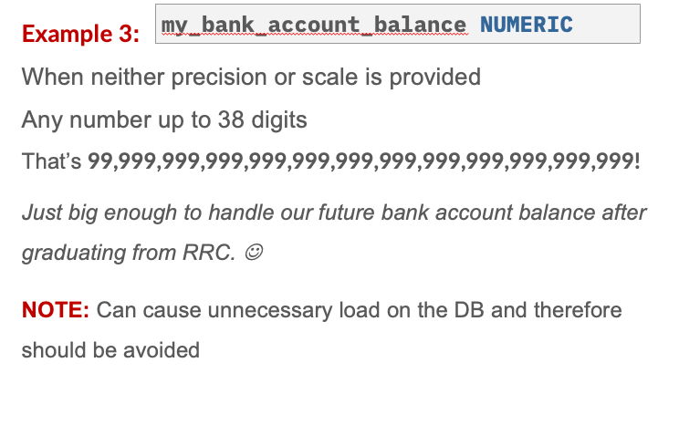

 
 ## Entity Relationship Diagrams(ERDs)

 ### 定义


 ### 如何定义多表关系

Relationships
- one-to-many/many-to-one(最常见)

one pet owner can have many pets
a pet can only have one owner

- one-to-one(很少见)
  2 个表的 PK 是一样的,这个情况不多.

- many-to-many(only theoretical)


 ### 理解关系,运用Cardinality Relationships,学会制作 ERD

Entities (tables)
Attributes (columns)
Relationships (cardinalities)

`Entities` are “things” in the real world that can be described.
An `Attribute` (or property) is a piece of information for an Entity. 
They can be a Primary Key (PK) or Foreign Key [FK].
Ultimately an attribute will be a column on a table.
A `Relationship` occurs between two tables when a foreign key appears on one table referencing a primary key on another table.

There are several kinds of relationships:
- One-to-Many / Many-to-One
- One-to-One
- Many-to-Many (only theoretical)


#### One-to-Many (or Many-to-One) relationship 

occurs between two tables when a row on one table is related to one or more rows in another table.


#### one to one 

Could we put the address columns into the first table if all the non-key columns are associated with the same unique value?


Less clutter in a single table (reduced columns in a table).
Less data returned in commonly run queries


#### many to many

A Many-to-Many relationship occurs between two tables when a row in one table can be associated with one or more rows in another table and vice-versa.

We can only have this kind of relationship in theory!

Let’s see why with an example… 


many这边经常是 FK


如何解决many-many,创造第三张表

Option A: Make a `COMPOSITE primary key` from the 2 Foreign Keys
Option B: Add an auto incrementing `SURROGATE` primary key!


# 读图 ERD


A Verb is used on the relationship line that connects the Foreign Key [FK] column to the Primary Key (PK) column.

The Foreign Key is on the MANY side of the relationship. This is ALWAYS true!


## Create Tables

复习 DDL 和 DML 指令

Data Definition Language (DDL)
THE STRUCTURE of the database:
DROP, ALTER, CREATE

Data Manipulation Language (DML)
Used to MANIPULATE THE DATA within the structure:
INSERT, UPDATE, DELETE, SELECT


### 如何命名一个 table

- maximum 30 characters
- no blank spaces
- only contain these symbols: $ _ # (仅建议underscore)
- name must be unique
- cannot use reserved words,like SELECT

### Create Table  Syntax Example 

```SQL 
CREATE TABLE Regions
(
  region_id     NUMRIC(5,0),
  region_name   VARCHAR(25)
);
```

#### DATA TYPES 


##### CHAR() datatype is used for a Static Length series of characters
一般用在确定知道几个字母的情况,否则会产生空格


Example syntax
`province_code CHAR(2)`

The number in the brackets will indicate the required number of characters the column Must Contain.
If no brackets are provided, the number will default to 1.

Example Values
`'MB' 'AB' 'SK' 'BC'`

Example
`NAME CHAR(10)`

IMPORTANT NOTE: 
>Assigning values with LESS characters than the definition will cause white space to be used to pad the difference on the end of the characters

We should only use CHAR when we know the number of characters used in that column is ALWAYS constant.

##### VARCHAR() datatype is used for a variable length series of characters

The `VARCHAR` data type is used for a variable length series of characters.

Example syntax:		
`NAME VARCHAR(25)

Example values:
‘Scott’, ‘Buck’, ‘Carolyn’, …  

The number in the brackets will indicate the MAXIMUM number of characters the column can contain.
If no brackets are provided, the number will default to 1.


##### NUMERIC() datatype is used for storing any positive or negative number;integers,floating points and fixed points;

``` NUMERIC(Precision,Scale)```

Scale: The number of digits agter the decimal point. default 0
Precision: the total number of digits(including scale)  default 38max


If not provided:	
Scale will default to 0		Precision will default to 38 (max)
				‘A really big number!’


在 DB 引起不必要的数据负担,因此应该尽量避免使用默认值


还有一些四舍五入的例子 会引起不精确


##### DATE used for storing calendar information.

```birthday DATE```  Year,Month,Day
the valid date range is :
January1, 4712 BC to December31,9999AD

Most of the time literal values are automatically converted into compatible DATE values.

If you encounter an error
You can use the TO_DATE() * function to convert the literal string to a matching date value: 

When creating tables, you may need this in your CHECK CONSTRAINTS
`TO_DATE('1900-01-01','YYYY-MM-DD')`


学会数据类型之后 就可以创建 table
这时候需要规定 PK FK 


#### Integrity Constraints

A `CONSTRATNT` is used to enforce integrity rules.

NOT NULL PK
UNIQUE   FK REFERENCES

CHECK     ON DELETE CASCADE
DEFAULT   ON DELETE SET NULL


**In-line:**
Part of the column definition.
Will have an auto-generated system constraint name.
Typically only used for NOT NULL constraints

The NOT NULL constraint will prevent NULL values from being assigned to a column. This constraint is in-line only.


```monster_name VARCHAR(100) NOT NULL```
这样如果赋值为空值会报错
Assigning a NULL to this column will cause an error


The `UNIQUE` constraint will prevent duplicate values from being assigned to the same column.


```sin NUMERIC(9) UNIQUE```
Duplicate values assigned to the column, will throw an error:
System errors can be a bit hard to read

**Out-of-line:**
Separated from the column definition line.
You must provide a constraint name.

- ARE COMMA separated as if they were a separate column
- must be given a unique name across the database

eg:
```SQL
 CONSTRAINT sin_is_unique UNIQUE(sin)
 ```


```SQL
CONSTRAINT full_name_unique
   UNIQUE(first_name,last_name)
```
There may be duplicate first names: Jon Smith, Jon Jones
There may be duplicates last names: Chris Smith, Jon Smith
Full names are unique: Only one John Smith!

#### CHECK

The CHECK constraint will only allow column value changes if they satisfy a custom boolean expression.

Generic syntax:
```SQL
CONSTRAINT name_here
  CHECK(expression)
```
We can use all the same symbols and keywords as we did in our WHERE clauses: 
<=, <,  >,  >=,  =,  <>, 
AND,  OR,  BETWEEN,  IN,  IS,  NULL,  NOT


The PRIMARY KEY constraint will prevent NULL values and duplicates from being assigned to a column.

OUT-OF-LINE constraint example: 

```SQL
CREATE TABLE Monsters
(
  monster_id    NUMERIC(7),
  name          VARCHAR(100),
  power_level   NUMRIC(4),
  CONSTRAINT cannot_be_over_9k
  CHECK(power_level < 9001)
)
 ```

```SQL
CREATE TABLE Birthday
(
  birthday DATE,
  CONSTRAINT valid_birth_date CHECK(
    birthdate BETWEEN
          TO_DATE('1900-01-01','YYYY-MM-DD')
      AND TO_DATE('2020-01-01','YYYY-MM0DD')
  )
)
 ```

```SQL
CREATE TABLE Monsters
(
monster id NUMERIC (7),
name     VARCHAR(100),
discovery_date DATE,
  CONSTRAINT MonstersPK
    PRIMARY KEY(monster_id)
) ;
 ```

Remember: Inside the CREATE TABLE syntax we must convert literal values to a DATE formatting with TO_DATE()

如果一个表中,需要2个 PK 位一个 composite pk
```SQL
CONSTRAINT Job_HistoryPK
      PRIMARY KEY (employee_id, start_date)
```

如何写 FK 呢?
```SQL
CONSTRAINT GroupedFK
FOREGIN KEY (region_id)
REFERENCES Regions(region_id)
```

```SQL
CONSTRAINT relationship_nameFK
  FOREIGN KEY (column1_fk, column2_fk)
  REFERENCES ParentTable (column1_pk, column2_pk)
```

:FK constraints reference the Parent table name (Regions). 
写个练习看会不会

```SQL
CREATE TABLE  Food(
  food_id   NUMERIC(4)   NOT NULL,
  description VARCHAR(99) NOT NULL,
  average_rating NUMERIC(3,2)

  CONSTRAINT FoodPK
    PRIMARY KEY(food_id),
  CONSTRAINT CheckAverageRating
    CHECK(average_rating BETWEEN 0.00 AND 5.00)
)
```

#### ON DELETE 语法

ON DELETE CASCADE when used with the FOREIGN KEY constraint will force the children to be deleted when a parent is deleted. 

EG:
The Pet table’s owner_id column references the Owner table’s owner_id column. When an owner is deleted, all pets (from the child table) with that owner will also be deleted.

```SQL
CREATE TABLE Pets
(
	… 
CONSTRAINT PetOwnerFK
FOREGIN KEY (owner_id)
REFERENCES Owner(owner_id)
ON DELETE CASCADE
);
```

作用是删除/更新对应关联信息后对应关联表自动删除/更新对应信息 
删掉 pk owner_id 的话,其他行信息也被删除 变为null

ON DELETE SET NULL when used with the FOREIGN KEY constraint will force the FK column to be set to NULL when a referenced PK is deleted. 

Using the same example, If we delete the row with Monica (parent), then the rows with Snowy, Rex and Astro  (child) will have their owner_id column value set to NULL.

Eg:
The Pet table’s owner_id column references the Parent table (Owner table’s owner_id column). 
When an owner is deleted from the parent table, all pets with that owner from the child table will have their owner_id set to NULL.

```SQL
CREATE TABLE Pets
(
	… 
CONSTRAINT PetOwnerFK
FOREGIN KEY (owner_id)
REFERENCES Owner(owner_id)
ON DELETE SET NULL
);
```


#### DROP Table

For our course, if you are making a CREATE TABLE to answer a question in your assignment/test, you should always start your script with a DROP TABLE command for that table.

If you have many tables, be sure to DROP the tables in the correct order:
Child tables first (no FK references from other tables)
Parent table last


The DROP TABLE command will remove a table and all of it’s rows from a database. 

IMPORTANT NOTE:  If you attempt to drop a parent table that is being referenced by another table, an error will be thrown.


`DROP TABLE Person;`
`DROP TABLE Food;`
  

创建表的时候先创建父表 再创建子表
DROP 先 DROP 子表,再 drop 父表

练习


```SQL
  
CREATE TABLE Person(
  person_id NUMERIC(6) NOT NULL,
  name      VARCHAR(30) NOT NULL,
  birthday  DATE,
  favfood_id  NUMRIC(4)  NOT NULL,
    CONSTRAINT PersonPK
      PRIMARY KEY(person_id),
    CONSTRAINT PrefersFK
      FOREIGN KEY(favfood_id)
      PREFERENCES Food(food_id)
      ON DELETE CASCADE
)
```

### DML INSERT  UPDATE DELETE
SELECT 学过了,是 DML 的一种

#### INSERT: adding a new row to a table

Syntax:
```SQL
INSERT INTO table_name (column1,column2…)
VALUES (value1,value2…);
```
Columns are a list of comma separated column names.
Values are a list of comma separated values that MUST match the number and order of the columns.

If a column is not specified during the INSERT: 
The column value will be NULL or DEFAULT (if specified)
Columns with a NOT NULL constraint *MUST* be included or will result in an ERROR

Values are checked against all table CONSTRAINTS before the row is actually inserted:
- PRIMARY KEY
- FOREIGN KEY
- CHECK
- UNIQUE
- NOT NULL

Adding a new Region named Oceanic.


如果我在插入列的时候,漏掉了一些本身 NOT NULL 的
```SQL
INSERT INTO Locations ( location_id, 
  city, 
  state_province, 
  country_id )
VALUES (3500,'Calgary','Alberta','CA');
```
Two columns are missing: street_address and postal_code 
The default values for these columns will be set to: NULL

An error would occur and prevented the INSERT had either of the two columns had a NOT NULL constraint


#### DELETE: deleting a row from a table
Syntax
```SQL
DELETE FROM table_name
WHERE (conditions);
```

IMPORTANT NOTE: If the WHERE clause is omitted, you delete ALL ROWS in the table!

删除的时候最好用 PK 的条件来删除,否则很容易删掉无关的行.

The PK column is unique and this will avoid accidentally deleting more rows than expected!


#### UPDATE: replacing the value(s) of column(s) on a row.

Syntax
```SQL
UPDATE  table_name
SET	     column_name  = 'new value',
         column_name2 = 'new value2'
WHERE   (conditions);
```
IMPORTANT: Omitting the WHERE clause conditions will update ALL ROWS.

Before the UPDATE command executes...
All table constraints are checked:
PRIMARY KEY / FOREIGN KEY, 
CHECK, 
UNIQUE, 
NOT NULL
The new values supplied must match the column datatype


Example: Modify `employee_id 100`. Increase their salary to 25000. Also change their last name to 'Kingster' and their email to 'SKINGSTER'.

```SQL
UPDATE	Employees
SET		salary = 25000,
last_name = 'Kingster',
email = 'SKINGSTER'
WHERE		employee_id = 100;
```
Note: Using the PRIMARY KEY column in the WHERE clause is useful to only update a specific record at a time.


Example: Modify the country of Australia (country_id is 'AU'). Remove the region_id as it is no longer considered part of region_id 3.
```SQL
UPDATE	Countries
SET		region_id = NULL
WHERE		country_id = 'AU';
```
Note: We do not use IS NULL here, because we are assigning the value of NULL and not comparing it in a boolean expression.
Notice how the SET clause uses ‘=‘  
Whereas the WHERE clause would use ‘IS NULL’


```
UPDATE	Jobs
SET		max_salary = max_salary + 100
WHERE		job_id IN ('IT_PROG', 
   'SA_REP', 
	'MK_MAN');
```


#### COMMIT: A command to use after all of our changes.

After making changes to the database you will want to use the COMMIT command at the end of your SQL file to save your changes to the server.

```COMMIT;```

