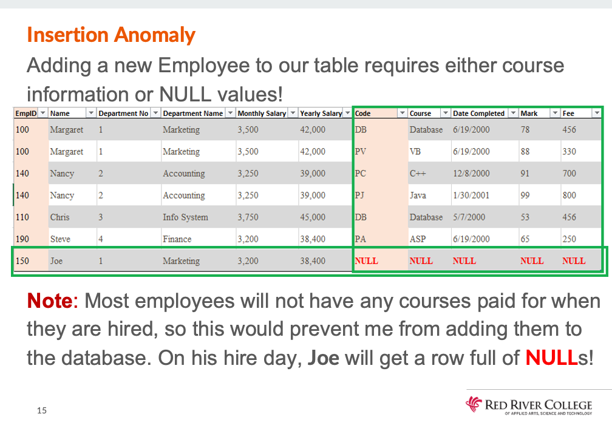
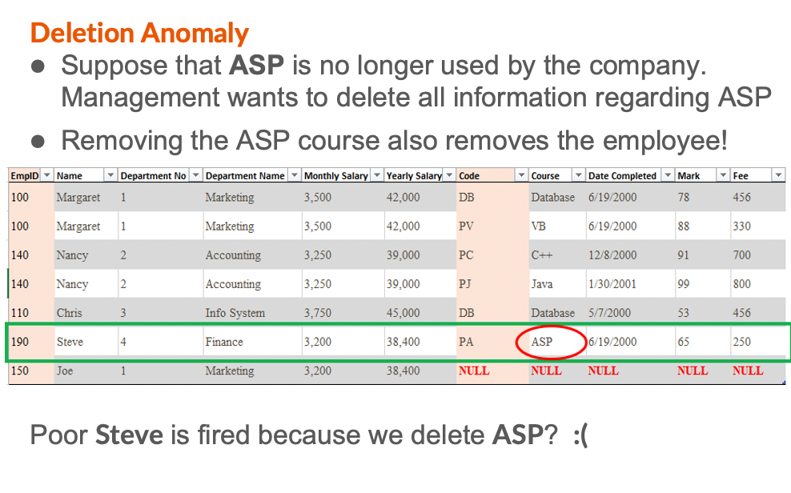
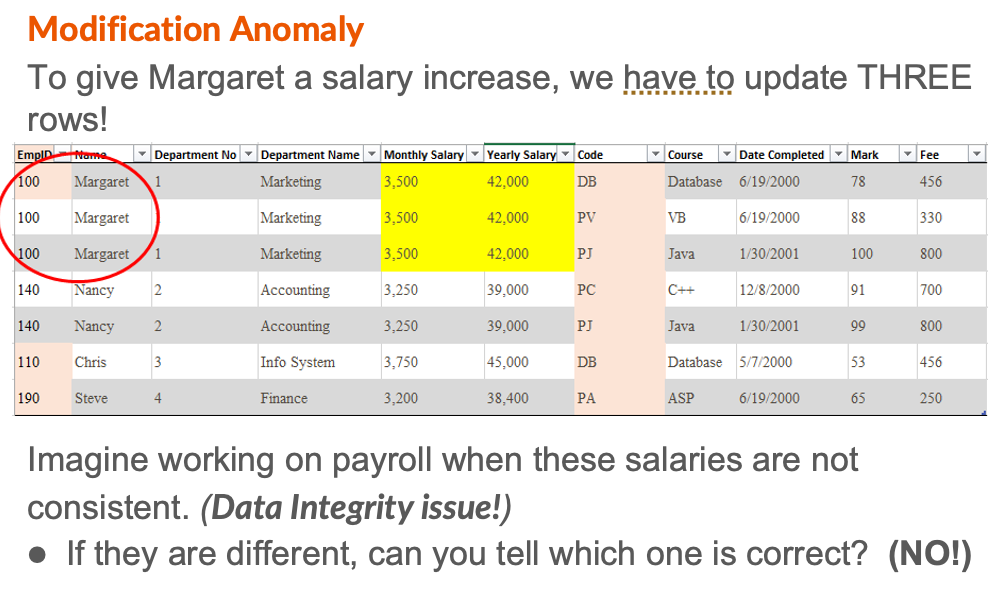
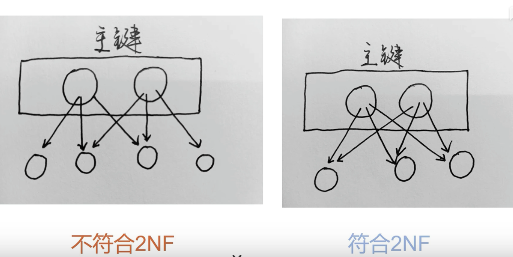
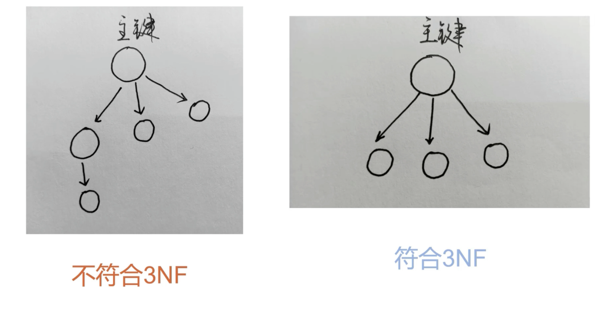

# Table normalization 

## 一 OUTLINE

- Database Normalization
  - First Normal Form (1NF)
  - Second Normal Form (2NF)
  - Third Normal Form (3NF)
- Anomalies /əˈnɑːməli/异常情况
  - Insertion, Deletion, Modification, Time
- Dependencies 依赖
  - Functional, Partial, Derived(衍生), and Transitive(传递)

## 二 Database Design

A well made relational database will REDUCE :

- **Data Redundancy**
  - values are repeated unnecessarily
  - such as a field value showing up on multiple  rows or a column repeated in 2 or more tables

- **Data Integrity** 数据完整
  - aims to prevent unintentional changes to the information stored in our database (防止无意识情况下更改了数据)

这些需要在设计之初就解决 否则后续会带来灾难性后果.

Poor database design will lead to 

- Extra storage requirements
- data anomalies(insertion / deletion / modification and /time anomalies)

## 三 Anomalies 异常

什么情况会发现呢.当设计的表格含有冗余数据(也就是不符合范式的时候)
Data Anomalies occur when a user attempts to modify a table that contains redundant information.

### Insertion Anomaly

Data cannot be inserted into a table without inserting data that is NOT directly related.

### Deletion Anomaly
When data is removed, other data not directly related must also be deleted.

### Modification Anomaly
Updating data requires duplicate data spread out over multiple rows to be updated at the same time for data integrity!

It is important to note that Data Redundancy can never truly be removed in a relational database. 

Because we must relate Primary Key columns to Foreign Key columns.
Just know that these keys will always have some level of duplication throughout a database and we are ok with that.

## 四 Database Normalization 解决 Anomalies

Database Normalization is the process of structuring relational databases to reduce data redundancy and to improve data integrity.
数据库规范化是对关系型数据库进行结构化的过程，以减少数据冗余并提高数据完整性。

**Normal Format 范式 级别越高表格越干净**
- First Normal Form (1NF)
- Second Normal Form (2NF)
- Third Normal Form (3NF)

### 4.1  1NF first normal form

最基本的范式,符合数据表的原子性 拆分列,有主键

1. All attributes contain an atomic piece of information 
> Complex attributes may need to be broken into their own separate columns.
1. There **exists a Primary Key**
2. There are no **Repeating Groups** 
Columns containing multiple values will need to move into their own table(s)
重复行的哪些列,单独放在一个新表.在新表需要有 PK,可能需要增加列做 composite key. 或则增加 Surrogate key.

### 4.2 2NF Second Normal Form (没有 partial dependency)

`2NF 的依据是非主键列到底是完全依赖于 PK,还是依赖于 PK 的一部分??`

要满足第一范式
表中的非主属性必须完全依赖于主属性.

- It is in first normal form 
- All non-key attributes do not have a partial functional dependency on the Composite Primary Key 
  - We will move these columns to their own tables (依赖列和它依赖的主键直接去新表)

3 个新定义:
- key attributes 包含所有的 PK 和 FK 的列.
- non-key attributes are all other columns.
- functional dependency: Within the same table, if one column can be determined by another column, it is said to be functionally dependent.
在一个表里,如果一列是被另一列定义的,可以是是功能性依赖. 那么这个被定义的列可以被称作候选键,Primary Key Candidate.
- Partial Functional Dependency: : Within the same table, if a non-key column can be determined by only one column of a composite primary key, it is said to be partially functionally dependent.

**What are we looking to eliminate in 2nd normal form?**
- Partial Functional Dependencies
>When you have a composite Primary Key, but only a subset of the Primary Key columns are required to determine other information
**What data must be checked to see if it is in 2nd normal form?**
- All data groups produced from 1st normal form
**Under what conditions may data already be in 2nd normal form?**
The Primary Key is a single attribute
No non-key attributes exist

### 4.3 3NF Third Normal Form (没有 detried 和 transive dependency)

`3NF 依据是非主键的列是直接依赖于主键,还是直接依赖于非主键??`

首先要满足第二范式
所有非主属性之间不能有依赖关系，它们是互相独立的
> 非主键的列,必须直接依赖于主键,不能存在传递依赖(不能依赖于其他非主键字段)或者衍生依赖(可以通过其他列计算出来)

Data is in Third Normal Form (3NF) if:
- It is in second normal form
- There are no attributes with Derived Dependencies
- There are no Transitive Dependencies 
> We will move these columns to their own table(s)

**What are we looking to remove in 3rd normal form?**
Derived Dependencies
> Anything that can be ‘calculated’
Transitive dependencies
> One non-key attribute that depends on another non-key attribute

**Which dependency is eliminated first?**
Derived dependency
Once all Derived Dependencies have been eliminated, work on Transitive Dependencies

Derived Dependency: 衍生依赖 一个非主属性可以被其他列计算出来
A Non-key column that can be calculated using other columns (from any table) is derived.
>Example: age Calculated by subtracting your birth date from today’s date.

Transitive Dependency: 传递依赖 一个非主属性依赖另一个非主属性
>A table has a Transitive Dependency if one or more non-key attribute(s) depend on another non-key attribute (in the same data group).

In order to have a transitive dependency, there must be at least two non-key attributes in a table.

### 4.4 Time Anomalies.

These happens when our tables are unable to handle data changes over time.

## Normal Forms - Overview

First Normal (1NF)
Any repeating groups should be given their own row. 
This may require a composite key (or surrogate) for the table.

Second Normal (2NF)
Non-key attributes dependent on part of a composite key
(partial functional dependency) to be move to a separate table.

Third Normal Form (3NF)
Fields with a derived dependency is removed
Non-key fields with a dependency on another non-key field 
(transitive dependency) is moved to new table.

## Anomalies - Overview
Insertion Anomaly
Data cannot be inserted into a table without inserting data 
that is not directly related to the data being inserted.

Deletion Anomaly
When data is deleted, other data, not directly related to the
data being deleted is also lost.

Modification Anomaly
Modifying data requires multiple rows to be updated.

Time Anomaly
Data is either missing or inconsistent over time.

## Dependencies - Overview

Functional Dependency
An attribute (ex: Employee Name) can be determined from another attribute in the same table (ex: Employee Number).

Partial Functional Dependency (2NF)
Non-key attribute(s) functionally dependent on part of a 
composite primary key in the same table.

Derived Dependency (3NF)
Non-key attributes(s) calculated from other non-key
attributes in either the same table or in other tables.

Transitive Dependency (3NF)
Non-key attribute(s) functionally dependent on another 
non-key attribute in the same table.

