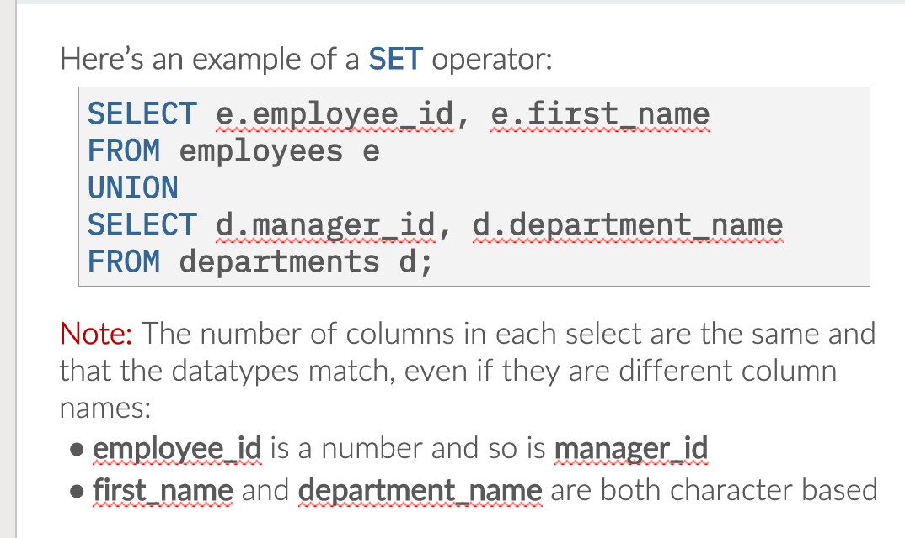
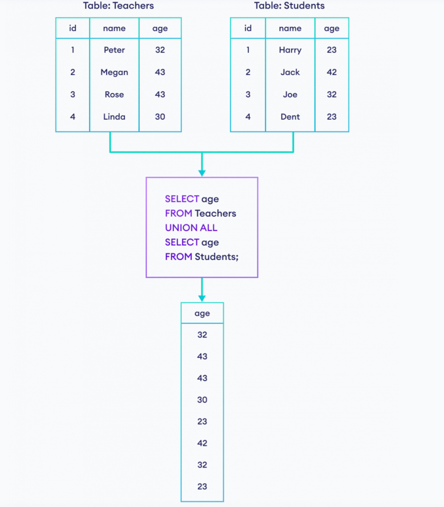
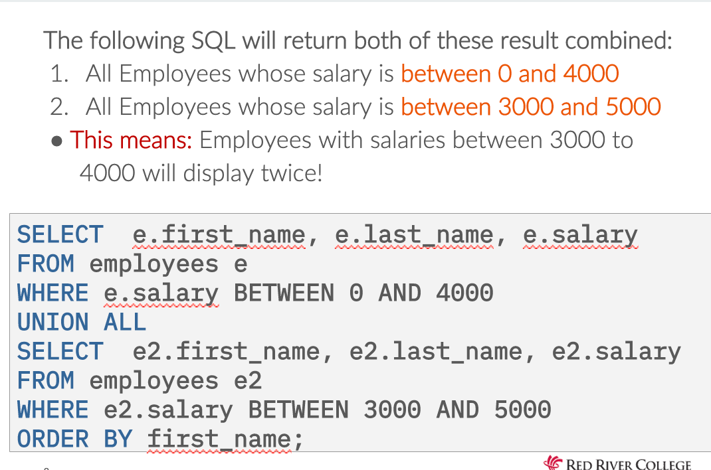
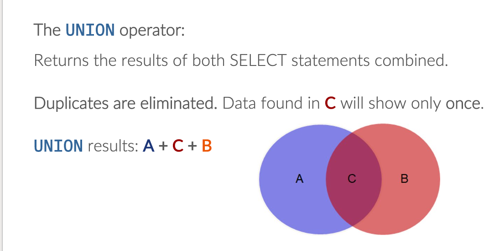
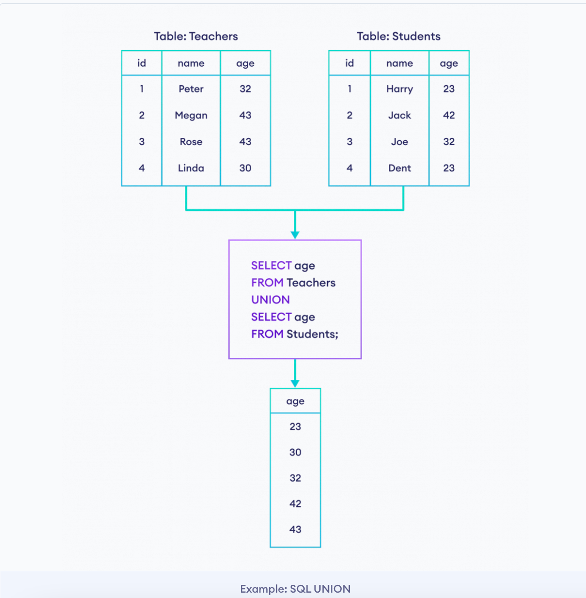
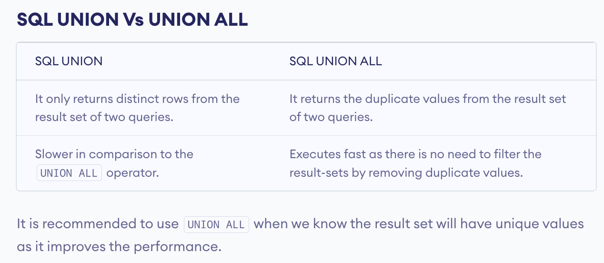
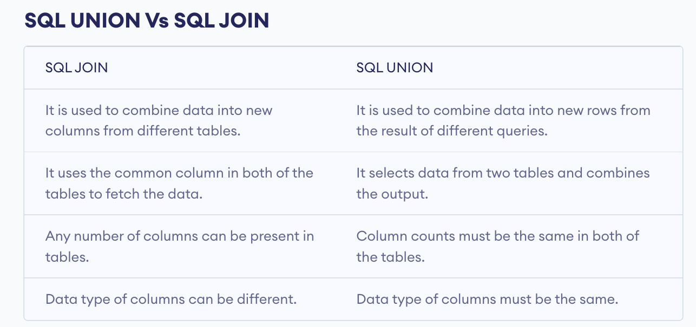
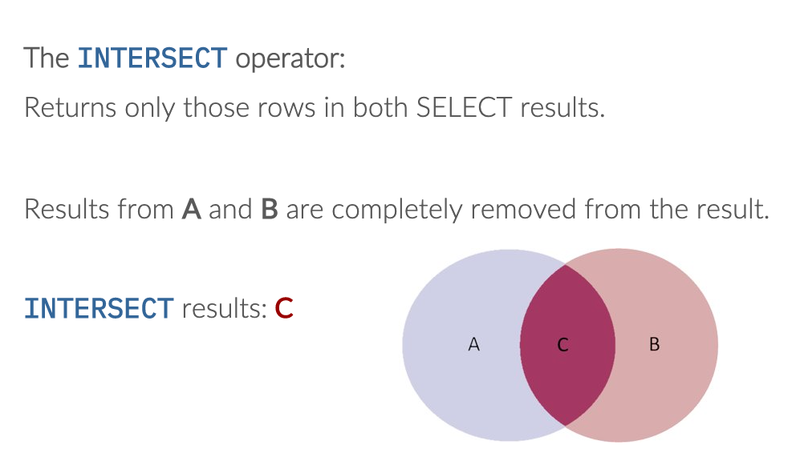

# SET Operators 

## 概念

比 JOIN 更快速

The SET Operators are a way of bringing data from multiple result sets together, we will be using the following new keywords:

**UNION ALL
UNION
INTERSECT**

JOINs can be very slow! So SET operators are sometimes used as an alternative solution.

## Syntax 

可以把 2 个 SELECT queries 的结果组合成一个新的结果

```
SELECT...
SET OPERATOR
SELECT ...;
```

The columns used in each SELECT result must match:
- Same number of columns
- Columns have matching data types




### UNION ALL


The UNION operator:
Returns the results of both SELECT statements combined.
DUNION ALL doesn't ignore duplicate rows

举例: 


**UNION results:(A + C) +(B+C)**




**Why would we want to use UNION ALL**

大表 无需比较 直接合并
- You may want duplicates
- Another factor is running time
  - No filtering or comparisons are required here, just two sets of data combined into a single result
  - Imagine LARGE tables of over 1 million records with even 1 comparison per row! That will definitely slow things down.

### UNION 



不会重复出现结果.
比如:



#### Things to Note While Using UNION
1. Column count in all tables must be the same. For example, Teachers and Students both tables have three columns.
2. The data types of columns must be the same. For example, the age column in Teachers is integer, so is the age in Students table.
3. The columns must be in the same order in each table. For example, the order of columns is id-name-age in Teachers, so in the Students table.
   
#### 和 UNION ALL 的区别




#### 和 JOIN 的区别


### INTERSECT



The INTERSECT operator:
Returns only those rows in both SELECT results.
Results from A and B are completely removed from the result

INTERSECT results: C


```SQL
SELECT e.employee_id
FROM employees e
WHERE e.salary > 13000
INTERSECT
SELECT d.manager_id
FROM departments d
WHERE d.manager_id IS NOT NULL;
```

