# JOIN 概念和语法

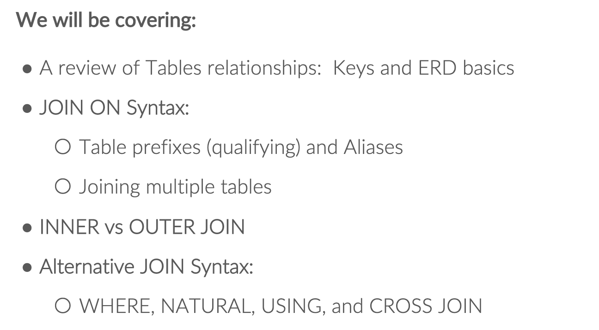

The SQL JOIN joins two tables based on a common column
and selects records that have matching values in these columns.

## Table Realationships 

###  Multiple tables & ERD  多表交互是常态

Entity Relationship Diagram

most meaningful SQL interactions 
invlove the use of 2 or more tables  at the same time.

那么,他们是怎么链接的呢?
Basic Realationship 是用 PK 和 FK 链接起来的.

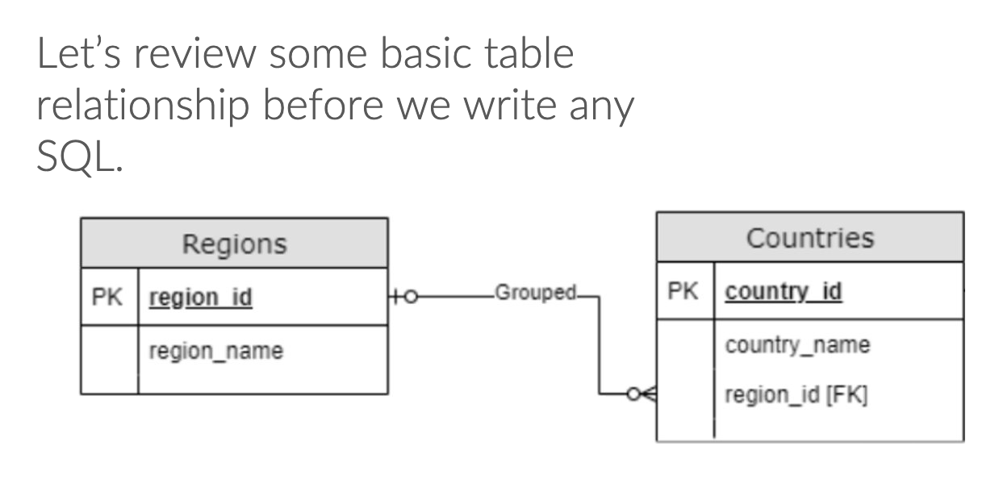

### PK AND FK

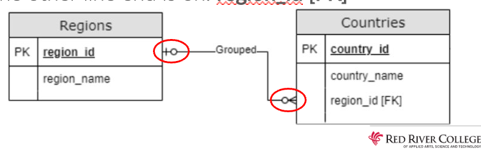

All table relationships will have a line bw a PK and a FK

- PK must be UNIQUE  and must not contain NULL values.
g: driver license, SIN ,ID

- FK is a column that references the primary key on another table .

PK在的表 =  Parent Table
FK在的表 =  Child Table


## JOIN ON - Syntax

### JOIN ON 

通过 PK FK JOIN在一起


```SQL
SELECT talbeA.column1,tableA.column2,...
	tableB.column1,tableB.column2,...
FROM tableA
JOIN tableB
ON tableA.PrimaryKey=tablebB.FroeignKEY;
```


IMPORTANT
- must prefix前缀(qualify修饰说明) a table 
  > (因为可能要显示 2 个表的数据,要写明白到底要的哪个表)
- ON 后面跟 boolean 公式 (True/False),定义合并哪一列
    > 表的顺序没关系,但等式 **PK = FK**, 尽量这样写.不强制.
- 可以用 WHERE  / ORDER BY 

Tips:
当我们合并 2 张表的时候,可能会出现 duplicate infomation
并且需要一个一个去对比/ 比如一个表 5 行,拿去 100 行的表比对拼接.
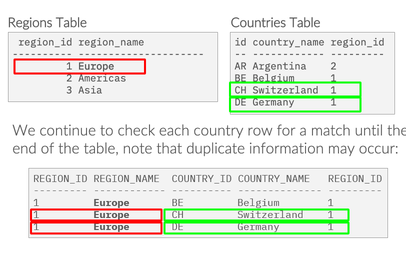

#### SQL JOIN and Aliases

We can use aliases with table names to make our snippet short and clean. 
For example,


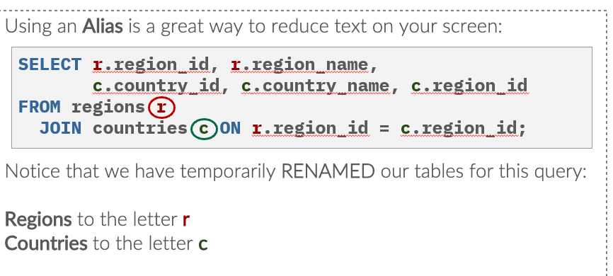

```SQL
SELECT *
FROM regions r
JOIN countries c
ON r.region_id = c.region_id
WHERE r.region_id =3 ;
```


## 各种连接方式

- (INNER) JOIN: Returns records that have matching values in both tables
- LEFT (OUTER) JOIN: Returns all records from the left table, and the matched records from the right table
- RIGHT (OUTER) JOIN: Returns all records from the right table, and the matched records from the left table
- FULL (OUTER) JOIN: Returns all records when there is a match in either left or right table

## INNER JOIN (Same AS ```JOIN```)

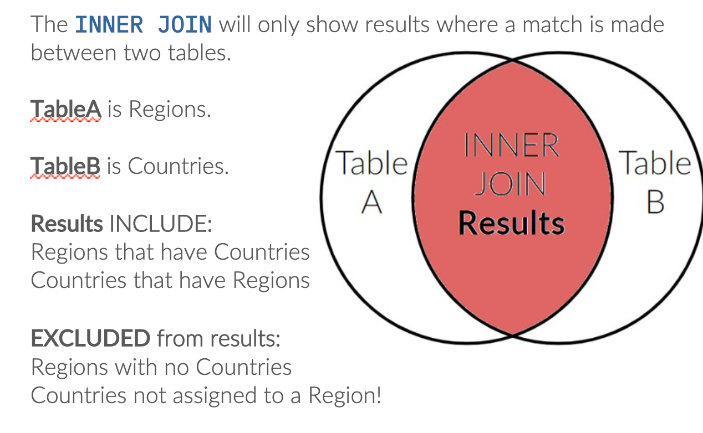

SQL INNER JOIN joins two tables based on a common column
and selects records that have matching values in these columns.


```SQL
SELECT 
    r.region_id,
    r.region_name,
    c.country_id,
    c.country_name,
    c.region_id
FROM regions r
    INNER JOIN countries c
    ON r.region_id = c.region_id;
```

INNER 不是必须的,但是加上也无法
INNER JOIN will only show results where a mathc is made between 2 tables.

```SQL
SELECT e.last_name,j.job_title
FROM jobs j
    JOIN employees e
    ON j.job_id = e.job_id;
```

PK 写在等式左边

SQL INNER JOIN With Three Tables
```sql
SELECT C.customer_id, C.first_name, O.amount, S.status
FROM Customers AS C
INNER JOIN Orders AS O
ON C.customer_id = O.customer
INNER JOIN Shippings AS S
ON C.customer_id = S.customer;
```


### 自连接 SELF-JOIN


应用场景:
在一个表里,比较不同的列,查找有关联的讯息. 那就需要自连接,来比较.
比如比较一个人的名和姓相同的情况,ID 相同的请款.等等.

举例:找出 Manager 是谁,Manager 也是 employee
也被称作 circular  recursive
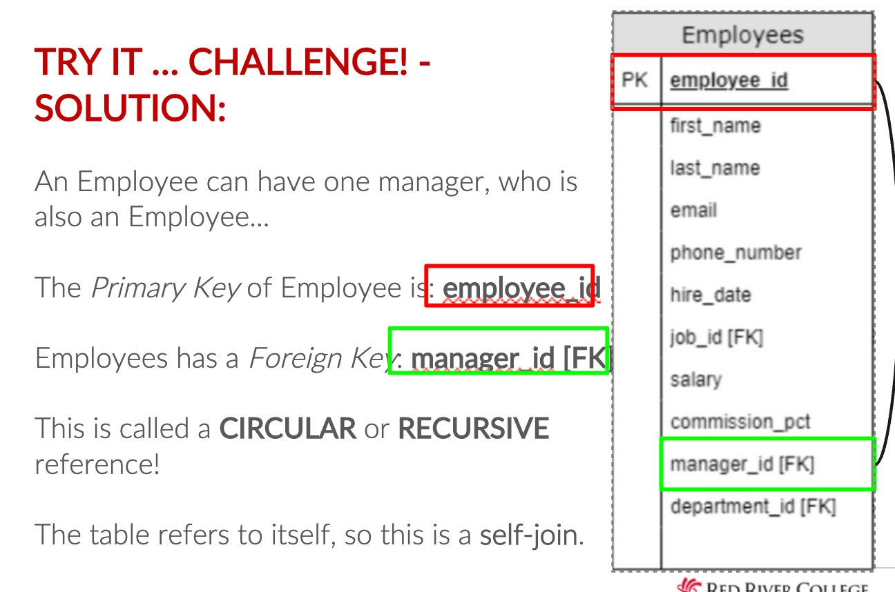

```sql
SELECT  e.first_name AS "Employee First Name",
        e.last_name AS "Employee Last Name",
        m.first_name AS "Manager First Name",
        m.last_name AS "Manager Last Name"
FROM employees e
JOIN employees m ON m.employee_id = e.manager_id;
```
/*这里的一个要点是，把manager这张表的employee_id当做PK
来比对 emloyee 的 manager_id ，数值是多*/


### 多表连接 Multiple Tables

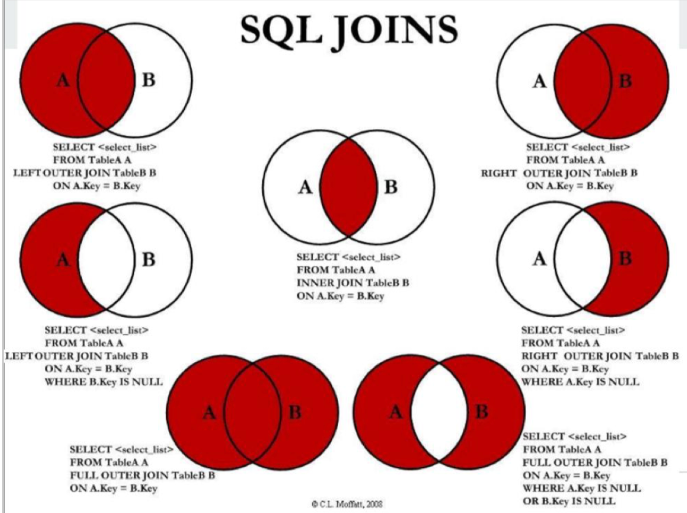

好处
JOINs are usefull tools to bring toghter rows from multiple tables into a single result set .
坏处

In terms of computer processor running time,this makes JOIN very expensive!
>(原因:Each row of a table will be compared with every row in another table ,whether it is added to the resulet set or not.
)


举个例子:
```SQL
SELECT 
    e.first_name,
    e.last_name,
    j.job_title,
    d.department_name
FROM employees e
    JOIN departments d
    ON d.department_id = e.department_id
    JOIN jobs j
    ON j.job_id = e.job_id;
```

IMPORTANT:
- 排序规则不限 
- PK 和 FK 必须有链接
    > PK from one table maybe referenced by FK in other tables .


## 外连接 OUT JION

### LEFT JOIN左连接
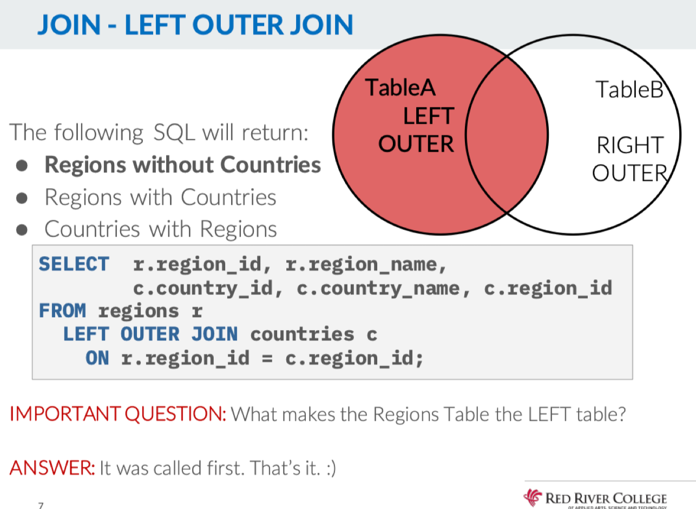

SQL LEFT JOIN joins two tables based on a common column
and selects records that have matching values in these columns 
and remaining rows from the left table.

```sql
SELECT 
    r.region_id,
	r.region_name,
	c.country_name,
	c.country_id
FROM regions r
LEFT OUTER JOIN countries c
   ON r.region_id = c.region_id;

```
写在等式左边的为左表


#### 右连接 RIGHT OUTER JOIN

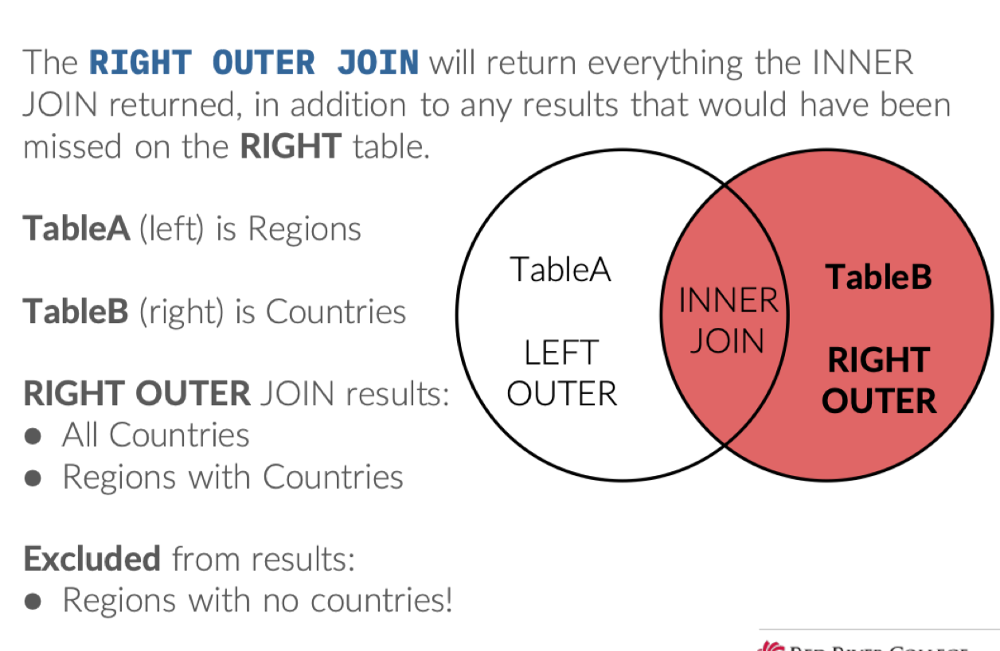

```SQL
SELECT 
    r.region_id,
	r.region_name,
	c.country_name,
	c.country_id
FROM regions r
RIGHT OUTER JOIN countries c
   ON r.region_id = c.region_id;
```

#### FULL JOIN

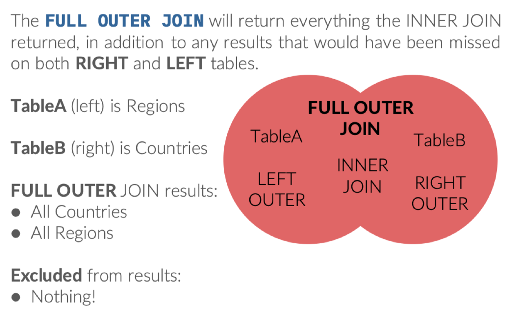

```SQL
SELECT 
    r.region_id,
	r.region_name,
	c.country_name,
	c.country_id
FROM regions r
FULL OUTER JOIN countries c
   ON r.region_id = c.region_id;
```


#### OUTER Area Results Only


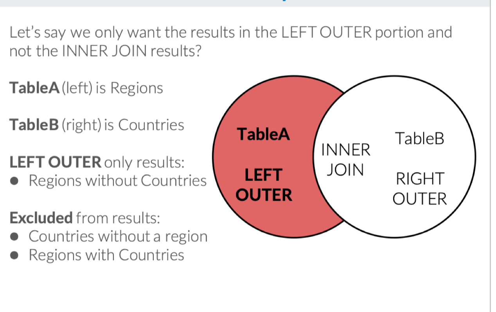

#### Practice

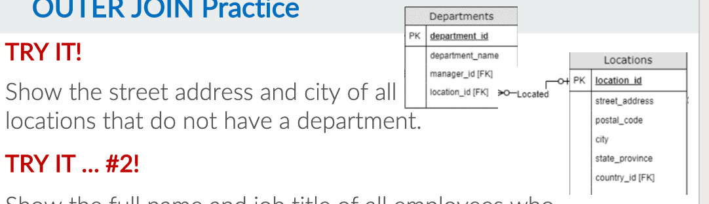

```SQL
SELECT 
	l.street_address,
	l.city,
	d.location_id,
	d.department_id
FROM locations l 
LEFT OUTER JOIN departments d
	ON l.location_id = d.location_id
WHERE d.location_id IS NULL;

```
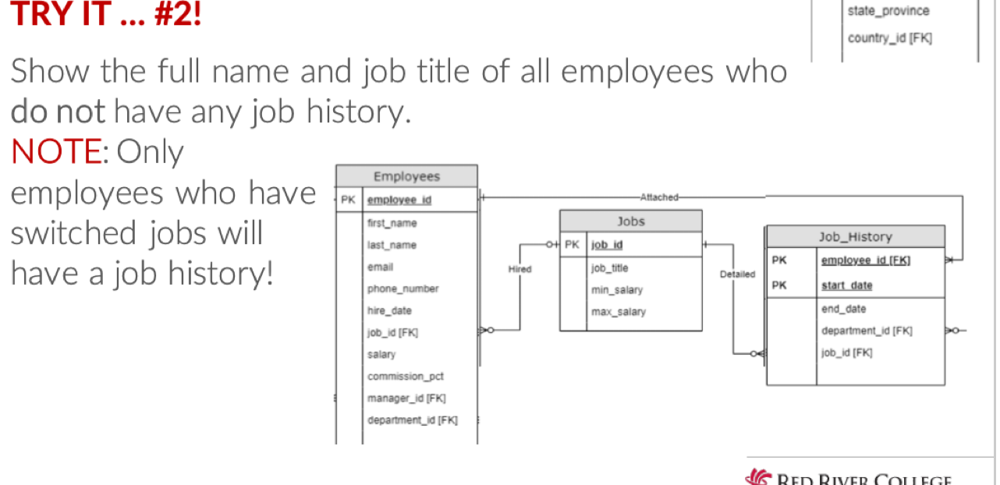

```SQL
SELECT
	e.first_name,
	e.last_name,
	j.job_title
FROM employees e
JOIN jobs j
	ON j.job_id = e.job_id
LEFT OUTER JOIN  job_history h
	ON e.employee_id = h.employee_id
WHERE h.employee_id IS NULL;

```

### Alternative JOIN Syntax

####  WHERE 来替代  INNER JOIN (常用)

```SQL
SELECT 
    e.first_name,
    e.last_name,
    j.job_title
FROM employees e , jobs j
WHERE j.job_id = e.job_id
```
这是 INNER JOIN 的可替代写法,没有办法替代 OUTER JOIN

当然,还可以用 WHERE 合并多张表.

```SQL
SELECT 
    e.employees,
    j.job_title,
    d.department_name
FROM 
    employees e, jobs j ,departments d
WHERE 
    j.job id = e.job_id
AND 
    d.department_id = e.department_id;
```


####  Natural Join(用的很少)

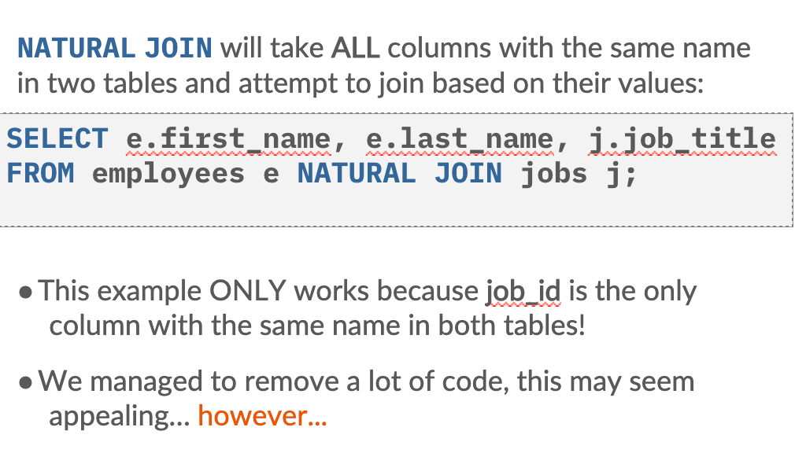

join on a spectied column name 
must be the SAME NAME in both tables
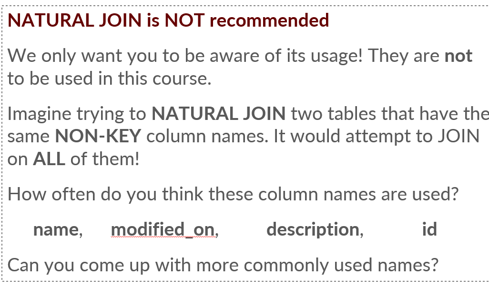


#### JOIN USING (不常用)

join on a specified column name (must be the SAME NAME in both tables)

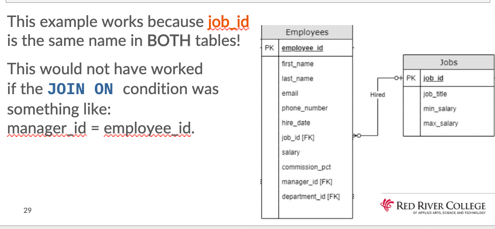

```SQL
SELECT 
    e.first_name,
    e.last_name,
    j.job_title,
    j.job_id
FROM employees e 
JOIN jobs j USING (job_id);
```


#### Cross JOIN (数据挖掘不常用)

The CROSS JOIN will take EVERY row in one table and jion it to every row in the 2nd table;

```SQL
SELECT 
    e.first_name,
    e.last_name,
    j.job_title
FROM employees e
CROSS JOIN jobs j;
```
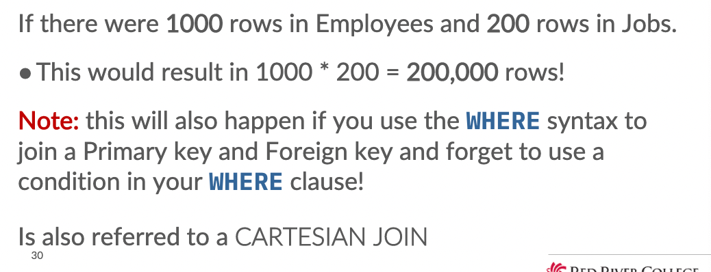

#### Equality JOIN 最常见
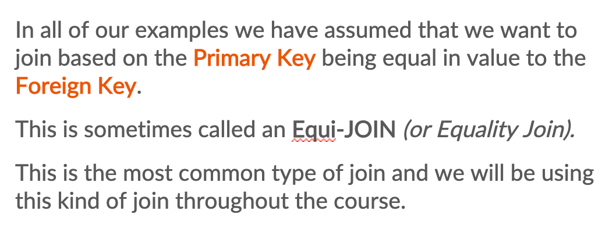


# Summary
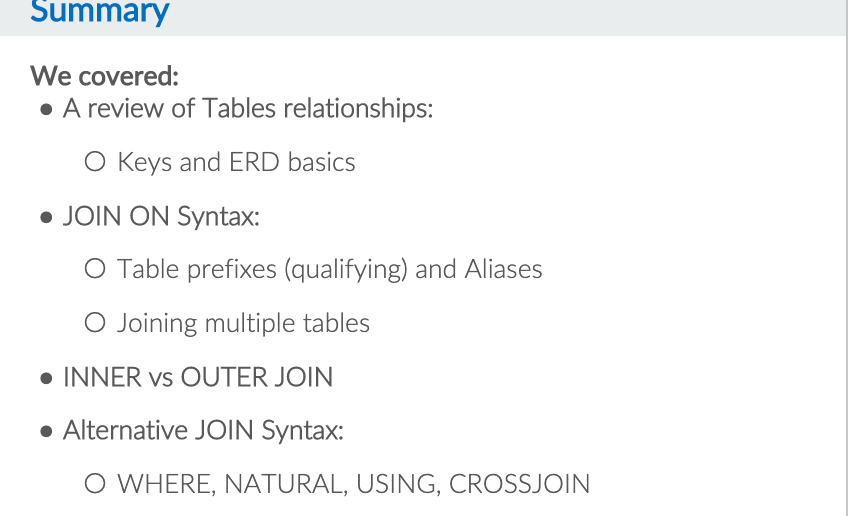


