# Layouts

[toc]


## Positioning  precise 精确定位

默认的位置是在网页左边,按照列排列
一个挨着一个,一个在另一个的上面


five types Position

```html
    <div id="static">
    default behaviors,默认在页面的左上角,不能赋值
    static; is not positioned in any special way;
    it is always positioned according to the normal flow of the page:
    </div>

    <div  id="relative">
    static 几乎一样
    The primary difference is that the relative value
    accepts the box offset properties top, right, bottom, and left.
    可用上下左右,元素是堆叠的,不占用别的元素的位置
    </div>

    <div id="absolute">
    跟随父元素的位置,父元素如果没有,就跟随页面
    父元素用 position:relatively来定位
    Since no parent elements have a position 
    this element will appear at the top right 
    of our browser window.
    </div>

    <div id="fixed">
    Similar to absolute positioned elements
    Positions the element in the browser window (sticks to the page while scrolling).
    fixed elements are also removed from the flow of the page, but when positioned, they never move from that spot.
    这个元素经常应用于页面的 Header 和 footer, asider
    </div>

    <div id = "sticky">
    An element with position: sticky;  
    is positioned based on the user's scroll position. 用的非常少
    depending on the scroll position.

    </div>

```

其中, relative 和 absolute均可以用 top bottom left right properties 定位.

top:40% , left:40%
This element will always appear 40% from the top of the window, and 40% from the left. No matter the size of the window.


## Floats 浮动定位

Floating elements is a natural process when building a website’s layout, and is the instinctive method for positioning elements on a page.

The float property instructs an element to "float" to the direction specified. The image in this example is instructed to float left, which then allows sibling elements to "wrap" around it. You can instruct an element to float left, right or inherit.


### img 和文字浮动

An  img  element floated to the side of a few paragraphs of text, for example, will allow the paragraphs to wrap around the image as necessary.

```html
    img {
    float: left;
    }
```
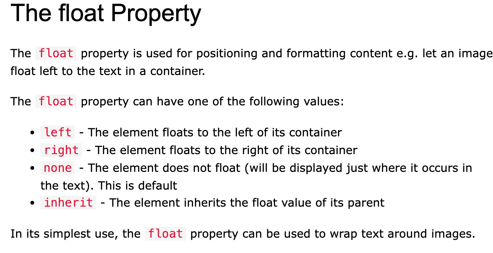

### Layouts

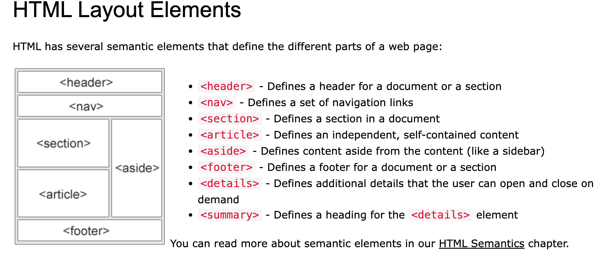

header - Defines a header for a document or a section
nav - Defines a set of navigation links
section- Defines a section in a document
article- Defines an independent, self-contained content
aside - Defines content aside from the content (like a sidebar)
footer - Defines a footer for a document or a section

details  - Defines additional details that the user can open and close on demand
summary - Defines a heading for the details element

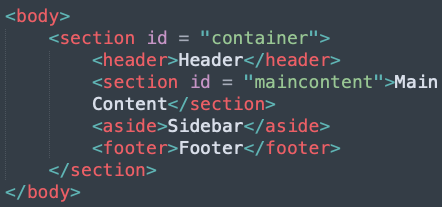


### Clearing Floats

There’s one issue though. With floats, every succeeding element will try to wrap itself next to the previous one, like we saw with the text wrapping around the image. As it is right now, the page would collapse and the footer would wrap to the top, appearing behind the section and aside.

为了解决这个问题，我们需要告诉页脚忽略它上面的浮动。Float有一个姐妹属性clear用来忽略前面所有的标记。

```html
 .footer{
    clear:both
 }
```


## flexbox 弹性框布局模型 


### 作用
为什么要使用 flex:

专为一维内容设计的布局模型。
它擅长获取一组大小不同的项目，并为这些项目返回最佳布局。
对于侧边栏模式，这种布局模型较为理想,在剩余空间不足的情况下，侧边栏还会换行。
提供灵活的边界来提示内容如何显示，而不是让浏览器采用僵化的尺寸。


### 主轴和横轴
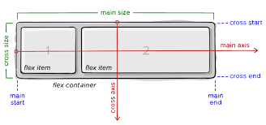

要理解弹性框，关键是理解主轴和横轴的概念。主轴由 flex-direction 属性设置。如果该属性为 row，则主轴沿行方向分布，如果该属性为 column，则主轴沿列方向分布。


### Properties

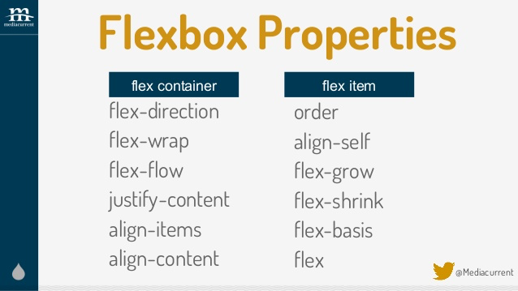

首先,定义父子模型.
**flex container:**
- display:flex 定义排列方法
- flex-direction 定义排列方向 row 默认 column
-  flex-wrap   默认wrap换行, nowrap 不换行
-  flex-flow:column wrap 2个元素
-  justify-content  
-  align-items
-  align-content

**flex item**
- flex :1 指定大小
- order:1 排序
- flex-grow 放大
- flex-shrink 缩小
- flex-basis 规定宽度大小的 替代 width 20%
- align-self 更优先级,可以在父元素规定之后的基础上更改
  

### 如何用

#### 1.布局
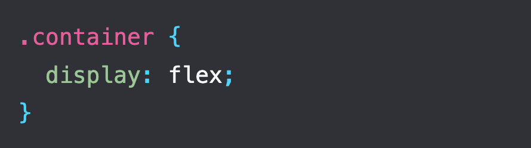

默认意味着：
项目显示为一行。项目不换行。
项目不会增长到填满容器。项目在容器开始处对齐。

#### 2.方向
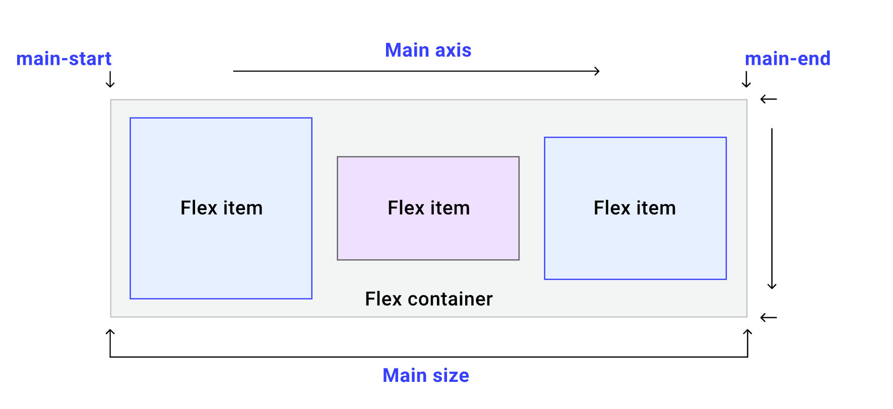
flex-direction 的初始值为 row 
- row：项目显示为一行。
- row-reverse：逆序显示为一行。
- column：项目显示为一列。
- column-reverse：逆序显示为一列。

*不要随便改变顺序,为无障碍阅读人士考虑

#### 3.换行

flex-wrap 属性的初始值为 nowrap。
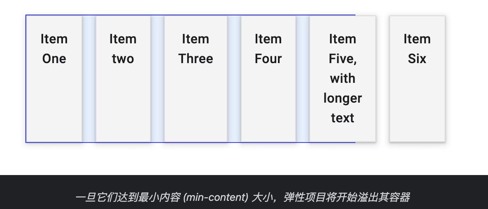

这意味着，如果容器中没有足够的空间，项目就会溢出。

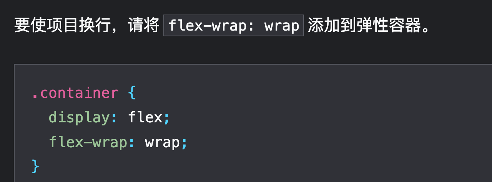

一个快速方法:flex-flow,来设置 flex-direction 和 flex-wrap 属性.
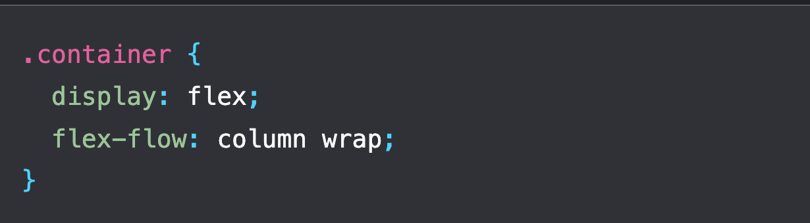

#### 4.大小

- flex-grow: 0：项目不增长。
- flex-shrink: 1：项目可以收缩到比它们的 flex-basis 小。
- flex-basis: auto：项目为基本大小 auto 。

flex:1 大小一致均匀排列,
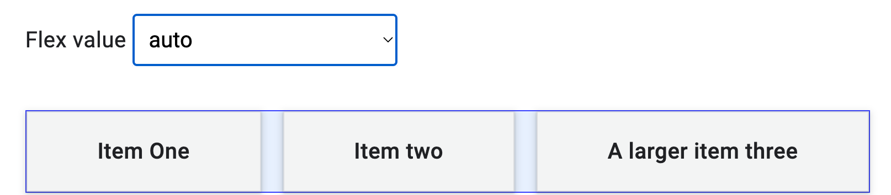
 auto 是根据文本大小
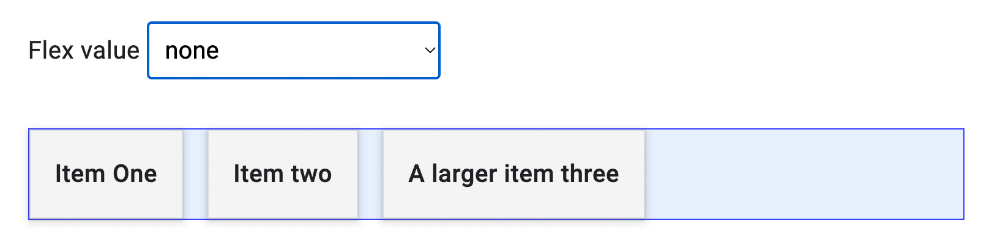
flex: none，可用于让弹性项目变得不灵活，既不增长，也不收缩
如果您只是使用弹性框来访问对齐属性但不需要任何弹性行为，该值可能很有用。


#### 5.排序

使用 order 属性可以为弹性容器中的项目重新排序


#### 6.对齐

container空间分配属性
justify-content：沿主轴分配空间。
align-content：沿横轴分配空间。
place-content：用于同时设置上述属性的速记。

box对齐
align-self：沿横轴对齐单个项目 https://developer.mozilla.org/zh-CN/docs/Web/CSS/align-self 
align-items：将所有项目作为一个组沿横轴对齐
- flex-start
- flex-end
- center
- stretch
- baseline

**如何将项目垂直和水平居中显示 
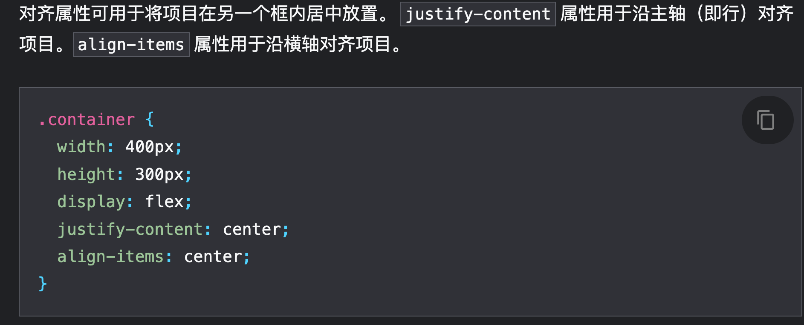

## Media Queries
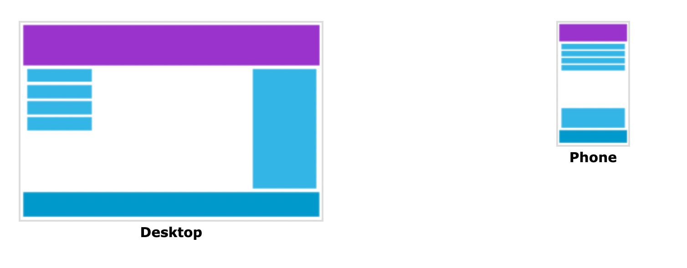
其实一个好的习惯是:Always Design for Mobile First
make the page display faster on smaller devices
media 后面跟的是桌面版的改变会更好


首先要在 HTML 里面设置
<meta name="viewport" content='width=device-width">

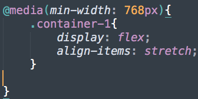


## Navigation

### html

```Html
<nav>
    <ul>
        <li><a href="#">Bridge</a></li>
        <li><a href="#">Content</a></li>
        <li><a href="#">Property</a></li>
        <li><a href="#">Float</a></li>
        <li><a href="#">Margin</a></li>
    </ul>
</nav>

<!-- 对应的 CSS 怎么写呢 -->
<!-- 需求是把导航栏基础的写出来 -->

nav{
    width:100%;
    border:2px black solid;
    font-weight:bold;
    font-size:1em;
    <!-- 背景色渐变色 -->
    background-image: linear-gradient(to right,#eca6a6,#334455); 
}

nav ul{
    display:flex;
    flex-wrap:wrap;
    padding:3px;
    margin:0px;
    list-style:none;
    text-align:center;
    align-items:center;
    justify-content:center;
}

nav ul li{
    flex:1;
    padding:10px;
    border:1px black solid;
}

nav ul li:hover,nav ul li a:focus{
    background-color:green;
}
```

那么,一般还要考虑如何把导航栏在手机端正常显示.
那就需要把 flex 模块粘贴到

@media(min-width:786px){
    
}

或者就是重新定义手机端的显示
@media(max-width:998px){
    nav ul{
        display:flex;
        flex-direction:column;
        width:100%;
        border;
    }
    }

