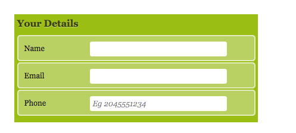
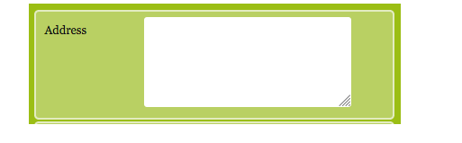
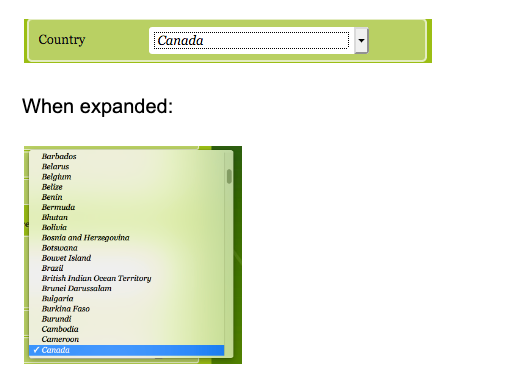
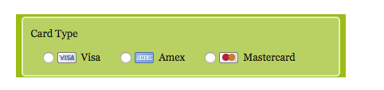

# HTML FROM 

## 1 为什么需要表单

An HTML form is used to collect user input. 
The user input is most often sent to a server for processing.

使用表单的目的是收集用户信息。
在网页中，需要跟用户进行交互，收集用户资料，此时就需要表单。

## 2 The `form` 表单的组成

在 HTML 中，一个完整的表单通常由 `表单域`、`表单控件`（也称为表单元素）和 `提示信息`  3 个部分构成。


### 2.1 表单域

**表单域是一个包含表单元素的区域。**

在 HTML 标签中，`<form>` 标签用于定义表单域，以实现用户信息的收集和传递。

`<form>` 会把它范围内的表单元素信息提交给服务器。
The form tag has two very important attributes: method and action. 


```html
<form id="payment"  action="url地址" method="提交方式" name="表单域名称">
    <!-- 各种表单元素控件 -->
</form>
```

The `method` attribute defines `how` the data is sent to the server when a form is submitted. 
Post is the method that is used most commonly, but get is used too. This will be covered much more indepthly next semester, but if you want to read more, check out this article. 

The action attribute defines `where` the data is sent when a form is submitted. 
When you submit a form usually you’re taken to some kind of thank you or invoice type page. Again, that’s a topic for next semester, but it’s important to understand this even at a basic level.
In case, if the action attribute is not defined the action is set to the current page.


**常用属性**

| 属性名   | 属性值         | 作用                                               |
| -------- | -------------- | -------------------------------------------------- |
| `action` | `url` 地址     | 用于指定接收并处理表单数据的服务器程序的 url 地址  |
| `method` | `get` / `post` | 用于设置表单数据的提交方式，其取值为 get 或 post   |
| `name`   | 名称           | 用于指定表单的名称，以区分同一个页面中的多个表单域 |

注意：对于 HTML 基础的学习来说，暂时不用考虑提交数据，只需写上 form 标签即可，后面学习服务端编程阶段会重新讲解。


*form 表单中 method 的 get 和 post 区别：**

> method 方法规定如何发送表单数据（form-data）（表单数据会被发送到在 action 属性中规定的页面中）。
>
> 表单数据可被作为 URL 变量的形式来发送（method="get"）或者作为 HTTP post 事务的形式来发送（method="post"）。
>
> **关于 GET 的注释：**
>
> - 将表单数据以名/值对的形式附加到 URL 中
> - URL 的长度是有限的（大约 3000 字符）
> - 绝不要使用 GET 来发送敏感数据！（在 URL 中是可见的，且浏览器会缓存 URL）
> - 对于用户希望加入浏览器书签的表单很有用（因为信息记录在 URL 中，直接保存 URL 即可）
> - GET 更适用于非安全数据，比如在 Google 中查询字符串
>
> **关于 POST 的注释：**
>
> - 将表单数据附加到 HTTP 请求的 body 内（数据不显示在 URL 中）
> - 没有长度限制
> - 通过 POST 提交的表单不能加入书签
> - POST 数据也是不安全的，但起码不会明目张胆的直接把数据显示在地址栏 URL 上，且不会缓存数据

【GET案例】

```html
<!doctype html>
<html lang="en">

<head>
    <meta charset="UTF-8">
    <meta http-equiv="X-UA-Compatible" content="IE=edge">
    <meta name="viewport" content="width=device-width, initial-scale=1.0">
    <title>Document</title>
</head>

<body>
    <form action="http://127.0.0.1:8080/" method="GET">
        <label for="name"> Name <label>
        <input type="text" name="name" id="name">
        <input type="submit">
    </form>
</body>

</html>
```

【POST案例】

```html
<!doctype html>
<html lang="en">

<head>
    <meta charset="UTF-8">
    <meta http-equiv="X-UA-Compatible" content="IE=edge">
    <meta name="viewport" content="width=device-width, initial-scale=1.0">
    <title>Document</title>
</head>

<body>
    <form action="http://127.0.0.1:8080/" method="POST">
        姓名：<input type="text" name="name">
        <input type="submit">
    </form>
</body>

</html>
```


### 2.2 表单标题\范围\布局
Fieldsets, Legends, and Common Form Layouts

With the form tag come other tags that are intrinsic to a form.
```html
<fieldset>
    <legend>Your Details</legend>
```
The `<fieldset>` tag defines a form area where common text fields can be grouped. 
The `<legend>` tag provides a heading for that fieldset.  


Forms can contain many text fields and headings, most of which have a display of `inline` by default. This can make it challenging to layout a form. 

Similar to navigations, using list tags (like `<ul>` or `<ol>`) is a common practice for forms to allow for easy layouts. 

```html
<fieldset>
  <legend>Your Details</legend>
  <ol>
    <li>
      <label for="name">Name</label>
      <input type="text" name="name" id="name">
    </li>
```


### 2.3  表单元素 `form` element

在表单域中可以定义各种表单元素，这些表单元素就是允许用户在表单中输入或者选择的内容控件。

`form` element is used to create an HTML form for user input:

The ```form``` element can contain one or more of the following form elements:

#### `<label>`
`<label>` 标签为 input 元素定义标注（标签）。

`<label>` 标签用于绑定一个表单元素，当点击 `<label>` 标签内的文本时，浏览器就会自动将焦点（光标）转到或者选择对应的表单元素上，用来增加用户体验。

The `<label>` tag works in tandem with the `<input>` so that when clicked, focus can be sent to the input. The for attribute in the `<label>` is used to link the input and label together. The value in the for attribute references the id attribute of the input. This is what links them. 

```html
 <label for="name">Name</label>
      <input type="text" name="name" id="name">
```
**核心：** `<label>` 标签的 for 属性应当与相关元素的 id 属性相同。

#### `<input>`
在英文单词中，input 是输入的意思，而在表单元素中 `<input>` 标签用于收集用户信息。

在 `<input>` 标签中，包含一个 type 属性，根据不同的 type 属性值，输入字段拥有很多种形式（可以是文本、字段、复选框、掩码后的文本控件、单选按钮、按钮等）。

`<input>`, an empty tag (like ``), is the most commonly used tag within a form. From its attributes we can determine what type of input it will be. 

```html
<input type="属性值" />
```

**除 type 属性外，`<input>` 标签还有很多其他属性，其常用属性如下：**

| 属性名      | 属性值       | 描述                                        |
| ----------- | ------------ | ------------------------------------------- |
| `name`      | 由用户自定义 | 定义 input 元素的名称                       |
| `value`     | 由用户自定义 | 规定 input 元素的值，也就是提交到服务器的值 |
| `checked`   | checked      | 规定此 input 元素首次加载时应当被选中       |
| `maxlength` | 正整数       | 规定输入字段中的字符的最大长度              |

- `name` 和 `value` 是每个表单元素都有的属性值，主要给后台人员使用
- `name` 表单元素的名字，要求：单选按钮和复选框要有相同的 name 值
- `checked` 属性主要针对于单选按钮和复选框，主要作用：打开页面时默认选中某个表单元素
- `maxlength` 是用户可以在表单元素输入的最大字符数，一般很少使用


The `<name>` attribute is used by the server when the form is submitted. It’s used to differentiate and assign keys to the values that are passed to the server.

The `<type>` attribute determines what type of input will be used. “text” is the default type for an input. More on these below. 

**Value 属性到底是什么**

`<input>`标签的 `value` 属性的作用是由 type 属性的值决定的

- 当 `<type>` 的取值为 `button、reset、submit` 中的其中一个时，此时 `value` 属性的值表示的是按钮上显示的文本
- 当 `<type>`的取值为 `text、password、hidden` 中的其中一个时，此时 value 属性的值表示的是输入框中显示的初始值，此初始值可以更改，并且在提交表单时，value 属性的值会发送给服务器（既是初始值，也是提交给服务器的值）
- 当 type 的取值为 checkbox、radio 中的其中一个时，此时 value 属性的值表示的是提交给服务器的值
- 当 type 的取值为 image 时，点击它提交表单后，会将用户的点击位置相对于图像左上角的 x 坐标和 y 坐标提交给服务器
- 当设置 input 标签的 type 属性值为checkbox 或者 radio 时，必须同时设置 input 标签的 value 属性
- 当 type="file" 时，不能使用 value 属性
  
```html
    <form action="#">
        <fieldset>
            <legend>value的值是按钮上的文本</legend>
            <input type="button" value="按钮"> <br>
            <input type="reset" value="重置"> <br>
            <input type="submit" value="提交"> <br>
        </fieldset>
        <br><br>
        <fieldset>
            <legend>value的值是输入框中的初始值</legend>
            <input type="text" value="我的type属性值是text"> <br>
            <input type="password" value="我的type属性值是password"> <br>
            <!--
                定义隐藏字段，隐藏字段对于用户是不可见的
                隐藏字段通常会存储一个默认值，它们的值也可以由 JavaScript 进行修改
            -->
            <input type="hidden" value="我的type属性值是hidden"> <br>
        </fieldset>
        <br><br>
        <fieldset>
            <legend>value的值在提交表单时会发送给服务器</legend>
            <input type="checkbox" value="v1"> <br>
            <input type="radio" value="v2"> <br>
            <!--image型input标签生成的按钮显示为一幅图像，点击它可以提交表单-->
            <input type="image" src="xxx.png" alt="Submit"> <br>
            <input type="image" src="xxx.png"> <br>
        </fieldset>
    </form>
</body>
</html>
```

#### `<textarea>`

**使用场景：**:
In situations where the user is allowed to write multiple lines or paragraphs of text, the `<textarea>` tag is used instead of `<input>` tag.
在表单元素中，`<textarea>` 标签是用于定义多行文本输入的控件。
使用多行文本输入控件，可以输入更多的文字，该控件常用于留言板、评论。

**Syntax：**

```html
<label for="address"> Address </label>
<textarea rows="3" cols="20" id="address" name="address">
	文本内容
</textarea>
```
- 通过 `<textarea>` 标签可以轻松地创建多行文本输入框
- `cols="每行中的字符数"`，`rows="显示的行数"`，我们在实际开发中不会使用，都是用 CSS 来改变大小
- 如果要禁止拉伸文本框大小，则：`style="resize: none" `
- 需要注意的是:textarea需要关门哦.
  


#### `<select> `

**使用场景：**在页面中，如果有多个选项让用户选择，并且想要节约页面空间时，我们可以使用 `<select>` 标签控件定义下拉列表。
For lists, the `<select>` tag can be used, with `<option>` tags within it for each item in the list. Notice the “selected” attribute in the option tag with the Canada as a content, below.

**语法：**
```html
<select id="city"  name="city">
    <option value="cityname1" select="selected">选项1</option>
    <option value="cityname2">选项2</option>
    <option value="cityname3">选项3</option>
    ...
</select>
```



- `<select>` 中至少包含一对 `<option>`
- 在 `<option>` 中定义 `selected="selected"` 时，当前项即为默认选中项
每个 `<option>` 元素都应该有一个 value 属性，其中包含选择该选项时要提交给服务器的数据值。如果不包含 value 属性，则 value 默认为元素内包含的文本。可以在 `<option>` 元素上包含 selected 属性，以使其在页面首次加载时默认选中。


### 3 Input Types 详解

Here’s a full list of [input types](https://www.w3schools.com/tags/att_input_type.asp). That signifies that these types are relatively new and are [HTML5 Input Types](https://www.webfx.com/archive/blog/images/assets/cdn.sixrevisions.com/demos/0345-new_html5_form_input_types/new-html5-form-input-types.html).

* 定义不同的 Type 在用户进行输入的时候,键盘输入法都会换为相应的输入模式,这会大大增加用户体验.
---

**type 属性的属性值及其描述如下：**

| 属性值      | 描述                                                         |
| ---------- | ------------------------------------------------------------ |
| `text`     | 定义单行的输入字段，用户可在其中输入文本，默认宽度为 20 个字符 |
| `button`   | 定义可点击按钮（多数情况下，用于通过 JavaScript 启动脚本）   |
| `checkbox` | 定义复选框，即：多选框，在一组多选中，要求它们必须拥有相同的 name |
| `radio`    | 定义单选按钮，在一组单选按钮中，要求它们必须拥有相同的 name  |
| `password` | 定义密码字段，该字段中的字符被掩码                           |
| `file`     | 定义输入字段和 “浏览” 按钮，供文件上传                       |
| `email`     | 定义输入字段为e mail                       |
| `reset`    | 定义重置按钮，重置按钮会清除表单中的所有数据                 |
| `submit`   | 定义提交按钮，提交按钮会把表单数据发送到服务器               |
| `image`    | 定义图像形式的提交按钮                                       |
| `hidden`   | 定义隐藏的输入字段                                           |

 
#### 3.1 `type="text"`

```input type="text"``` defines a single-line text input field:

```html
<form>
  <label for="fname">First name:</label><br>
  <input type="text" id="fname" name="fname"><br>
  <label for="lname">Last name:</label><br>
  <input type="text" id="lname" name="lname">
</form>

 ```

#### 3.2`type="password"`

defines a password field:

```HTML
<form>
  <label for="username">Username:</label><br>
  <input type="text" id="username" name="username"><br>
  <label for="pwd">Password:</label><br>
  <input type="password" id="pwd" name="pwd">
</form>
 ```

#### 3.3 `type="radio"` 单选

radio buttons should be used when only one choice can be accepted
Radio buttons let a user select ONLY ONE of a limited number of choices:

```html
<li>
  <input type="radio" value="visa" name="cardtype" id="visa">
  <label for="visa">Visa</label>
</li>
<li>
  <input type="radio" value="amex" name="cardtype" id="amex">
  <label for="amex">Amex</label>
</li>
<li>
  <input type="radio" value="mastercard" name="cardtype" id="mastercard">
  <label for="mastercard">MasterCard</label>
</li>
```

这里有几个注意点:
- `<li>`标签的使用,为了格式排列
- `<name>`需要设置为一样才可以分为一组进行单选, id 需要和 for 一致.
- 可以使用<select="selected">来设置一个默认选项




```HTML
<p>Choose your favorite Web language:</p>
<form>
  <input type="radio" id="html" name="fav_language" value="HTML">
  <label for="html">HTML</label><br>
  <input type="radio" id="css" name="fav_language" value="CSS">
  <label for="css">CSS</label><br>
  <input type="radio" id="javascript" name="fav_language" value="JavaScript">
  <label for="javascript">JavaScript</label>
</form>
 ```

#### 3.4  `type="checkbox"`

Checkboxes should be used when multiple choices can be made
let a user select ZERO or MORE options of a limited number of choices.

```HTML
<form>
  <input type="checkbox" id="vehicle1" name="vehicle1" value="Bike" checked ='checked'>
  <label for="vehicle1"> I have a bike</label><br>
  <input type="checkbox" id="vehicle2" name="vehicle2" value="Car">
  <label for="vehicle2"> I have a car</label><br>
  <input type="checkbox" id="vehicle3" name="vehicle3" value="Boat">
  <label for="vehicle3"> I have a boat</label>
</form>
 ```

给多选框设置默认选项:


#### 3.5 `type="button"` 

defines a button 
2 种写法

1. 一种是使用`type="button"` 

```html
<input type="button" value="Click Me!" onclick="msg">
```
2. 直接使用```<button></button>``` [推荐,因为更容易设置 CSS 样式]
```html
<button type="button">Click Me!</button>
```
The `<button>` tag defines a clickable button.
Inside a `<button>` element you can put text (and tags like `<i>, <b>, <strong>, <br>, `, etc.). That is not possible with a button created with the `<input>` element!

Tip: Always specify the type attribute for a `<button>` element, to tell browsers what type of button it is.
Tip: You can easily style buttons with CSS! Look at the examples below or visit our CSS Buttons tutorial.

#### 3.6 `type="color"` 颜色选择

used for input fields that should contain a color.

Depending on browser support, a color picker can show up in the input field.
```html
<label for="favcolor">Select your favorite color:</label>
<input type="color" id="favcolor" name="favcolor">
```

#### 3.7 `type="date"` 日期选择,比如生日

is used for input fields that should contain a date.
Depending on browser support, a date picker can show up in the input field.

```html
<label for="birthday">Birthday:</label>
<input type="date" id="birthday" name="birthday">
```
You can also use the min and max attributes to add restrictions to dates:
```html
<input type="date" id="datemax" name="datemax" max="1999-12-31">
<input type="date" id="datemin" name="datemin" min="1990-01-01">
```

#### 3.8 `type="email"` 填写邮箱地址

Depending on browser support, the e-mail address can be automatically validated when submitted.
Some smartphones recognize the email type, and add ".com" to the keyboard to match email input.

```html
  <label for="email">Enter your email:</label>
  <input type="email" id="email" name="email">
```

#### 3.9 `type="submit"` 

defines a button for submitting form data to a form-handler.
The form-handler is typically a server page with a script for processing input data.
The form-handler is specified in the form's action attribute:

``` HTML
<label for="submit">Enter your email:</label>
<input type="submit" value="Submit" id="submit"> 
 ```


#### 3.10  `type="reset"`

 defines a reset button that will reset all form values to their default values:

```HTML 
<label for="reset">Enter your email:</label>
<input type="reset" value="reset" id="reset"> 
 ```

#### 3.11 `type="file"`

Define a file-select field and a "Browse..." button (for file uploads):
```html
<label for="myfile">Select a file:</label>
<input type="file" id="myfile" name="myfile">
```
#### 3.12 `type="img"`

Define an image as a submit button:
```
<input type="image" src="img_submit.gif" alt="Submit">
```

#### 3.13 `type="search"`

Define a search field (like a site search, or Google search):
```html
<label for="gsearch">Search Google:</label>
  <input type="search" id="gsearch" name="gsearch">
  <input type="submit">
```

#### 3.14 `type="tel"`
Define a field for entering a telephone number:
```html
<label for="phone">Enter a phone number:</label><br><br>
<input type="tel" id="phone" name="phone" placeholder="123-45-678" pattern="[0-9]{3}-[0-9]{2}-[0-9]{3}" required><br><br>
```

#### 3.15 `type="hidden"`

A hidden field often stores what database record that needs to be updated when the form is submitted:

```html
<input type="hidden" name="..." value="..."> 
```

上面是 html 中的隐藏域。主要作用为：
> 1. 隐藏域在页面中对于用户是不可见的，在表单中插入隐藏域的目的在于收集或发送信息，以利于被处理表单的程序所使用。浏览者单击发送按钮发送表单的时候，隐藏域的信息也被一起发送到服务器。
> 2. 有些时候我们要给用户一信息，让他在提交表单时提交上来以确定用户身份，如 sessionkey，等等。当然这些东西也能用 cookie 实现，但使用隐藏域就简单的多了。而且不会有浏览器不支持，也避免了用户禁用 cookie 后的烦恼。
> 3. 有些时候一个 form 里有多个提交按钮，怎样使程序能够分清楚到底用户是按那一个按钮提交上来的呢？我们就可以写一个隐藏域，然后在每一个按钮处加上 onclick="document.form.command.value="xx"" 然后我们接到数据后先检查 command 的值就会知道用户是按的那个按钮提交上来的。
> 4. 有时候一个网页中有多个 form，我们知道多个 form 是不能同时提交的，但有时这些 form 确实相互作用，我们就可以在 form 中添加隐藏域来使它们联系起来。
> 6. 定义隐藏输入字段，隐藏字段对于用户是不可见的。隐藏字段常常存储默认值。通常是提交一些表格的时候，有些变量是预先定了其值的，而且不想客户再改变其值，所以用 hidden 隐藏，但提交表单的时候还是会把其值上交上去的。
>
> 以上为基本用法，其实和文本框差不多的作用，唯一的区别就是用户界面是不可见的。
>
> 在使有中要注意，不要将敏感信息存放在隐藏域里！尽管一般用户看不到它。
>
案例
>
> ```html
> <!doctype html>
> <html lang="en">
> 
> <head>
>     <meta charset="UTF-8">
>     <meta http-equiv="X-UA-Compatible" content="IE=edge">
>     <meta name="viewport" content="width=device-width, initial-scale=1.0">
>     <title>Document</title>
> </head>
> 
> <body>
> <form action="http://127.0.0.1:8080/" method="get">
>     <input type="hidden" name="name" value="周吉瑞">
>     <input type="submit">
> </form>
> 
> </body>
> 
> </html>
> ```


# Styling Forms


With `<input>` and `<label>` being inline it can be challenging to line up form inputs to be visually pleasing. Assigning a common width to the labels will aid in lining up inputs.

```html