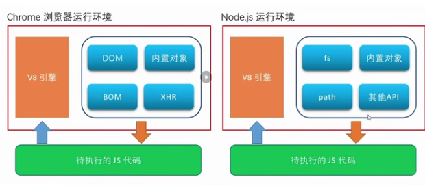
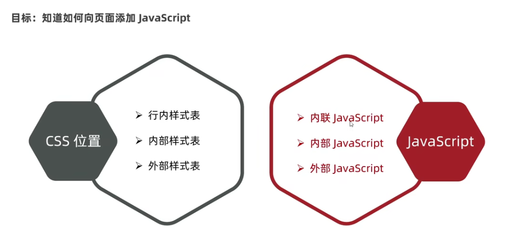

b
# JavaScript 定义

## 初步定义

JavaScript 是一种运行在客户端(浏览器)的编程语言,实现人机交互效果.

## 作用

> 改变HTML 内容 JavaScript Can Change HTML Content
> 网页特效(监听用户行为让网页做反馈)
  > Change HTML Attribute Values 
  > CSS styles 
  > Hide HTML Elements / Show HTML Elements
> 表单验证(针对表单数据合法性做判断)
> 数据交互(获取后台数据 渲染到前端)
> 服务端编程(node.js)

## JS组成
> ECMAScript 规定了 JS 基础语法核心知识 JavaScript was invented by Brendan Eich in 1995, and became an ECMA standard in 1997.
  - 比如:变量 分支语句 循环语句 等等
> WEB APIS 
  >DOM 页面文档对象模型 操作文档.比如对页面中的元素进行移动 大小 添加 删除等操作
  >ROM 浏览器对象模型 操作浏览器.检测窗口宽度,储存数据到浏览器等等.

# JavaScript 书写位置



1.内部 JavaScript

直接写在 HTML 文件里,使用 Script 标签包住
规范:script 标签写在`</body>`的上面.(专业)

```HTML
<body>
  <h1>hi</h1>
  <script>
    /*弹出警示框*/
    alert('hello JS')
  
  </script>
</body>
```

2. 外部 JS (多用这个)
代码写在 .js 结尾
语法:通过 script 标签 引入到 html 页面

注意事项: script 中间无需写其他代码,否则容易被忽略
It separates HTML and code
It makes HTML and JavaScript easier to read and maintain
Cached JavaScript files can speed up page loads

   ```html
   <body>
     <script src="myScript.js"></script>
  </body>

   ```

3. 内联


# JavaScript 注释

`//单行注释`
`/*多行注释 */`

# JavaScript 结束符 `;`

CSS 的分号是必须写的,不然会报错;
JS 中的结束符可写可不写(现在基本不写)
因此,要看团队要求,要写都写,要不写都不写


# 输入和输出的语法

交互语法
## JavaScript Output

JavaScript Display Possibilities

JavaScript can "display" data in different ways:

### Writing into the HTML output using `document.write(要输出的内容)`.
- 向 body 内输出内容
- 如果输出内容写的是标签,也会被解析成网页元素
- The document.write() method should only be used for testing.

### Writing into an alert box, using `window.alert()`. 警示框
你可以跳过window这个关键词。
在JavaScript中，窗口对象是全局范围的对象。这意味着变量、属性和方法默认都属于窗口对象。这也意味着，指定window关键字是可选的。
`<script>alert(5 + 6);</script>`

### Writing into the browser console, using `console.log()` 控制台
For debugging purposes, you can call the console.log() method in the browser to display data.
`<script>
console.log(5 + 6);
</script>
`


### Writing into an HTML element, using `innerHTML`.
To access an HTML element, JavaScript can use the document.getElementById(id) method.

The id attribute defines the HTML element. The innerHTML property defines the HTML content:

```html
<p id="demo"></p>
<script>
document.getElementById("demo").innerHTML = 5 + 6;
</script>
```

Changing the innerHTML property of an HTML element is a common way to display data in HTML.

## JavaScript Input


### `prompt` 输入示框

`prompt("how old are you ")`

联系:
```html
<script>

alert('Hello,JS')
document.write('JavaScript I am coming')

</script>
```

# 字面量 Literal

Literal 是在计算机中描述 事物的.
Fixed values are called Literals.
1. Numbers are written with or without decimals:
`10.50
1001`


2. Strings are text, written within double or single quotes:
"John Doe"
'John Doe'


