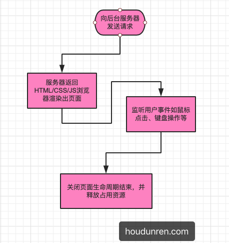

# JavaScript Basis

### 初步定义

JavaScript 官方名称是 `ECMAScript` 是一种属于网络的脚本语言,已经被广泛用于 Web 应用开发,常用来为网页添加各式各样的动态功能,为用户提供更流畅美观的浏览效果。

> 1995 年 2 月 Netscape 的`布兰登.艾奇`开发了针对网景公司的 `Netscape Navigator`浏览器的脚本语言 LiveScript。之后 Netscape 与 Sun 公司联盟后 LiveScript 更名为 JavaScript。
>
> 微软在 javascript 发布后为了抢占市场推出了 JScript。为了让脚本语言规范不在混乱，根据 javascript 1.1 版本推出了 ECMA-262 的脚本语言标准。
>
> ECMA 是欧洲计算机制造商协会由 Sum、微软、NetScape 公司的程序员组成。

**JavaScript 是一种运行在客户端(浏览器)的编程语言,实现人机交互效果.**

### 适用场景

- 浏览器网页端开发(改变HTML 内容 /网页特效/表单验证/数据交互)
- 做为服务器后台语言使用[Node.js](https://nodejs.org/en/)
- 移动端手机 APP 开发，如 Facebook 的 [React Native (opens new window)](https://facebook.github.io/react-native/)、`uniapp`、`PhoneGap`、`IONIC`
- 跨平台的桌面应用程序，如使用 [electronjs(opens new window)](https://electronjs.org/)


### JS运行流程

所有内容需要在特定的环境中运行，就像 PSD 需要在类似 PS 的软件处理一样。浏览器内置了处理的 JS 的解析器，但不同浏览器的性能不同，所以 JS 一般都在浏览器中执行，当然也有可以在服务器后台执行的 JS 解析器。

> Javascript is also different from most languages, as **it’s interpreted, not compiled** That means that you won’t know that you have syntax errors until you run it in the browser.

### JS组成

> ECMAScript 规定了 JS 基础语法核心知识 JavaScript was invented by Brendan Eich in 1995, and became an ECMA standard in 1997.
  - 比如:变量 分支语句 循环语句 等等
> - WEB APIS 
  >- DOM 页面文档对象模型 操作文档.比如对页面中的元素进行移动 大小 添加 删除等操作
  >- ROM 浏览器对象模型 操作浏览器.检测窗口宽度,储存数据到浏览器等等.

### JS书写位置


1.内部 JS

直接写在 HTML 文件里,使用 Script 标签包住

规范:script 标签写在`</body>`的上面.(专业)

```HTML
<body>
  <h1>hi</h1>
  <script>
    /*弹出警示框*/
    alert('hello JS')
  
  </script>
</body>
```

2. 外部 JS (多用这个)   通过设置 `src` 属性引入外部 js 文件。代码写在 .js 结尾


注意事项: script 中间无需写其他代码，因为不会执行会被忽略

   ```html
   <body>
     <script src="myScript.js"></script>
  </body>

   ```


### 代码注释

**单行注释**

```JS
<script>
  // 这是单行注释
</script>
```

**多行注释**

```js
<script>
  /*
  这是多行注释体验
  请关注后盾人每晚直
  */
</script>
```


## JS 的输入和输出

### JavaScript Output

JavaScript can "display" data in different ways:

#### Writing into the HTML output using `document.write(要输出的内容)`.

- 向 body 内输出内容
- 如果输出内容写的是标签,也会被解析成网页元素
- The document.write() method should only be used for testing.

#### Writing into an alert box, using `window.alert()`. 警示框

你可以跳过window这个关键词。
在JavaScript中，窗口对象是全局范围的对象。这意味着变量、属性和方法默认都属于窗口对象。这也意味着，指定window关键字是可选的。
`<script>alert(5 + 6);</script>`

#### Writing into the browser console, using `console.log()` 控制台

For debugging purposes, you can call the console.log() method in the browser to display data.
`<script>
console.log(5 + 6);
</script>
`

#### Writing into an HTML element, using `innerHTML`.

To access an HTML element, JavaScript can use the document.getElementById(id) method.

The id attribute defines the HTML element. The innerHTML property defines the HTML content:

```html
<p id="demo"></p>
<script>
document.getElementById("demo").innerHTML = 5 + 6;
</script>
```

Changing the innerHTML property of an HTML element is a common way to display data in HTML.

### JavaScript Input

#### `prompt` 输入示框

`prompt("how old are you ")`

联系:
```html
<script>

alert('Hello,JS')
document.write('JavaScript I am coming')

</script>
```

#### 字面量 Literal

Literal 是在计算机中描述 事物的.
Fixed values are called Literals.

1. Numbers are written with or without decimals:
`10.50
1001`


2. Strings are text, written within double or single quotes:
"John Doe"
'John Doe'

## Javascript Methods

#### access HTML elements

 there are 2 common methods that we can use
 `getElementsByTagName`  `getElementByID`

```js
let section = document.getElementsByTagName("section");
//This creates an array variable, even if there was only one section tag in the HTML.

let section = document.getElementsByTagName("section")[0];
//dd an index at the end to a specify one 

```

```js
let div = document.getElementById("home");
```


There are newer methods that you can use if you like to retrieve elements from the HTML. The `querySelector` and `querySelectorAll` methods use CSS selectors as parameters to retrieve elements. 

#### querySelector() & querySelectorAll()

The `querySelector()` method returns the **first** element that matches a CSS selector.

To return **all** matches (not only the first), use the `querySelectorAll()` instead.

Both `querySelector()` and `querySelectorAll()` throw a SYNTAX_ERR exception if the selector(s) is invalid.


```js
//Get the first <p> element:
document.querySelector("p");
//Get the first element with class="example":
document.querySelector(".example");
```

### Functions

Functions are quite easy to create in Javascript. Here’s a simple function:


```js
function hi(){
   console.log("hello,Dave");
}

function hello(name){
   console.log(`hello,${name}`);
}


function favNum(number){
   reture number * 42;
}
```

### The Document Object Model (DOM)

The `Document Object Model (DOM)` is the data representation of the objects that comprise the structure and content of a document on the web. In this guide, we'll briefly introduce the DOM. We'll look at how the DOM represents an HTML or XML document in memory and how you use APIs to create web content and applications.


When the browser loads a webpage, it creates a `DOM` for the page. It treats the `elements` as `objects`. 

These `objects` have children, siblings, and parents. All of these `objects` have methods and properties that we can use to access and manipulate the elements. 

If we wanted to change the `class attribute` of an element, we can do so using the `setAttribute` method:

```  
div.setAttribute("class","main"); //设置class属性为main
```

## Event Listeners


Javascript events provide a dynamic interface to a webpage. These events are hooked to elements in the Document Object Model(DOM).

We use listeners to determine what happens when an event occurs. For example, if a button is clicked, then the click event is triggered, and perhaps a function is called to decide the next course of action. 

Remember earlier when we had a script tag inside our `<body> `tag? I mentioned then that is probably not the best way to handle it. There is an event that occurs when the browser has completed loading the DOM. 

如果我们使用监听,就不必把 `script` 的标签放在 body 最下面了,我们可以把它放在 `head`里面.DOM 加载后,就可以开始 script.

When the DOMContentLoaded event is triggered, then the load function will be called. This allows us to put our `<script> `tag inside the` <head>` tag. Once the DOM is loaded we can start our script.


```js
document.addEventListener("DOMContentLoaded",load);
function load(){}
```


