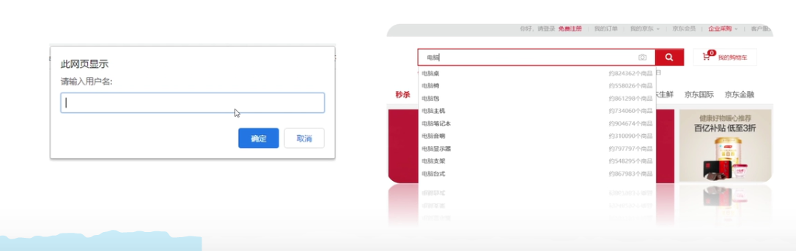
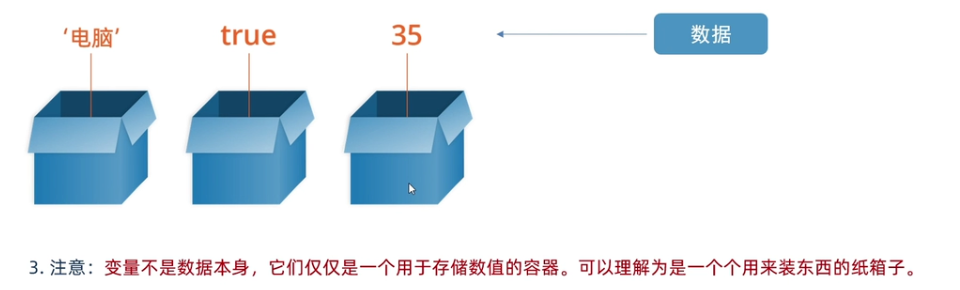

# JS Variables

目标: 理解变量是计算机存储数据的容器.

[toc]

## 理解变量

Q1 用户输入的数据如何储存? 变量.


就是装东西的盒子,可以让计算机变得有记忆. 变量不是数据本身,而是容器.



JavaScript syntax is the set of rules, how JavaScript programs are constructed:
```js
// How to create variables:
var x;
let y;

// How to use variables:
x = 5;
y = 6;
let z = x + y;
```


## 声明变量  

JS 中的变量是弱类型可以保存所有类型的数据，即变量没有类型而值有类型。变量名以字母、$、_ 开始，后跟字母、数字、_。

### 方法

可以使用多种方式定义变量比如 var、let 等（后面作用域章节会再讨论变量）。

```js
let name = 'houdunren';
```

以上代码是声明和赋值的结合

```js
let name ;
name = 'houdunren'
```

使用`,` 可以同时声明多个变量

```js
let n = 2,f = 3;
console.log(f);
```

下面演示了变量可以更换不同类型的数据

```js
let hd = 'houdunren';
console.log(typeof hd);

hd = 18;
console.log(typeof hd);
```

### 弱类型

在 JS 中变量类型由所引用的值决定

```js
var web = "hdcms";
console.log(typeof web); //string
web = 99;
console.log(typeof web); //number
web = {};
console.log(typeof web); //object
```

### 变量提升(*Var 并不好 建议其他赋值语句代替)

解析器会先解析代码，然后把声明的变量的声明提升到最前，这就叫做变量提升。

下面代码在解析过程中发现`while`不能做为变量名，没有到执行环节就出错了，这是一个很好的解析过程的体验。

```js
var web = 'houdunren';
console.log(web);
let while = 'hdcms'; //Uncaught SyntaxError: Unexpected token 'while'
```

使用 `var` 声明代码会被提升到前面

```js
console.log(a); //undefined
var a = 1;
console.log(a);  //1

//以上代码解析器执行过程如下
var a;
console.log(a); //1
a = 1;
console.log(a); //1
```

下面是 `if(false)` 中定义的 var 也会发生变量提升，注释掉`if` 结果会不同

```js
function hd() {
  if (false) {
    var web = "后盾人";
  }
  console.log(web);
}
hd();
```

虽然没执行，但是解析环境还是有变量提升的。这个过程不好。

使用 `var` 定义的代码，声明会被提升到前面，赋值还在原位置

```js
console.log(hd);
var hd = '后盾人';

//以上代码解析器执行过程如下
var hd;
console.log(hd); //后盾人
hd = '后盾人';
```

### TDZ

TDZ 又称暂时性死区，指变量在作用域内已经存在，但必须在`let/const`声明后才可以使用。

TDZ 可以让程序保持先声明后使用的习惯，让程序更稳定。

- 变量要先声明后使用
- **建议使用 let/const 而少使用 var**

使用`let/const` 声明的变量在声明前存在临时性死区（TDZ）使用会发生错误

```text
console.log(x); // Cannot access 'x' before initialization
let x = 1;
```

在`run`函数作用域中产生 TDZ，不允许变量在未声明前使用。

```text
hd = "houdunren";
function run() {
  console.log(hd);
  let hd = "hdcms";
}
run();
```

下面代码 b 没有声明赋值不允许直接使用

```text
function hd(a = b, b = 3) {}
hd(); //Cannot access 'b' before initialization
```

因为 a 已经赋值，所以 b 可以使用 a 变量，下面代码访问正常

```text
function hd(a = 2, b = a) {}
hd();
```

## 块作用域

### 共同点

`var/let/const`共同点是**全局作用域中定义的变量，可以在函数中使用**

```js
var hd = 'hdcms';
function show() {
	return hd;
}
console.log(show());
```

**函数中声明的变量，只能在函数及其子函数中使用**

```js
function hd() {
  var web = "后盾人";

  function show() {
    console.log(web);
  }
  show(); //子函数结果: 后盾人 因为没改变这个变量
  console.log(web); //函数结果: 后盾人
}
hd();
console.log(web); //全局访问: hd is not defined
```

**函数中声明的变量就像声明了私有领地，外部无法访问**

```JS
var web = "hdcms.com";
function hd() {
  var web = "houdunren.com";
  console.log(web); //houdunren.com
}
hd(); //houdunren.com
console.log(web); //hdcms.com
```

#### var

使用 `var` 声明的变量存在于最近的函数或全局作用域中，没有块级作用域的机制。

没有块作用域很容易污染全局，下面函数中的变量污染了全局环境

```JS
function run() {
  web = "houdunren";
}
run();
console.log(web); //houdunren
```

没有块作用作用域时 var 也会污染全局

```JS
for (var i = 0; i < 10; i++) {
  console.log(i);
}
console.log(i);
```

使用`let`有块作用域时则不会

```JS
let i = 100;
for (let i = 0; i < 6; i++) {
  console.log(i);
}
console.log(i);
```

下例中体验到 `var` 没有块作用域概念， `do/while` 定义的变量可以在块外部访问到

```JS
var num = 0;

function show() {
  var step = 10;
  do {
    var res = 0;
    console.log(num = step++);
    res = num;
  } while (step < 20);
  console.log(`结果是${res}`);
}
show();
```

`var` 全局声明的变量也存在于 `window`对象中

```JS
var hd = "houdunren";
console.log(window.hd); //houdunren
```

以往没有块任用时使用立即执行函数模拟块作用域

```js
(function() {
  var $ = this.$ = {};
  $.web = "后盾人";
}.bind(window)());
console.log($.web);
```

有了块作用域后实现就变得简单多了

```text
{
  let $ = (window.$ = {});
  $.web = "后盾人";
}
console.log($.web);
```

### [#](https://doc.houdunren.com/系统课程/js/1 基础知识.html#let)let

与 `var` 声明的区别是 `let/const` 拥有块作用域，下面代码演示了块外部是无法访问到`let`声明的变量。

- 建议将`let`在代码块前声明
- 用逗号分隔定义多个

`let`存在块作用域特性，变量只在块域中有效

```text
if (true) {
    let web = 'hdcms',url = 'houdunren.com';
    console.log(web); //hdcms
}
console.log(web); //web is not defined
```

块内部是可以访问到上层作用域的变量

```text
if (true) {
  let user = "向军大叔";
  (function() {
    if (true) {
      console.log(`这是块内访问：${user}`);
    }
  })();
}
console.log(user);
```

每一层都是独立作用域，里层作用域可以声明外层作用域同名变量，但不会改变外层变量

```text
function run() {
  hd = "houdunren";
  if (true) {
    let hd = "hdcms";
    console.log(hd); //hdcms
  }
  console.log(hd); //houdunren
}
run();
```

### [#](https://doc.houdunren.com/系统课程/js/1 基础知识.html#const)const

使用 `const` 用来声明常量，这与其他语言差别不大，比如可以用来声明后台接口的 URI 地址。

- 常量名建议全部大写
- 只能声明一次变量
- 声明时必须同时赋值
- 不允许再次全新赋值
- 可以修改引用类型变量的值
- 拥有块、函数、全局作用域

常量不允许全新赋值举例

```text
try {
  const URL = "https://www.houdunren.com";
  URL = "https://www.hdcms.com"; //产生错误
} catch (error) {
  throw new Error(error);
}
```

改变常量的引用类型值

```text
const INFO = {
  url: 'https://www.houdunren.com',
  port: '8080'
};
INFO.port = '443';
console.log(INFO);
```

下面演示了在不同作用域中可以重名定义常量

```text
const NAME = '后盾人';

function show() {
  const NAME = '向军大叔';
  return NAME;
}
console.log(show());
console.log(NAME);
```

### [#](https://doc.houdunren.com/系统课程/js/1 基础知识.html#重复定义)重复定义

使用 var 可能造成不小心定义了同名变量

```text
//优惠价
var price = 90;
//商品价格
var price = 100;
console.log(`商品优惠价格是:${price}`);
```

使用`let` 可以避免上面的问题，因为 let 声明后的变量不允许在同一作用域中重新声明

```text
let web = 'houdunren.com';
let web = '后盾人'; //Identifier 'web' has already been declared
```

不同作用域可以重新声明

```text
let web = 'houdunren.com';
if (true) {
	let web = '后盾人'; //Identifier 'web' has already been declared
}
```

但可以改变值这是与 const 不同点

```text
let price = 90;
price = 88;
console.log(`商品价格是:${price}`);
```

`let` 全局声明的变量不存在于 `window`对象中，这与`var`声明不同

```text
let hd = "hdcms";
console.log(window.hd); //undefined
```

### [#](https://doc.houdunren.com/系统课程/js/1 基础知识.html#object-freeze)
