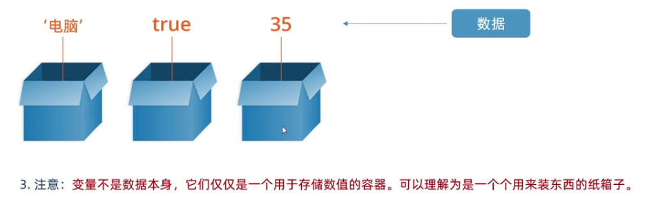

# 2.1 变量是什么

目标: 理解变量是计算机存储数据的容器.

Q1 用户输入的数据如何储存? 变量.


就是装东西的盒子,可以让计算机变得有记忆.
变量不是数据本身,而是容器.



JavaScript syntax is the set of rules, how JavaScript programs are constructed:
```js
// How to create variables:
var x;
let y;

// How to use variables:
x = 5;
y = 6;
let z = x + y;
```

JavaScript Values
The JavaScript syntax defines two types of values:

Fixed values
Variable values
Fixed values are called Literals.
Variable values are called Variables.


## 声明变量  

JavaScript uses the keywords var, let and const to declare variables.
4 Ways to Declare a JavaScript Variable:
- Using var (let 就是为了 干掉 var)
- Using let  * 比较新  变量
- Using const  * 比较新 常量
- Using nothing

```js
const price1 = 5;
const price2 = 6;
let total = price1 + price2;
```

> Always declare JavaScript variables with var,let, orconst.
The var keyword is used in all JavaScript code from 1995 to 2015.
The let and const keywords were added to JavaScript in 2015.
If you want your code to run in older browsers, you must use var.


let 和 var 的区别
> var可以先使用再声明,重复声明,不是很合理


### 语法: `let 变量名`
```
let x;
x = 6;
```
合并写法
```
let x = 6, y = 8;
```

注意数组的使用 
可以保存多个数据.
字面量用 [] 表示
从 0 开始的, `halo `是` arrary[2]`

```js
let arrary = ['hi','hello','halo']
```


## JavaScript Operators
JavaScript uses arithmetic operators ( + - * / ) to compute values:
`(5 + 6) * 10`


命名关键字:
JavaScript programmers tend to use camel case that starts with a lowercase letter:
firstName, lastName, masterCard, interCity.
