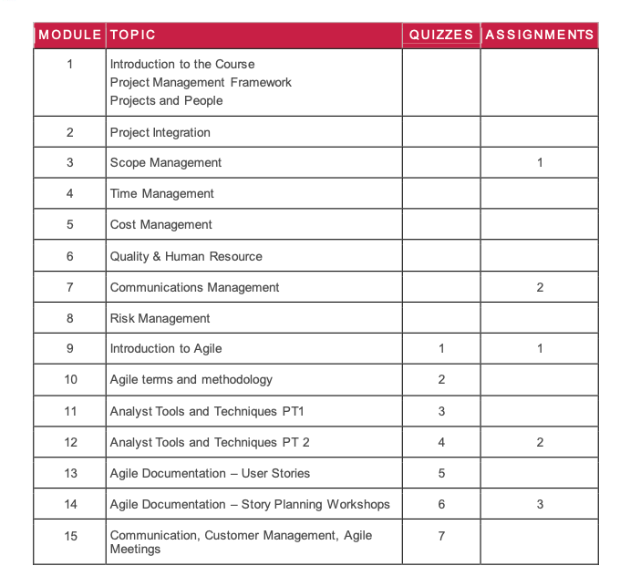
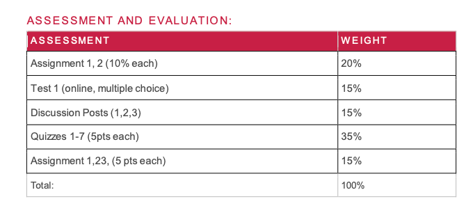
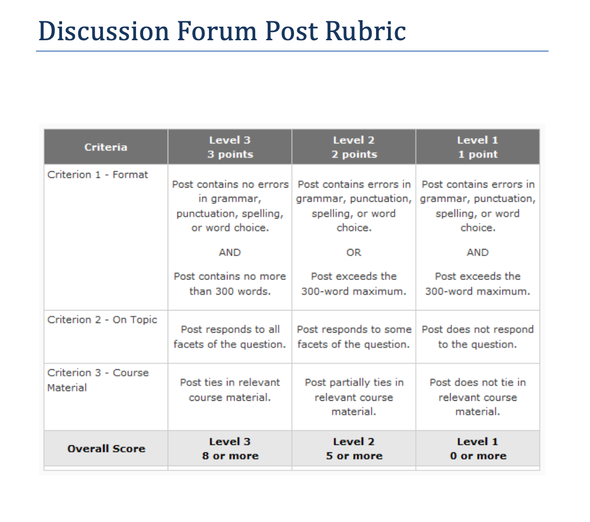
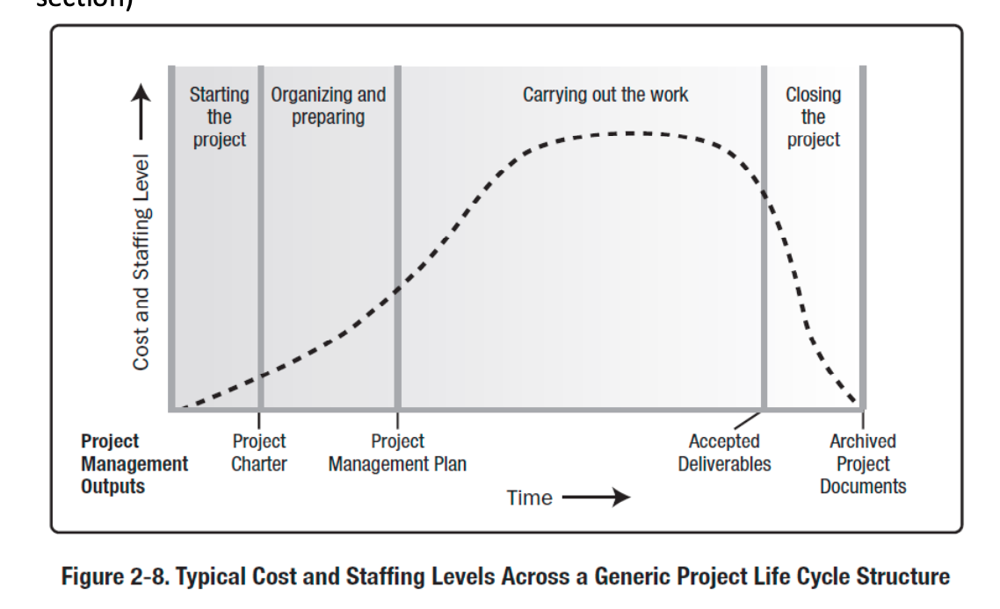

## Project Management Fundamentals and Agile Business Analyst

### Outline

#### what

1. This course will focus on the fundamental aspects and principles of project management,including life cycle, integration, planning, organization and communication. 

   - work breakdown structures
   - diagramming

   - cost management 

   - resource allocation

2. Examine issues affecting project management including risk management, quality, conflict, and team building.
3. Apply Agile methodologies, tools and techniques.
4. How to manage the project team and ensure a positive end user experience.

**Learning Outcomes:**

- Describe the project management framework.
- Describe the project management processes and interactions.
-  Describe the project management knowledge areas and processes. 
- Identify and document stakeholder needs and expectations.
- Identify and document project deliverables and work breakdown.
- Identify and estimate resources and costs, and develop budgets.
- Identify and estimate effort and time, and develop a schedule.
-  Identify, analyze and respond to project risks
- Develop, integrate, and present project plans, to achieve measurable objectives.
- Organize people resources; develop and lead a project team.

#### how

**Assesments**

3 discussion 15/100 2 PM Assignment 20/100 (15-25) 1.27  2.24 一个月一次作业

Test1(multiple choice)  20    --15

3 敏捷开发Assignment  15/100 （15-15-15） 3.17-3.21-4.14

7 quiz  35/100 

### **WEEK1 - Intro**

As a Project Manager, you will be expected to say what you are going to do, and deliver on your promises. 

Wouldn’t it be nice to have a detailed list of a bunch of best practices that you COULD use to make sure you manage your project correctly? 

The PMBOK is exactly that kind of reference and that’s why we refer to it when teaching you the fundamentals of project management (PM). In this way, you will share a common understanding of how projects can be managed with millions of PMs around the world, and also share the same language and terms.

To help keep things in perspective, the following process map (Table 3-1 from your text) can be used as a reference when you want to get a high level overview of the processes that project managers may employ when managing a project. You DO NOT need to memorize this table for this course – simply use it as a reference to re-orient yourself as you work through the course content from week to week.

### Week 2 – PM Framework

**Reading from PMBOK**

5th Edition: Chapters 1 – 3 6th Edition: Chapters 1 - 2

**Key Definitions & Terms**

- Project. A temporary endeavor undertaken to create a unique product, service, or result.
-  Project Management. The application of knowledge, skills, tools, and techniques to project activities to meet the project requirements.
-  Program. A group of related projects, subprograms, and program activities managed in a coordinated way to obtain benefits not available from managing them individually. 
- Portfolio. Projects, programs, subportfolios, and operations managed as a group to achieve strategic objectives.
- Project Management Office (PMO). An organizational structure that standardizes the project-related governance processes and facilitates the sharing of resources, methodologies, tools, and techniques.
- **3 Major Types of Organizational Structures:**
  -  Functional Organization. A hierarchical organization where each employee has one clear superior, and staff are grouped by areas of specialization and managed by a person with expertise in that area.
  -  Matrix Organization. Any organizational structure in which the project manager shares responsibility with the functional managers for assigning priorities and for directing the work of persons assigned to the project.
  - Projectized Organization. Any organizational structure in which the project manager has full authority to assign priorities, apply resources, and direct the work of persons assigned to the project.

- 4 Phases of the Generic Project Life Cycle: (See figure 2-8, phases are at the top of each section)

- 3 types of project life cycles:

  - Predictive Life Cycle. A form of project life cycle in which the project scope, and

    the time and cost required to deliver that scope, are determined as early in the life

    cycle as possible.

  - Adaptive Life Cycle. A project life cycle, also known as change-driven or agile

    methods, that is intended to facilitate change and require a high degree of ongoing stakeholder involvement. Adaptive life cycles are also iterative and incremental, but differ in that iterations are very rapid (usually 2–4 weeks in length) and are fixed in time and resources.

  - Iterative/ Incremental Life Cycle. A project life cycle where the project scope is generally determined early in the project life cycle, but time and cost estimates are routinely modified as the project team’s understanding of the product increases. Iterations develop the product through a series of repeated cycles, while increments successively add to the functionality of the product.

    

- 5 Process Groups:

  - Initiating Process Group. Those processes performed to define a new project or a

    new phase of an existing project by obtaining authorization to start the project or

    phase.

  - Planning Process Group. Those processes required to establish the scope of the

    project, refine the objectives, and define the course of action required to attain

    the objectives that the project was undertaken to achieve.

  - Executing Process Group. Those processes performed to complete the work defined in the project management plan to satisfy the project specifications.

  - Monitoring and Controlling Process Group. Those processes required to track, review, and regulate the progress and performance of the project; identify any areas in which changes to the plan are required; and initiate the corresponding changes.

  - Closing Process Group. Those processes performed to finalize all activities across all Process Groups to formally close a project or phase.

### Week 3 – Projects & People

Reading from PMBOK

5th Edition: Chapter 9 6th Edition: Chapter 3, 9, 13

Key Definitions & Terms
 Project Manager (PM). The person assigned by the performing organization to lead the team that is responsible for achieving the project objectives.
 3 Project Manager Competencies.
 11 Project Manager Interpersonal Skills.
 Leadership. Project Success.
 Stakeholder. An individual, group, or organization who may affect, be affected by, or perceive itself to be affected by a decision, activity, or outcome of a project.
 Project Management Staff. The members of the project team who perform project management activities such as schedule, communications, risk management, etc.
 Project Team. A set of individuals who support the project manager in performing the work of the project to achieve its objectives.
 Sponsor. A person or group who provides resources and support for the project, program, or portfolio and is accountable for enabling success.

7

### Week 4 – Project Integration

Reading from PMBOK

5th Edition: Chapter 4 6th Edition: Chapter 4

Key Definitions & Terms
 10 Project Management Knowledge Areas (don’t memorize definitions, just know the knowledge areas and be able to explain them in general terms):

- Project Integration Management. Project Integration Management includes the processes and activities needed to identify, define, combine, unify, and coordinate the various processes and project management activities within the Project Management Process Groups.
- Project Scope Management. Project Scope Management includes the processes required to ensure that the project includes all the work required, and only the work required, to complete the project successfully.
- Project Time Management. Project Time Management includes the processes required to manage the timely completion of the project.
- Project Cost Management. Project Cost Management includes the processes involved in planning, estimating, budgeting, financing, funding, managing, and controlling costs so that the project can be completed within the approved budget.
- Project Quality Management. Project Quality Management includes the processes and activities of the performing organization that determine quality policies, objectives, and responsibilities so that the project will satisfy the needs for which it was undertaken.
- Project Human Resource Management. Project Human Resource Management includes the processes that organize, manage, and lead the project team.
- Project Communications Management. Project Communications Management includes the processes that are required to ensure timely and appropriate planning, collection, creation, distribution, storage, retrieval, management, control, monitoring, and the ultimate disposition of project information.
- Project Risk Management. Project Risk Management includes the processes of conducting risk management planning, identification, analysis, response planning, and controlling risk on a project.
- Project Procurement Management. Project Procurement Management includes the processes necessary to purchase or acquire products, services, or results needed from outside the project team.
- Project Stakeholder Management. Project Stakeholder Management includes the processes required to identify all people or organizations impacted by the project, analyzing stakeholder expectations and impact on the project, and developing appropriate management strategies for effectively engaging stakeholders in project decisions and execution.

 Project Integration Management Processes:

1. Develop Project Charter. The process of developing a document that formally

   authorizes the existence of a project and provides the project manager with the

   authority to apply organizational resources to project activities.

2. Develop Project Management Plan. The process of defining, preparing, and

   coordinating all subsidiary plans and integrating them into a comprehensive project

   management plan.

3. Direct and Manage Project Work. The process of leading and performing the work

   defined in the project management plan and implementing approved changes to

   achieve the project’s objectives.

4. Monitor and Control Project Work. The process of tracking, reviewing, and

   reporting the progress to meet the performance objectives defined in the project

   management plan.

5. Perform Integrated Change Control. The process of reviewing all change requests;

   approving changes and managing changes to deliverables, organizational process assets, project documents, and the project management plan; and communicating their disposition.

6. Close Project or Phase. The process of finalizing all activities across all of the Project Management Process.

Project Charter. A document issued by the project initiator or sponsor that formally authorizes the existence of a project and provides the project manager with the authority to apply organizational resources to project activities.
 Project Management Plan. The document that describes how the project will be executed monitored, and controlled.

Perform Integrated Change Control. The process of reviewing all change requests; approving changes and managing changes to deliverables, organizational process assets, project documents, and the project management plan; and communicating their disposition.

Project Change Request. A formal request for a change to the project plan. It needs to be identified, evaluated, documented and either approved for inclusion in the project plan or rejected.

Close Project or Phase. The process of finalizing all activities across all of the Project Management Process Groups to formally complete a project or phase.

9

### Week 5 – Scope Management

Reading from PMBOK

5th Edition: Chapter 5 6th Edition: Chapter 5

Key Definitions & Terms
 Product Scope. The features and functions that characterize a product, service, or result. Project Scope. The work performed to deliver a product, service, or result with the specified features and functions.
 Project Scope Management. Project Scope Management includes the processes required to ensure that the project includes all the work required, and only the work required, to complete the project successfully.
 Scope Baseline. The approved version of a scope statement, work breakdown structure (WBS), and its associated WBS dictionary, that can be changed only through formal change control procedures and is used as a basis for comparison.
 Requirement. A condition or capability that is required to be present in a product, service, or result to satisfy a contract or other formally imposed specification.
 Key Benefit of Collecting Requirements – (page 110, section 5.2)
 Project Scope Statement. The description of the project scope, major deliverables, assumptions, and constraints.
 Work Breakdown Structure (WBS). A hierarchical decomposition of the total scope of work to be carried out by the project team to accomplish the project objectives and create the required deliverables.
 WBS Dictionary. A document that provides detailed deliverable, activity, and scheduling information about each component in the work breakdown structure.
 Create WBS: Tools and Techniques

- Decomposition. A technique used for dividing and subdividing the project scope and project deliverables into smaller, more manageable parts.

- Expert judgment. Judgment provided based upon expertise in an application area, knowledge area, discipline, industry, etc., as appropriate for the activity being performed. Such expertise may be provided by any group or person with specialized education, knowledge, skill, experience, or training.

  Key Benefit of Validating Scope – (page 133, section 5.5)
   Key Benefit of Controlling Scope – (page 136, section 5.6)
   Scope Creep. The uncontrolled expansion to product or project scope without adjustments to time, cost, and resources.

  Collect Requirements: Tools and Techniques

- Interview. A formal or informal approach to elicit information from stakeholders by

  talking to them directly.

- Facilitated workshops. Focused sessions that bring stakeholders together to define

  product requirements.

- Group creativity techniques. Brainstorming, idea/mind mapping are good

  examples.

10

- Questionnaires and surveys. Written sets of questions designed to quickly accumulate information from a large number of respondents.
- Benchmarking. Comparing actual or planned practices, such as processes and operations, to those of comparable organizations to identify best practices, generate idea for improvement and provide a basis for measuring performance.

11

### Week 6 – Time Management

Reading from PMBOK

5th Edition: Chapter 6 6th Edition: Chapter 6

Key Definitions & Terms
 Key Benefit of Defining Activities
 Activity List. A documented tabulation of schedule activities that shows the activity description, activity identifier, and a sufficiently detailed scope of work description so project team members understand what work is to be performed.

Rolling Wave Planning. An iterative planning technique in which the work to be accomplished in the near term is planned in detail, while the work in the future is planned at a higher level. ‘Progressive Elaboration’ is another term that is used.

Milestone. A significant point or event in a project, program, or portfolio.

The 4 Types of Dependencies:

-   Mandatory Dependency. A relationship that is contractually required or

  inherent in the nature of the work.

-   Discretionary Dependency. A relationship that is established based on

  knowledge of best practices within a particular application area or an aspect of

  the project where a specific sequence is desired.

-   External Dependency. A relationship between project activities and non-project

  activities.

-   Internal Dependency.

  Precedence Diagramming Method (PDM). A method of constructing a project schedule network diagram that uses boxes or rectangles, referred to as nodes, to represent activities. The nodes are connected with arrows that show the dependencies.

  Project Schedule Network Diagram. A graphical representation of the logical relationships among the project schedule activities.
   Key Benefit of Estimating Activity Resources
   Resource Calendar. A calendar that identifies the working days and shifts on which each specific resource is available.

  Bottom-Up Estimating. A method of estimating project duration or cost by aggregating the estimates of the lower-level components of the work breakdown structure (WBS).
   Key Benefit of Estimating Activity Durations
   Estimate Activity Durations - Tools and Techniques:

- Analogous Estimating. A technique for estimating the duration or cost of an activity or a project using historical data from a similar activity or project.

- Parametric Estimating. An estimating technique in which an algorithm is used to calculate cost or duration based on historical data and project parameters.

  12

• Three-Point Estimating. A technique used to estimate cost or duration by applying an average of optimistic, pessimistic, and most likely estimates when there is uncertainty with the individual activity estimates.

o Most Likely Duration. An estimate of the most probable activity duration that takes into account all of the known variables that could affect performance.

o Optimistic Duration. An estimate of the shortest activity duration that takes into account all of the known variables that could affect performance.

o Pessimistic Duration. Estimate of the longest activity duration that takes into account all of the known variables that could affect performance.

• Critical Path Method. A method used to estimate the minimum project duration and determine the amount of scheduling flexibility on the logical network paths within the schedule model.

-   Critical Path. The Critical Path is the path through the project and work that has the longest duration and that has the least amount of scheduling flexibility or float.

-   Schedule Baseline. The approved version of a schedule model that can be changed

  only through formal change control procedures and is used as a basis for

  comparison to actual results.

- Project Schedule. An output of a schedule model that presents linked activities with

  planned dates, durations, milestones, and resources.

- Schedule Compression. Techniques used to shorten the schedule duration without

  reducing the project scope.

o Crashing. A technique used to shorten the schedule duration for the least

incremental cost by adding resources.
 o Fast Tracking. A technique in which activities or phases normally done in

sequence are performed in parallel for at least a portion of their duration. • Scheduling Tool. A tool that provides schedule component names, definitions,

structural relationships, and formats that support the application of a scheduling method. *Course note: (E.g. Microsoft Project)

Earned Value Management. A methodology that combines scope, schedule, and resource measurements to assess project performance and progress. *Course note: Also refer to page 189, section 6.7.2.1 and page 217, section 7.4.2.1 for more detail on earned value management)

13

### Week 7 – Cost Management

Reading from PMBOK

5th Edition: Chapter 7 6th Edition: Chapter 7

Key Definitions & Terms
 Project Cost Management. Project Cost Management includes the processes involved in planning, estimating, budgeting, financing, funding, managing, and controlling costs so that the project can be completed within the approved budget.
 Key Benefit of Estimating Costs
 Basis of Estimate. Supporting documentation outlining the details used in establishing project estimates such as assumptions, constraints, level of detail, ranges, and confidence levels.

Estimating costs. Tools and Techniques:

-   Expert judgment. Expert judgment, guided by historical information, provides

  valuable insight about the environment and information from prior, similar projects.

  Can be used to determine estimating methods to use.

-   Analogous estimating. Uses information from a previous, similar project as the basis

  for estimating the measurements and parameters for a current project.

-   Bottom up estimating. The cost of individual work packages or activities is

  estimated to the greatest level of specified detail. Detailed cost is summarized to

  higher levels for reporting and tracking purposes.

-   Three point estimating. Estimating using the Optimistic, Pessimistic and Most Likely

  durations in a calculation. Examples: Averaging, PERT

  Key Benefit of Determining a Budget
   Cost Aggregation. Summing the lower-level cost estimates associated with the various work packages for a given level within the project’s WBS or for a given cost control account. Cost Baseline. The approved version of the time-phased project budget, excluding any management reserves, which can be changed only through formal change control procedures and is used as a basis for comparison to actual results.

14

Key Benefit of Controlling Costs

15

### Week 8 – Quality & HR Management

Reading from PMBOK
 5th Edition: Quality: Chapter 8 HR: Chapter 9
 6th Edition: Quality: Chapter 8 Resource Management: Chapter 9

Quality Key Definitions & Terms
 Project Quality Management. The processes and activities of the performing organization that determine quality policies, objectives, and responsibilities so that the project will satisfy the needs for which it was undertaken.

Cost-Benefit Analysis. A financial analysis tool used to determine the benefits provided by a project against its costs.
 Cost of Quality. A method of determining the costs incurred to ensure quality. Prevention and appraisal costs (cost of conformance) include costs for quality planning, quality control (QC), and quality assurance to ensure compliance to requirements (i.e., training, QC systems, etc.). Failure costs (cost of nonconformance) include costs to rework products, components, or processes that are non-compliant, costs of warranty work and waste, and loss of reputation.

Cause and Effect Diagram. A decomposition technique that helps trace an undesirable effect back to its root cause.
 Key Benefit of Performing Quality Assurance
 Quality Audits. A quality audit is a structured, independent process to determine if project activities comply with organizational and project policies, processes, and procedures.

Key Benefits of Controlling Quality
 Inspection. Examining or measuring to verify whether an activity, component, product, result, or service conforms to specified requirements.

HR Key Definitions & Terms
 Project Human Resource Management. Project Human Resource Management includes the processes that organize, manage, and lead the project team.
 Key Benefit of Planning Human Resource Management
 Responsibility. An assignment that can be delegated within a project management plan such that the assigned resource incurs a duty to perform the requirements of the assignment.
 Accountability. “answerability, blameworthiness, liability, and the expectation of account- giving.” http://en.wikipedia.org/wiki/Accountability, [05/09/2013]
 Authority. The right to apply project resources, expend funds, make decisions, or give approvals.
 Key Benefit of Developing the Project Team
 Phases of Team Development (excerpt page 276, 141 words):

16

o Forming. This phase is where the team meets and learns about the project and their formal roles and responsibilities. Team members tend to be independent and not as open in this phase.

o Storming. During this phase, the team begins to address the project work, technical decisions, and the project management approach. If team members are not collaborative and open to differing ideas and perspectives, the environment can become counterproductive.

o Norming. In the norming phase, team members begin to work together and adjust their work habits and behaviors to support the team. The team learns to trust each other.

o Performing. Teams that reach the performing stage function as a well-organized unit. They are interdependent and work through issues smoothly and effectively.

o Adjourning. In the adjourning phase, the team completes the work and moves on from the project

Colocation. An organizational placement strategy where the project team members are physically located close to one another in order to improve communication, working relationships, and productivity.
 Key Benefit of Managing the Project Team

5 General Techniques for Conflict Resolution (excerpt page 283, 119 words):

o Withdraw/Avoid. Retreating from an actual or potential conflict situation; postponing the issue to be better prepared or to be resolved by others.

o Smooth/Accommodate. Emphasizing areas of agreement rather than areas of difference; conceding one’s position to the needs of others to maintain harmony and relationships.

o Compromise/Reconcile. Searching for solutions that bring some degree of satisfaction to all parties in order to temporarily or partially resolve the conflict.

o Force/Direct. Pushing one’s viewpoint at the expense of others; offering only win- lose solutions, usually enforced through a power position to resolve an emergency.

o Collaborate/Problem Solve. Incorporating multiple viewpoints and insights from differing perspectives; requires a cooperative attitude and open dialogue that typically leads to consensus and commitment.

Influencing (excerpt page 515, 20 words). Influencing is a strategy of sharing power and relying on interpersonal skills to get others to cooperate towards common goals.

17

### Week 9 – Communications Management

Reading from PMBOK

5th Edition: Chapter 10 6th Edition: Chapter 10

Key Definitions & Terms
 Project Communications Management. Project Communications Management includes the processes that are required to ensure timely and appropriate planning, collection, creation, distribution, storage, retrieval, management, control, monitoring, and the ultimate disposition of project information.
 Key Benefit of Planning Communications – (page 289, section 10.1)

Interactive communication (excerpt page 295, 127 words). Between two or more parties performing a multidirectional exchange of information. It is the most efficient way to ensure a common understanding by all participants on specified topics, and includes meetings, phone calls, instant messaging, video conferencing, etc.
 Push communication. Sent to specific recipients who need to receive the information. This ensures that the information is distributed but does not ensure that it actually reached or was understood by the intended audience. Push communications include letters, memos, reports, emails, faxes, voice mails, blogs, press releases, etc.
 Pull communication. Used for very large volumes of information, or for very large audiences, and requires the recipients to access the communication content at their own discretion. These methods include intranet sites, e-learning, lessons learned databases, knowledge repositories, etc.
 Key Benefit of Managing Communications – (page 297, section 10.2)
 Work Performance Reports. The physical or electronic representation of work performance information compiled in project documents, intended to generate decisions, actions, or awareness.
 Information Management Systems. Facilities, processes, and procedures used to collect, store, and distribute information between producers and consumers of information in physical or electronic format.

Project Performance Reporting. Information on project performance is reported to project stakeholders throughout the project’s life cycle. Information is collected, shared and distributed as required. Information must be distributed to project stakeholders in a timely manner. Distributed information will include the communications defined in the communications management plan as well as unexpected requests for information that come up periodically throughout a project.

Project Status Report. A project status report is a regular report that contains information describing how the project is tracking to its plan. It describes:

 Issues, problems, opportunities, and pending decisions related to the project.
 18

-   Accomplishments in the previous reporting period.

-   Expected accomplishments in the upcoming the reporting period.

-   Variance analysis comparing what was planned to what has actually been achieved.

  Note that project scope, schedule and budget are the three most common

  elements reported in the variance analysis.

• Information about project resources.

Project Meetings. t is important to have regular team meetings to ensure that everyone on the team is committed to and understands project progress.

19

### Week 10 – Risk Management

Reading from PMBOK

5th Edition: Chapter 11 6th Edition: Chapter 11

Key Definitions & Terms
 Project Risk Management. Project Risk Management includes the processes of conducting risk management planning, identification, analysis, response planning, and controlling risk on a project.
 Key Benefit of Planning Risk Management

Key Benefit of Identifying Risks
 Checklist Analysis. A technique for systematically reviewing materials using a list for accuracy and completeness.
 Assumptions Analysis. A technique that explores the accuracy of assumptions and identifies risks to the project from inaccuracy, inconsistency, or incompleteness of assumptions.
 SWOT Analysis. Analysis of strengths, weaknesses, opportunities, and threats of an organization, project, or option.
 Risk Register. A document in which the results of risk analysis and risk response planning are recorded.
 Key Benefit of Qualitative Risk Analysis
 Probability and Impact Matrix. A grid for mapping the probability of each risk occurrence and its impact on project objectives if that risk occurs.

20

Key Benefit of Planning Risk Responses
 Key Benefit of Controlling Risks
 4 Strategies for addressing negative risks (threats)

o Risk Avoidance. A risk response strategy whereby the project team acts to eliminate the threat or protect the project from its impact.

o Risk Transference. A risk response strategy whereby the project team shifts the impact of a threat to a third party, together with ownership of the response.

o Risk Mitigation. A risk response strategy whereby the project team acts to reduce the probability of occurrence or impact of a risk.

o Risk Acceptance. A risk response strategy whereby the project team decides to acknowledge the risk and not take any action unless the risk occurs.

4 Strategies for addressing positive risks (opportunities).

21

### Week 11 – Procurement & Stakeholder Management

Reading from PMBOK
 5th Edition: Procurement: Chapter 12 Stakeholder: Chapter 13 6th Edition: Procurement: Chapter 12 Stakeholder: Chapter 13

Procurement Key Definitions & Terms
 Project Procurement Management. Project Procurement Management includes the processes necessary to purchase or acquire products, services, or results needed from outside the project team.
 Key Benefit of Planning Procurement Management
 Conduct Procurements. Conduct Procurements is the process of obtaining seller responses, selecting a seller, and awarding a contract.
 Key Benefit of Controlling Procurements
 Contract Change Control System. The system used to collect, track, adjudicate, and communicate changes to a contract.
 Procurement Performance Reviews. A structured review of the seller’s progress to deliver project scope and quality, within cost and on schedule, as compared to the contract. Inspections and Audits. A process to observe performance of contracted work or a promised product against agreed-upon requirements.
 Close Procurements. The process of completing each project procurement.
 Deliverable Acceptance

Stakeholder Key Definitions & Terms
 Project Stakeholder Management. Project Stakeholder Management includes the processes required to identify the people, groups, or organizations that could impact or be impacted by the project, to analyze stakeholder expectations and their impact on the project, and to develop appropriate management strategies for effectively engaging stakeholders in project decisions and execution.
 Key Benefit of Identifying Stakeholders
 Stakeholder Analysis. A technique of systematically gathering and analyzing quantitative and qualitative information to determine whose interests should be taken into account throughout the project.
 4 Strategies for dealing with stakeholders placed into a power/interest grid (labels in center of each quadrant):

22

Stakeholder Register. A project document including the identification, assessment, and classification of project stakeholders.
 Key Benefit of Planning Stakeholder Management
 5 Levels of Stakeholder Engagement (excerpt page 402, 60 words).

o Unaware. Unaware of project and potential impacts.
 o Resistant. Aware of project and potential impacts and resistant to change.
 o Neutral. Aware of project yet neither supportive nor resistant.
 o Supportive. Aware of project and potential impacts and supportive to change.
 o Leading. Aware of project and potential impacts and actively engaged in ensuring

the project is a success.

Key Benefit of Managing Stakeholder Engagement Key Benefit of Controlling Stakeholder Engagement