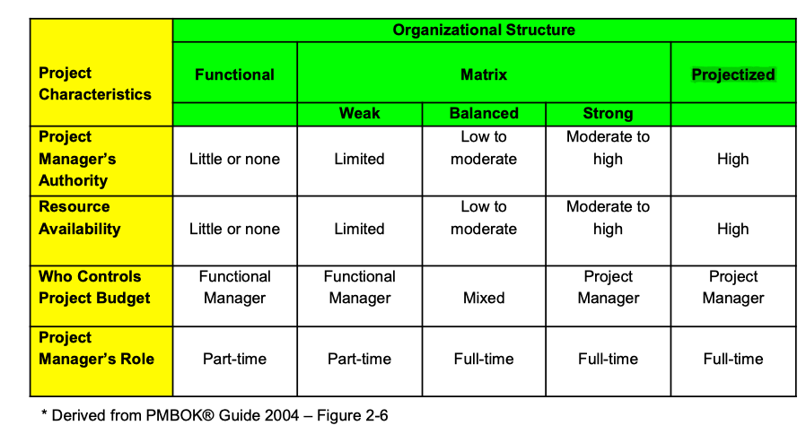

#### 1.Define project and project management 

**Project:** 

A project is a temporary endeavour undertaken to create a unique product, service or result.

> eg:Developing a new product, Designing a new vehicle,

- Temporary means that a project has a definite, well-defined beginning and a definite, well-defined end. While the duration of a project can vary greatly from a few hours or days to multiple years, it is finite. It will end.

  > You launch a project to install a hot tub in your back yard. The building and installation project is finite. It starts and ends. The product created, in this case the hot tub, lasts long after the installation project is over.

Creating a unique product, service or result is an important characteristic of a project.

progressive elaboration

**Project Management** 

PM is the application of knowledge, skills, tools and techniques to project activities to meet project requirements.

Project Management includes, but is not limited to, all of the work that is done to:

- Initiate the project,*/*ɪˈnɪʃieɪt/
- Identify project requirements,
- Determine and set project objectives,
-  Execute the project activities,
- Manage and control the quality, scope, time and cost of a project,
-  Identify and manage risk,
- Satisfy project stakeholders,
- Manage project change, and
- Close the project

Using Project Management skill you can:

- Effectively define and manage the project scope.
- Determine the costs of a project, build a project budget, and track and control the costs and budget as the project proceeds.
-  Develop, track and manage a project schedule.
- Determine the resources (people, materials, and equipment) that are required to deliver the project objectives.
- Manage project communications. 80-90% of a project manager’s job is communication.

Many key factors must be balanced in managing a project. Four important ones are: Scope, Time, Cost and Quality.

Scope, Time, and Cost are often referred to as the Triple Constraint. All three elements need to be balanced in order to effectively manage a project. As one factor changes, one or both of the other factors will also change.

#### 2.Define program ,portfolio,and project management office

A Program is a group of related projects managed in a coordinated way to obtain benefits and control not available from managing them individually.

Projects can be subdivided into manageable components called subprojects.

> Projects can be subdivided into manageable components called subprojects.
>
> A subproject may related to a single phase of a project, or may be set up to take advantage of some specific technical or people skills required. On very large projects, the subprojects themselves may be further subdivided into subsubprojects.

A portfolio is a collection of projects or programs and other work that is grouped together to make it easier for an organization to meet broader, strategic business objectives.

> Typically a portfolio has goals of its own to achieve and is managed by senior level managers within the organization. 

Many organizations set up a special unit called a Project Management Office (PMO) to centralize and coordinate the management of projects.

### 3.Explain the differentces between operations and project work.

- Projects, as we have seen, are temporary and unique. The purpose of a project is to meet its objectives and then end.

- Operations are ongoing and repetitive. The purpose of operations is to keep the business going. Objectives are constantly changing as the needs of the business evolve.

#### 4.Explain how organizational cultures and styles effect a project.

#### 5.Describe the 3 major types of organizational structures.

The functional organization is one that many people are familiar with. In this type of organization there is a clear hierarchy where every employee has one clear supervisor. People are grouped into functional areas based upon the type of work they do.Project work is typically coordinated across the functional groups by the functional managers.In a purely functional organization each department works independently of the others. Information flows up the chain to the functional manager, across to another functional manager, and then down through the structure to the staff working on the project.

At the opposite end of the spectrum is the fully projectized organization. In a projectized organization the project manager directly controls the project staff. The Project staff report directly to the project manager for the duration of the project.Most of the resources in the company are focused on delivering projects so project managers have a great deal of authority and independence.Project teams are often co-located and identify themselves as members of the project rather than members of a particular functional department. The project team members are usually working full time on the project.

Matrix organizations are a blend of the functional and projectized organizational structures. There is a variety of different types of matrix organization depending upon how mature the project management culture is in the organization.

- In a weak matrix organization many of the main characteristics of the functional organization are maintained. Project staff still typically report to their functional manager, budgets are controlled by the functional manager and so on. The project manager is more of a coordinator than a manager in this type of an organization.

- Strong matrix organizations share many of the characteristics of the projectized organization. Project teams are assigned to projects and the project managers themselves may be grouped into their own department with their own functional manager. The Project Manager has lots of authority and will work full time on the project.

- Balanced matrix organizations are more of a blend of the features of the strong and weak matrix organizations. There is any number of combinations.

#### 6.Identify the 4 phases of the generic project life cycle.

#### 7.Explain the 3 types of project life cycles.

#### 8.Identify and describe the 5 project management process groups be the project management institute.

A process is a set of interrelated actions and activities that are performed to achieve a pre-specified set of products, results or services.

The project management processes can be organized into five groups of one or more processes each.

-  Initiating Processes

  > Initiating Processes are those processes related to starting a project or a project phase. They include any activities that allow a reasonable definition of what the project needs to achieve. This includes activities such as:
  >
  > Two key documents are produced:
  >
  > • the Project Charter, which defines the rationale for the project, and
  >
  > • the Preliminary Scope Statement, which provides initial, high-level definition of what the project will do.

- Planning Processes

  > Planning Processes are used to gather information from many sources and assemble it into a Project Management Plan. 

- Executing Processes

  > Executing Processes carry out the project plan by performing the activities identified in the planning processes. 

- Controlling Processes

  > Controlling Processes consist of those things done to observe the project execution and monitor it so that progress can be reported, and that problems can be detected and resolved quickly.

- Closing Processes

  > Closing Processes describe the project and administrative things needed to bring the project to an orderly end. 
  >
  > This will include disbanding the project team, looking at lessons learned and closing out any third-party contracts among other things.

A Project Stakeholder is an individual or organization involved in a project, or those whose interests may be positively or negatively affected as a result of project execution or completion.
