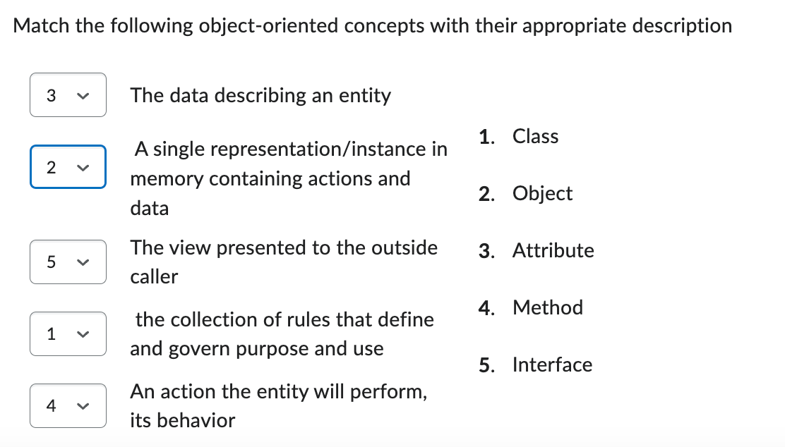

Reading: chapter1

Videos: https://www.linkedin.com/learning/programming-foundations-object-oriented-design-3/object-oriented-thinking?u=75841506

## OOD(Object Oriented Development)

 When you think of a cup in general abstract terms, it follows certain rules and has a specific purpose, this is the class. 

An object is an instance in memory that follows the rules of its class

A class is a set of rules that govern what data is stored in the object and what actions it can perform

### Attribute

Your cup has attributes that allow it to work.

 In this case a big opening in the center that allows you to put stuff in. You might say your cup is most useful when it has content. Content would be an attribute (or property) of cup. You can pour say tea to your cups content. I think that would make more sense than basin.

### State

The state of your cup has now changed, it was empty, now it has tea content. This is how we refer to an objects state in object-oriented development. **An objects state is the current value of all its attributes.**

### Behaviors

By adding tea to your cup, you can perform new actions with it. The Drink action is perhaps enabled. Don’t burn your tongue. You Drink the Cups Content. Once the Content is empty, you can no longer Drink.

#### Encapsulation

*/*ɪnˌkæpsjuˈleɪʃ(ə)n*/*

Encapsulation is the term for separation of outside maintainable data versus internal private data

This makes it easier to manage complexity, as the code can be broken down into smaller, more manageable parts.

#### Inheritance

Inheritance is a term that allows one class to use all the rules of another but add specializations only it has.

#### Abstraction

Abstraction occurs when your class is very general and has attributes and actions but needs a specialized class instantiated as an object or they can't be done, it has no idea how to do them itself.

**‘is a’ or ‘has a’, Inheritance or Composition**

Your holiday mug ‘has a’ handle and content and a temperature allowance, **‘has a’ indicates attributes**. Your holiday mug ‘is a’ cup. It follows all the rules of cup but adds the temperature specialty, ‘**is a’ indicates inheritance.**

#### Getters and Setters

To access an `attribute `of an object it must provide you access with its interface. The interface of a mug is a hole in the top and a handle. You use the handle to hold the mug with your hand and provide its contents via the hole in the top. You can then drink the contents via the same interface.

The `get` and` set` of this content is only available through this interface, if the content could be changed without knowledge of the interface, then you would not be able to count on your desired result, you could think of this like a magic unseen hole in the bottom of your cup.

Therefore, the content of your class should never be directly accessible from outside forces.`public String Name;'`should never be used, it should be private and then grant access.

Many languages now allow this construct setup to be automatically completed and hidden from the developer it’s so important. Public Property Name as String in VB automatically creates all getters and setters as well as a private variable _Name. This is also seen in class diagrams. A class with a public attribute is assumed to be a private variable with public get and set methods, since a fully public attribute should never exist.

#### Read only attributes (get only)

Temperature allowance is an attribute of cup then, one you can’t change but one you can see.

#### Polymorphism

ˌ/pɑlɪˈmɔrfɪzm/

Polymorphism occurs when the exact same action can perform different tasks in classes in an inheritance relationship.

With our original concept of tea in mind, what if we’re talking iced tea? Its still tea but you pour it differently and will drink it differently from the cup as well. This is where polymorphism comes in. 

Your cup knows you will drink from it, but how you drink from it will be different based on the type of cup as well as its contents.

 You will drink differently from the specialized holiday cup then the iced tea cup, so the specialization must put different actions inside the commonly known drink action implemented by the cup class.

## 3 Programming Paradigms

### Procedural(PP)

PP is a paradigm that organizes code using procedures, also known as subroutines, functions or routines, and follows a step by step approach for the problem-solving process. In PP the focus is on the functions that should be performed rather than on the data on which they operate. Examples of PP languages include `C, Fortran, and Pascal.`

The purpose of PP is to break down a problem into a series of steps, and to provide a clear and organized way of implementing solutions. 

when we choose PP

1. The process is a small and simple one without integration or interaction
2. The process is internal to the IT department, no outside user involvement

Why is that? 

The longer the process, the more actions you need to get to your result. A big long process with action after action is hard to debug and find an issue so you often have to simply start at the beginning and walk it through line by line until you find the problem. u can create re-usable action based code, it’s just much harder to work with later in a larger code base.

### Object-Oriented(OOP)

OOP is a programming paradigm that organizes code using objects and classes to represent real-world entities. OOP is a widely used paradigm, and it is known for its ability to manage complexity, promote reusability, and improve maintainability. Examples of OOP languages include `Java, C++, and C#`.

The purpose of OOP is to manage complexity, promote reusability, and improve maintainability of the code. 

There are 2 big requirements for proper object-oriented programming if it’s going to help you keep your large code base easy to maintain.

1. Behaviors and the data they need are stored in the same class. Parameters should only be needed if the action needs data that is not normally attributed to the class as well to complete. The action depends on the data in the object at the time the action is executed, known as the objects State.
2. The classes, attributes, and actions are created and stored in the language of the business.

Concepts

- Class:  the collection of rules that define and govern purpose and use

- Object:  A single representation/instance in memory containing actions and data

- Attributes: The data describing an entity

- Method: An action the entity will perform

- Interface: The view presented to the outside caller

Incomplete Truths

1. Object Oriented development was created to make code more reusable

   > Procedural code is action oriented, that doesn't mean you can't break a problem down into many actions and re-use them.

2. Procedural is sequential, so they made object oriented development.

   > All programming is sequential, Only the actor can change the sequences but they are still sequences

### Functional（FP）

FP is a paradigm that emphasizes the use of functions to organize and structure code. FP is commonly used for building systems that need to perform a lot of mathematical calculations, or need to handle large data sets efficiently. Examples of FP languages include `Haskell, Lisp, and Scala.`

The purpose of FP is to make the code more expressive, easy to reason about and to handle large data sets efficiently. 

A lot of developers really like to use it though because it is an action oriented paradigm which makes understanding and solving complex problems easier for them. Since functional programming is stateless, they only have to know and understand exactly what's been provided to the action at the time it is called.

**It's worth noting that** many modern languages could be classified in more than one of these paradigms, as they can support a combination of different paradigms such as `Python`, `JavaScript`.

## 1.3 UML Diagram

UML Unified Modelling Language is a set of rules that software designers follow to produce diagrams in a uniform way to help describe/document their program.

- Class Diagram:  map class relationships that are used to allow connections between their objects and show the attributes and actions of a class 

  > Provide a clear and high-level view of the system's architecture, and to help developers understand the relationships between different parts of the code.

- Use Case Diagram: shows the relationships of different use cases an actor(user(wishes to perform.

  > Provide a clear and concise view of the system's functionality, and to help developers understand the requirements of the system from the user's perspective. 

- Activity Diagram: allows you to model a process as a collection of activities and transitions

- Sequence Diagram: maps the sequence of message flow from the actor to the classes

  > Model the dynamic aspects of a system, and to help developers understand the interactions between objects and the flow of control within a system.

- State Diagram: shows actions to be performed when an objects state changes

## Question

1. A core concept of class design is  **Inheritance**which says that actions and data are also part of a more 
2. When a class "Is a" type of another class you can use **Inheritance** to say they follow the same core rules
3. An Objects 'State' is defined by the current value of it's**attributes** defined by it's class
4. Composition is when one class attribute indicates it 'has a' different class. The attributes type is complex and has rules.
5. 