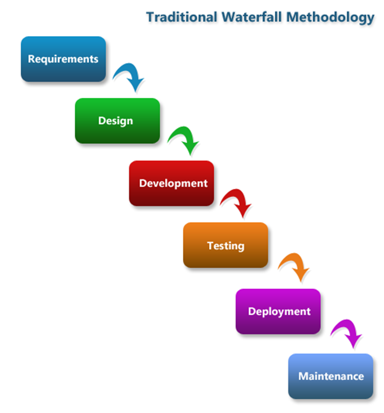

This Module will walk you through how to break a basic requirements specification down into the components needed to better understand the application you are building.

You will provide your design thoughts on the requirements and produce the documentation needed to begin the analysis phase of your design. You will learn different aspects of requirements gathering. You will look at documents produced in a Waterfall and Agile format.

- The Object-Oriented Thought Process Chapter 2

https://www.linkedin.com/learning/programming-foundations-object-oriented-design-3/object-oriented-thinking?u=75841506

https://www.linkedin.com/learning/requirements-elicitation-and-analysis/analysis-overview-8357555?u=75841506

## Project Styles and Requirements

The project style in use will vary how much information you will have available to design your software.

The most common methodologies are:

- Waterfall
- V-Model
- Iterative/Incremental
- Agile

These have been listed in order of 'Having the most detailed requirements' to 'Having a minimum of requirements'

### waterfall

Waterfall is the oldest form of software development life cycle. The premise is all of the requirements are gathered and analyzed first in great detail. The development process then runs until the entire application is complete at which point it's delivered/deployed. The process runs from start to finish with no deviation or looping back.

**Development Techniques**

Prototyping - To try and help reduce risk of change a prototype of the project can be shown to the project sponsor for early feedback and proof of concept. Unfortunately, there was only one point of feedback near the beginning. To make matters worse the prototype was usually horribly hacked together and had a nasty habit of becoming the application.

Personas - This is a huge investment in requirements as it requires development of extremely detailed fake user profiles complete with hobbies, families, likes and dislikes. It helps developers with no real user feedback options attempt to think like the users they are developing the software for. Long term it can prove out to create a better user experience and more user focused developers.

**Advantages**

**Easy to Budget** - Because the project is designed in its entirety up front it's easy to estimate reasonably accurate costs

**Easy to Manage** - There's no deviations or decisions other then move on to the next phase when this phase is delivered

Disadvantages

- Rigidity 

  \- While it's advantages are based in this it's also it's disadvantage

  1. There can be no change in requirements. The problem being solved cannot change as this process will deliver what was asked for.
  2. No allowance for missed requirements

- **No Feedback** - The solution is provided in it's at the end so no chance for user input once they've seen it

When to use

