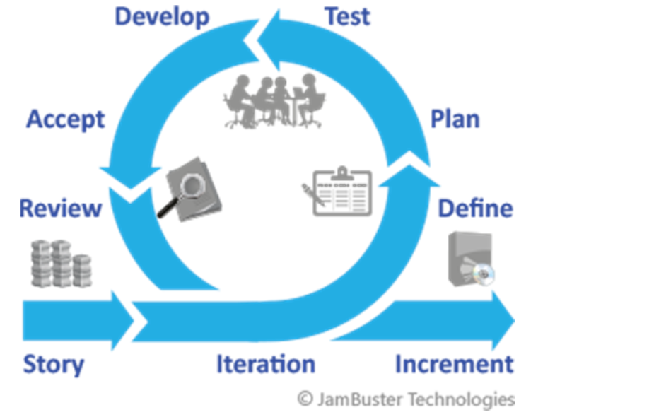
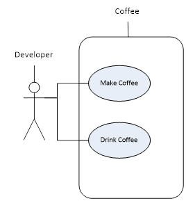
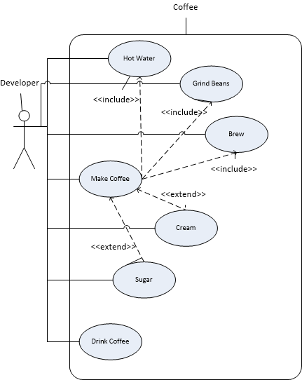

This Module will walk you through how to break a basic requirements specification down into the components needed to better understand the application you are building.

You will provide your design thoughts on the requirements and produce the documentation needed to begin the analysis phase of your design. You will learn different aspects of requirements gathering. You will look at documents produced in a Waterfall and Agile format.

## Project Styles and Requirements

### Project Style

The project style in use will vary how much information you will have available to design your software.

#### waterfall

The Waterfall method is a traditional and linear approach to software development. It is also known as the "Linear Sequential Model" and it is one of the oldest and most widely used project management methodologies.

In the Waterfall model, the development process is divided into distinct phases and each phase must be completed before the next one can begin. The phases typically include requirements gathering and analysis, design, implementation, testing, and maintenance. Each phase has specific goals and deliverables, and they are completed in a linear and sequential order.

The key characteristics of the Waterfall model are:

- Each phase of the project must be completed before the next one can begin.
- Changes and modifications are difficult to make once a phase has been completed.
- The project is divided into distinct phases with specific goals and deliverables.
- The testing phase is done only at the end of the project.

**Development Techniques**

Prototyping - To try and help reduce risk of change a prototype of the project can be shown to the project sponsor for early feedback and proof of concept. Unfortunately, there was only one point of feedback near the beginning. To make matters worse the prototype was usually horribly hacked together and had a nasty habit of becoming the application.

原型 - 为了尝试和帮助减少变化的风险，可以向项目发起人展示项目的原型，以获得早期反馈和概念证明。不幸的是，在接近开始时只有一个反馈点。更糟糕的是，原型通常是可怕的黑客攻击，并且有一个讨厌的习惯，那就是成为应用程序。

Personas - This is a huge investment in requirements as it requires development of extremely detailed fake user profiles complete with hobbies, families, likes and dislikes. It helps developers with no real user feedback options attempt to think like the users they are developing the software for. Long term it can prove out to create a better user experience and more user focused developers.

角色 - 这是一个巨大的需求投资，因为它需要开发极其详细的假用户资料，包括爱好、家庭、喜欢和不喜欢。它可以帮助没有真实用户反馈选项的开发者尝试像他们为之开发软件的用户那样思考。长期来看，它可以证明创造出更好的用户体验和更注重用户的开发者。

**Advantages**

**Easy to Budget** - Because the project is designed in its entirety up front it's easy to estimate reasonably accurate costs

**Easy to Manage** - There's no deviations or decisions other then move on to the next phase when this phase is delivered

**Disadvantages**

- Rigidity 僵化

  \- While it's advantages are based in this it's also it's disadvantage

  1. There can be no change in requirements. The problem being solved cannot change as this process will deliver what was asked for.
  2. No allowance for missed requirements

- **No Feedback** - The solution is provided in it's at the end so no chance for user input once they've seen it

**When to use**

Waterfall is best suited for projects where requirements are well understood and unlikely to change, and where a clear and unchanging project scope can be defined. It is also well suited for projects where the deliverables can be easily defined and measured.

- The project is of small duration (it can finish before changes may be required)
- There is no developer collaboration needed or if collaboration is difficult due to remote teams
- There is a low risk of requirements changing
- There is a need to have more precise budgeting

#### V-Model

The V-Model is a variation of the Waterfall model and is a structured approach to software development. It is also known as the "Vee-Model" or "Validation and Verification Model". It is a graphical representation of the software development process, where each phase of the project is represented by a box or a diamond shape.

The key characteristics of the V-Model are:

- Each phase of the project is followed by a corresponding test phase.
- The development process and the testing process are parallel and integrated.
- The project is divided into distinct phases with specific goals and deliverables.
- The testing phase is done at the end of each phase.
- The acceptance testing is done at the end of the project.

**Advantages**

> **Easy to Budget** - Because the project is designed in its entirety up front it's easy to estimate reasonably accurate costs

> **Easy to Manage** - There's no deviations or decisions other then move on to the next phase when this phase is delivered

> **Requirements are validated before coding** - Because test planning and development is parallel to the design and development processes

**Disadvantages**

- Rigidity 

  > \- While it's advantages are based in this it's also it's disadvantage. Even more rigid than Waterfall
  >
  > There can be no change in requirements. The problem being solved cannot change as this process will deliver what was asked for.
  >
  > No allowance for missed requirements
  >
  > If you try to account for changes you must revisit testing as well as design

- **No Feedback** - The solution is provided in it's at the end so no chance for user input once they've seen it. No possibility of an early prototype.

**When to use**

The V-Model is best suited for projects where the requirements are well understood and unlikely to change, and where a clear and unchanging project scope can be defined. It is also well suited for projects where the deliverables can be easily defined and measured.

- The project is of small duration (it can finish before changes may be required)

- There is no developer collaboration needed or if collaboration is difficult due to remote teams

- There is a low risk of requirements changing

- There is a need to have more precise budgeting

- There are quality assurance concerns

  ####  

#### Iterative/Incremental

The Iterative/Incremental model is an approach to software development that emphasizes on continuous iteration and incremental delivery of the product. It is also known as the "Iterative and Incremental Development (IID) model" or "Agile model".

In the Iterative/Incremental model, the development process is divided into small, manageable chunks called "iterations" or "sprints". Each iteration has a specific goal and deliverables, and at the end of each iteration, the product is reviewed and feedback is gathered. Based on this feedback, the next iteration is planned and the process is repeated.

**Development Techniques**

> **Go ugly early** - First pattern to allow delivering of the highest risk features first allowing for early cut and run if it will fail

**Advantages**

> Responsive to change** - Requirements for the iteration at gathered at its start so changes from the start of the project to that iteration are caught
>
> Work can be split up** - The project is broken down into smaller parts anyway so there is easier opportunity for simultaneous work
>
> **Feedback** - Each iteration can be a deliverable so there is more opportunity to assess risk of failure

**Disadvantages**

> **Budgeting is harder** - You don't have all the requirements early on so response to changing requirements could add a cost factor
>
> **Requirements for the iteration are up front** - Cannot respond to change inside an iteration so iterations must be kept as small as possible.
>
> **Communication problems** - The project is broken down which runs the risk of missed integration requirements or development not coordinated correctly.

**When to use**

Iterative/Incremental model is best suited for projects where the requirements are complex and change frequently, and where a clear project scope cannot be defined at the beginning. It is also well suited for projects where the deliverables are difficult to define and measure.

- The project is of longer duration (1 iteration is commonly a month duration)
- There is more concern for a viable product then cost overruns
- Developer collaboration is difficult due to remote teams
- There is a risk of requirements changing
- There are high risk features that may cause project failure

#### Agile

Agile is a project management methodology that emphasizes on flexibility, collaboration, and rapid delivery of working software. It is an iterative and incremental approach to software development that encourages regular inspection and adaptation of the product. Agile methodologies such as Scrum, Kanban, and Scaled Agile Framework (SAFe) are among the most popular.

Agile software development is an umbrella term covering many formats of development. Its foundation is in Iterative/Incremental design though. A team may implement many of these formats or only 1. The idea behind Agile is that your requirements are wrong, and you will fail. We all know it so why fight it? Let’s just fail faster, cleaner, and with less damage, so that we can fail again and still get it right by the end of the project. Keep failing until you get it right (or it's determined unfeasible). Get the software working the way the requester wants it. Make it so they can use it easily without thinking.

The Agile approach values individuals and interactions, working software, and customer collaboration over processes and tools. Agile teams work in short sprints, usually 2-4 weeks, during which they deliver a potentially releasable product increment.

 Why do we fail? 

Communication. 

The requester didn't ask for it right or the developer didn't build it right or everyone realized that something completely different was needed or that there are scenario's we didn't think about. Formats of Agile are about improving team communication and collaboration, getting a working feature in front of the requester as fast as possible, so they can ask for changes before it's too late. Iterations in Agile must be much faster. They will usually be contained in a major planning cycle called a Sprint. A slow Agile process will have weekly iterations with a monthly Sprint. The idea is each iteration has deployable/reviewable software at the end so it can be reviewed.

**Development Techniques**

The nature of Agile development brings a host of timeline and quality issues. To deal with them many of these techniques were developed and are usually required for an Agile team to be successful

- **Scrum** - A prescribed set of work ownership and team communication structure. This is commonly implemented even when not truly Agile and is usually viewed as a first step toward Agile. It's the first step to the development team controlling what they work on.

- **Lean** - Taken from manufacturing this involves analyzing the team’s throughput to production to find bottlenecks and improve efficiencies/eliminate waste. KANBAN is tied to this.

- **Continuous Integration** - The developer "Checks In" their change to a centralized source control (indicating completion and combining changes with others) and this automatically kicks off a release process for that code. The epitome is an automatic release to production with each check-in.

- Extreme Programming 

  > This is a combination of
  >
  > ​	paired programming (2 people working on 1 computer to solve the problem)
  >
  > ​	procedural/functional programming.
  > ​	The first idea is based on a developer spending 80% of their day solving and 20% coding. Applying 2 people to solving increasing coding throughput more than applying 2 people to coding and solving separately. The second is based on Object Oriented Programming being too complex and that re-usability is a myth.

- Test driven development (TDD) 

  > Writing an automated test first to drive the code that's actually written. This way you only development as much as needed and any further code changes/cleanup is protected by tests. This means any further change is protected thus improving QA.
  >
  > Deviations include Behavior Driven Development, Acceptance Test Driven Development, Scenario Driven development and many more...

**Advantages**

> Responsive to change** - The requester is shown working product they can request refinements against for immediate feedback
>
> Work can be split up** - All the work is broken down very small
>
> Business Priorities** - The business users usually control the order of work so developers are responding to highest needs.

**Disadvantages**

> **Budgeting is harder** - Responsiveness to change is hard to budget for. If you have a fixed internal team size doing regular work, then it doesn't really matter but planning for external support or pre-budgeting large project costs is extremely hard.
>
> Communication problems** - Even more so then Iterative/Incremental. The team has to be in nearly constant communication, not only with themselves but with the requesters. This is very hard on distributed teams.

When to use

- The project is of longer duration or the team is working on a permanent solution in constant flux
- There is more concern for a viable product than cost overruns
- Team communication is high, and requesters are engaged
- There is a risk of requirements changing

 

### Software Requirements Specification

Software projects should start with a specification. This is a high level summary of what the purpose of the software is and what it should do.

The specification can be in may formats depending on the templates favored by the team you're in. Some of these may be 20 pages long for a small project. They can appear in a Functional Specification, or a Software Requirements Specification, or whatever template is in use. What should be in all of them:

- **An executive summary** - This includes a summary of the business reason you’re developing the features. All the features in the document should align to this summary. This is the business goal your team is trying to achieve.

- The list of features

   

  \- There should be a brief title and small description of each feature you will be working on. This is likely a high-level description that may include a lot of functionality

  - Enter a Sale - The users will enter the items for sale and take payment from the customer

    What this means (these will appear as user stories or use cases):

    - Sales entry screen allowing entry
    - Product lookup and entry validation (assuming product entry feature has already been done)
    - Running total of sale
    - Applying discounts to a sale
    - Payment processors (1 per: cash, debit, Mastercard, Visa)
    - Saving the sale
    - Write accounting entries for sale
    - etc....

The Executive summary gives an idea of the projects purpose overall. The features give the list of Epics or major milestones. These then become the Use Cases and User Stories or if they are Epics are broken down into more cases the actor needs to do as part of that feature.

#### Wireframing

Wireframing is the process of creating a visual representation of a website or application's layout, structure and interface. It is used to plan the layout and functionality of a website or application before it is actually built.

Wireframes are typically simple, black-and-white illustrations that show the layout of a website or application, including the placement of text, images, and buttons. They do not include color, graphics, or final design elements.

The key characteristics of wireframing are:

- It's a visual representation of a website or application's layout
- It's simple and black-and-white illustrations
- It's used to plan the layout and functionality of a website or application
- It doesn't include color, graphics, or final design elements

Wireframing is an important step in the website or application design process as it helps to visualize and communicate the layout, structure, and functionality of the website or application. It allows designers, developers and stakeholders to see how the website or application will function and make changes before it's actually built.

In summary, wireframing is the process of creating a visual representation of a website or application's layout, structure, and interface, it's simple, black-and-white illustrations, it's used to plan the layout and functionality of a website or application, and it doesn't include color, graphics or final design elements.

#### Use Case Detail

A use case detail document comes out of the waterfall style projects but ties to Object Oriented Development (which we'll be covering later) through a document language style called UML. A Use Case details step by step how a type of user (known as an Actor) will interact with the system and what's expected of the system in return. Analysts today separate "Use Cases" in to two different types, for your reference we are only discussing "System Use Cases".

A use case detail is a detailed description of a specific use case that outlines the steps a user must take to complete a specific task or achieve a specific goal using a system or application. It describes the interactions between the user and the system, the inputs and outputs, and the conditions that must be met for the use case to be successful.

参考：coffee.pdf

A use case detail typically includes the following elements:

1. Title: A brief and descriptive title that summarizes the use case.
2. Actors: A description of the user or users who will interact with the system to complete the use case.
3. Preconditions: The conditions that must be met before the use case can begin.
4. Steps: A detailed description of the actions that the user must take to complete the use case, including inputs, outputs, and system responses.
5. Post-conditions: The conditions that must be met after the use case has been completed.
6. Alternate flows: A description of any alternative paths that the user may take during the use case, and how the system will handle those paths.
7. Exception flows: A description of any exceptional conditions that may occur during the use case and how the system will handle those conditions.
8. Notes and assumptions: Any additional information or assumptions that are relevant to the use case.

#### User Story

##### Keys to a good user story

1. Who will use it?
2. What would they like to do?
3. Why do they want it?
4. What must it do?

##### Basic common structure

As ***a type of user indicated\*** I want to ***perform a single sentence desired effect\*** so that I *a**n indicated business value***.

The 'So That I' section is often missed, however without it you will likely find the following:

- The user has an idea, but no real understanding if it will be of use, investigation should be done or this will be unnecessary work.
- The user knows exactly what the end result should be and is dictating what they think the solution should be assuming you can't do anything else. This will generate a lot of re-work as you struggle to find what it is they are actually trying to solve, and an easier solution may have been possible if you knew the end result.

The only thing missing from this is a clear **definition of done**. So, we add Acceptance Criteria, Constraints, and/or scenarios beneath when we talk with the requestor. This is where you have Functional and Non-Functional requirements.

- Acceptance Criteria - What will the users be testing on top of the simple sentence above to determine if the story is complete. e.g.: must have validation on screen if I don't enter this field
- Constraints - Are there limiting factors or outside concerns. e.g.: Must change the current sales process, Legal constraints, etc.
- Scenarios - How many ways can we see this happening? Are there different processes for different sets of data? Beware the words "I want it to always do this, every time"

#### Use Case Diagram

A use case diagram maps the use cases or stories that are needed to produce a system. It maps the case to the actor that will use it, and it maps interactions between cases as well.

An actor is the person, system, or time that initiates the use case and interacts directly with it. It’s what requests the process to start. Normally this is a person or time, however some note a system if this use case map doesn’t interact directly with a person, even if that other system obviously does.

A use case can interact with other use cases. A use case can either Extend another use case or Include it.

- **Extend** – One use case may start from the other
- **Include** – One use case always uses the other

If we look at a simple process such as the developer Making Coffee. The Developer is the actor, they want to make and drink coffee.

If we look at the whole process to make coffee though, it may be a little more complicated and need to be broken down into further use cases. On looking at the process closely the Developer needs to be more involved in the coffee making process.

Some items in this process are needed only and always for making coffee, others could be used on their own, and some may be used by the coffee press or not. The Developer is still actively performing all actions, but they are now recognized to have relationships to each other. Note the additional arrows to include or extend now have specific directions.

- Hot Water – Making Coffee requires this process (<<include>>)
- Grind Beans – Making Coffee requires this process (pre-ground is not available currently (<<include>>)
- Brew - Making Coffee requires this process (<<include>>)
- Cream – Nice to have if the Developer wants lighter coffee but not always required (<<extend>>)
- Sugar – Nice to have if the Developer wants lighter coffee but not always required (<<extend>>)

If we had a feature that coffee could be prepared the night before and an alarm would be set to brew the next morning. Then an additional actor of Time would interact with Brew alone.

 

### Self Assessment Module 2

A (Use Case Diagram) shows a map of use cases and the actor that executes them

Adding an Include stereotype on a line between used cases indicates the use case might or might not occur as part of this case (False)

Adding an Extend stereotype on a line between used cases indicates the use case might or might not occur as part of this case(True)

As A ________ - Provides the Actor, User, Context

I want to __________ - Indicates what they are trying to accomplish, end result

So That I __________ - The business value, why should this be done, what benefit

Acceptance Criteria - Elements the user is looking for when testing. Functional and non-functional requirements.

Scenario - A more specific example of one way the story will play out

Steps on a use case are divided into two parts. The (User, Actor) provides data and kicks of an event and the (System) processes and provides a result
