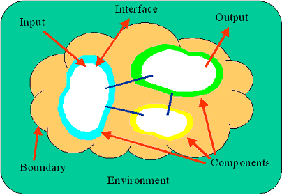

### Type of systems

| System Type                   | Description                                                  |
| ----------------------------- | :----------------------------------------------------------- |
| Transaction Processing system | This system captures information about business activities / transactions. These systems automated the data collection / modification processes.Example: Cash Register, Purchase Order 交易系统 |
| Office Automation system      | This system allows communication between people / companies and a system that allows people to create and share documents / reports / memos.Example: Word processing, E-Mail system 文字邮件系统 |
| Management Information system | This system allows users to work with information captured by Transaction Processing system for purposes of planning and control. The system converts the raw data that was captured in a Transaction processing system and makes it meaningful for management.Example: Reports indicating monthly sales figures, quarterly profit / loss. 季度销售 |
| Decision Support system       | This system allows a user to explore "what if" scenarios with information captured in a transaction processing system. This allows the user to make a decision about certain aspects of the business.Example: What if analysis to determine if more staff will be needed if sales during the holidays was to increase by 20%? |
| Expert Information system     | This system replicates the decision making process by having business rules and logic programmed into it, so that users can have the system supply them with answers based on the criteria fed into the system.Example: Doctor enters a patient's symptom into the system and it returns with a list of ailments that the patient may have. |

### Why BAs need to  know this information?

Different types of systems have changed the way companies do business today. More efficient！

- Transaction processing systems have reduced the need to have data entry people recording business transactions. 

- Office Automation systems have allowed businesses to speed up the communication process 

-  Management information systems have allowed business to summarize and report on business activities in a timely fashion. 

- Decision Support systems allow business to forecast future changes and make informed decisions. 

- Expert Information systems allow business to standardize the decision making process and provide users with all possible answers. 

  **All of these have greatly improved businesses, making them more efficient and effective** and as technology changes, more improvements become available. 

  Therefore, ensuring that **BAs** understand the types of systems, knowing that a solution may contain one or more of the types, we can **assist the business in defining the solution.**

Along with the different types of systems, there can also be d**ifferent types of business systems** and each has its own purpose

- Sales & Marketing - systems that capture sales data, forecast of sales, customer information and product information.
- Manufacturing & Production - systems that capture the production process, the product materials list, inventory control, raw materials, personnel time, quality and shipping documents.
- Finance & Accounting - systems that record and report financial information, budgets, cash flows and investments.
- Human Resources - systems that capture and record personnel information, performance evaluations, payroll and tax information

### Basic Function of a system

All IS system have four basis operations:

- **Entering data (Input)**
- **Changing / Manipulating data (processing),**
- **Extract data (Output), Store data (storage)**

Input -  input information into the system. need to be efficientand effective. 快速而准确. 

> Efficient is  reducing the time it takes to input the information. Effective is achieved by capturing the "right" information and there is a need to determine what information is "right". 

Processing -  process the information that has been captured whichalso needs to be efficient and effective. 

> Processing can mean that the info is stored for later retrieval, or the information is changed to a new state, or the information is combined with additional information to create new information. 

Output - Output the information from the system. 

The information can be extracted to a report, screen or file that is used by another system or user. 

When reviewing the outputs of a system it is important to question the usage of the information. 

Storage - The remaining step does not follow the sequence because information captured through an input, processed and then extracted through an output does not always need to be stored.

 However, storage is a major part of a system because it captures all of the information from transaction processing systems to be used by all of the other systems. 

The capability to store information for later usage is a great benefit of systems and careful attention should be given to it when defining requirements. Determining the correct relationship between data allows the development of the storage areas to be efficient and effective with retrieval occurs.

### System Characteristics

There are 9 characteristics that we will look at using the following diagram:

- Purpose - The purpose identifies the overall goal or function of the system. Understanding this allows the BA to gauge the effectiveness of the system in accomplishing it's goal or function.

- Components - A component provides a piece of functionality that makes up the system. 

  > When trying to determine the components of a system, it is important to try and not create many components that have limited functionality. The components identified should be similar in size and follow a natural grouping because the component can become a section that is reviewed for requirements - grouping the information together in a manageable size.
  >
  > Interrelationships - When defining components, it is also important to identify the interrelationships between components, indicating how they connect and how often.

- Boundary - The boundary indicates what is included in the system and what is excluded. 

  Often this is referred to the scope of the system.It is important for the BA to establish this boundary line early in the process and manage the change in it (also known as scope creep).Early in the requirements gathering process, a change in the boundary may have no impact on the development of the system because it is still early in the SDLC.

- Environment - the environment includes all the activities / functionalities that are outside of a system's boundary. These are often referred to as the items that are out of scope. 

  > It is important to identify these items because there is usually an interface between them and the system and the interface information must be captured.

- Constraints - Constraints identifies the limits of a system, indicating what it cannot do. The constraints can be from internal sources (within the boundary) or external sources (from the environment). It is important to identify this information because it indicates the limitations that a system has and this becomes requirements that should be captured. The source of the limitation is also important to note since business is constantly changing the constraint may disappear as time passes. Examples of constraints are: limited number of people to enter information, external sources cannot process electronic files.

- Interfaces - The interface identifies the point where the system interacts with the environment. The interface points allow information to enter or exit the system, defining requirements that would be included in gathering process. The interfaces are further broken down into Inputs and Outputs.
  - Inputs - identifies information that enters the system into one of the components.
  - Outputs - identifies information that exits the system from one of the components.

These characteristics can often be the starting point for a BA when collecting requirements. Understanding each of these areas about a system will take you along way in gathering the requirements.

