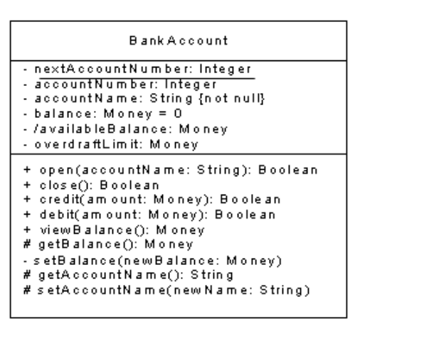
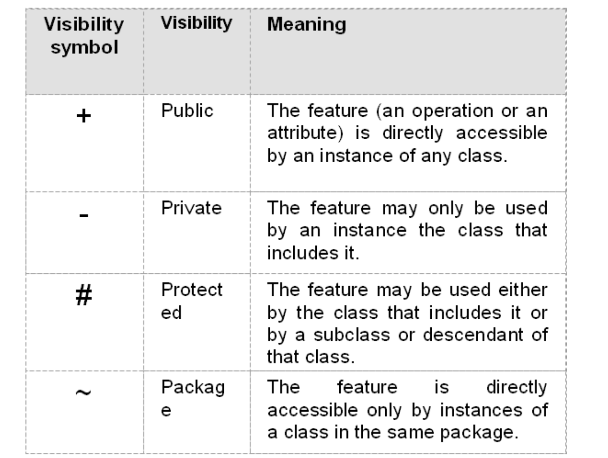

### Creating the Class Interface

#### Layout

Examine the class in the following class diagram from the text: Object-Oriented Systems Analysis and Design by Simon Bennett from McGraw Hill 

Create objects of type BankAccount, from the name at the top. 

There are 6 attributes, found in the top portion of the class. Their data types have also been provided already (though that often comes later in the design). The data types all represent simple information, so this class has no dependencies.

The bottom half of the class is it's actions, these include the accessors which you will note have the corresponding attribute in the name preceded by "get" or "set". An attribute with only a "get" accessor would be read-only. You'll note there are many special ways to use visibility to help control access with accessors.

#### Visibility

The following chart summarizes the possible visibilities for attributes and operations. By default we make all attributes private and some operations. Operations that need to be accessible to other objects should be made public. Within your class, public operations may call other internal operations to fulfill the duties of the public operations. These internal operations should be made private.

#### Class scope

Examine the attribute nextAccountNumber in the following class diagram from the text: Object-Oriented Systems Analysis and Design by Simon Bennett from McGraw Hill

The attribute nextAccountNumber is an example of a class-scope attribute. It is indicated by underlining. A class scope attribute occurs only once and is associated with the class not individual objects. nextAccountNumber holds the next available account number. When a new account is created, nextAccountNumber is incremented by 1. Being a class scope variable, it is accessible even if no instance of the class has been created.

It is also possible to have class scope operations. There are no class scope operations in the preceding example. If there were, they also would be underlined. A class scope operation can be called even when no instance of the class exists. It can also be called through objects of that class.

## Creating Associations

An association that must support message passing in both directions is a two-way association. A two-way association is indicated with arrowheads at both ends. Minimizing the number of two-way associations keeps the coupling between objects as low as possible. Determine the direction of message passing i.e., the navigability of the association. In general, an association between two classes A and B should considered with the questions:

- Do objects of class A have to send messages to objects of class B?
- Does an A object have to provide some other object with B object identifiers?

If yes, then A needs B's object identifier.

Let's examine an example from the text, but give it a user story:

As a Cabbie I want to drive people to their destination in my cab so I get paid.

A cabbie can drive only one cab at a time. A Cab could just be a Cab Number of course and then the attribute on Cabbie would contain just that. But if your analysis of other stories found that Cab was complex and had its own attributes, so Cab was a class, the Cabbie still needs his Cab, there are just more rules around what a cab is. So, Cabbie has a Cab (or MyCab) attribute of type Cab.

Since Cabbie has a Cab, his Drive behavior can Drive the current cab he has. Cabbie sends the message to Cab to move via its attribute. The Cab doesn’t need to know anything about the driver to move. If the Cabbie was car jacked, the cab would still drive away. So Cab doesn’t need to send a message to Cabbie, it’s just waiting to be told to move, so the message is one direction, from Cabbie to Cab, which is why Cab doesn’t have a Cabbie attribute.

You may be thinking about more complex scenarios where the Cab needs to inform the Cabbie of something right now. What if the Cab needs to inform the Cabbie the engine is overheating? What if the Cab wants to tell the Cabbie to put on his seat belt? You might thing this means the Cab will need access to the Cabbie. When creating direct access to another class, think of it as ceding control. Does the Cab throw the Cabbie out if their seat belt isn’t on? Does it pull itself over if the engine light comes on? No this isn’t Herbie. We cover events in later modules, for right now the Cabbie has control of how they respond, so Cabbie has the attributes. An attribute indicates direct and immediate access.

 