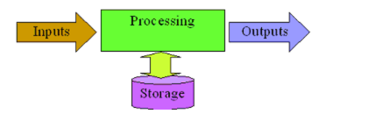
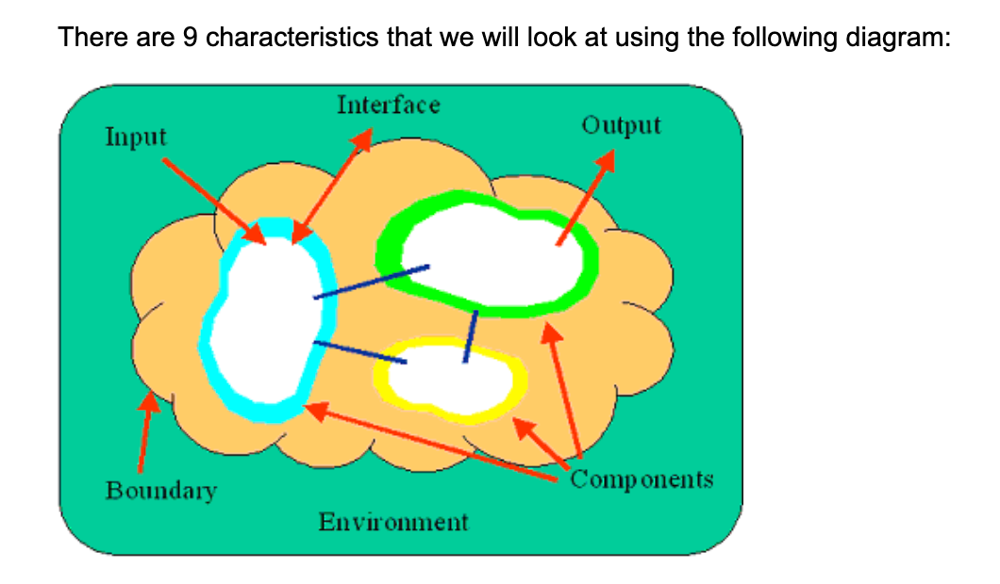

Understanding Requirements for Systems Development

 [toc]

## Topic 1: Types of Systems

#### **Types of Information Systems**

 This information provides insight into the type of functionality the system has to offer, its limitations and the amount of complexity it may have. The following is a list of system types, a description of them that indicates their functionality, their limitations and the degree of complexity.

| System Type                               | Description                                                  |
| ----------------------------------------- | ------------------------------------------------------------ |
| Transaction Processing system交易处理系统 | This system captures information about business activities / transactions. These systems automated the data collection / modification processes.Example: Cash Register, Purchase Order |
| Office Automation system办公自动系统      | This system allows communication between people / companies and a system that allows people to create and share documents / reports / memos.Example: Word processing, E-Mail system |
| Management Information system管理信息系统 | This system allows users to work with information captured by Transaction Processing system for purposes of planning and control. The system converts the raw data that was captured in a Transaction processing system and makes it meaningful for management.Example: Reports indicating monthly sales figures, quarterly profit / loss. |
| Decision Support system决策支持系统       | This system allows a user to explore "what if" scenarios with information captured in a transaction processing system. This allows the user to make a decision about certain aspects of the business.Example: What if analysis to determine if more staff will be needed if sales during the holidays was to increase by 20%? |
| Expert Information system专家信息系统     | This system replicates the decision making process by having business rules and logic programmed into it, so that users can have the system supply them with answers based on the criteria fed into the system.Example: Doctor enters a patient's symptom into the system and it returns with a list of ailments that the patient may have. |

#### **So why do we need to know this information?**

These different types of systems have changed the way companies do business today. 

- Transaction processing systems have reduced the need to have rooms full of data entry people recording business transactions.
-  Office Automation systems have allowed businesses to speed up the communication process internally and externally. 
- Management information systems have allowed business to summarize and report on business activities in a timely fashion. 
- Decision Support systems allow business to forecast future changes and make informed decisions.
- Expert Information systems allow business to standardize the decision making process and provide users with all possible answers. 

All of these have greatly improved businesses, making them more efficient and effective and as technology changes, more improvements become available. Therefore, ensuring that BAs understand the types of systems, knowing that a solution may contain one or more of the types, we can assist the business in defining the solution.

Along with the different types of systems, there can also be different types of business systems and each has its own purpose. A subset of the business systems is listed below:

- Sales & Marketing - systems that capture sales data, forecast of sales, customer information and product information.
- Manufacturing & Production - systems that capture the production process, the product materials list, inventory control, raw materials, personnel time, quality and shipping documents.
- Finance & Accounting - systems that record and report financial information, budgets, cash flows and investments.
- Human Resources - systems that capture and record personnel information, performance evaluations, payroll and tax information

#### **4 Basic Function of System**

Enter data (Input), Manipulate data (processing), Extract data (Output), Store data (storage)

- Input - Typically this is captured in a Transaction Processing system, where business information is captured. It is important for the input of information to be efficient and effective. Efficient is improved by reducing the time it takes to input the information. Effective is achieved by capturing the "right" information and there is a need to determine what information is "right".

  > For example, at a shoe store, you can collect a lot of information about your customers; shoe size, name, address, payment information Therefore, for each system the "right" information must be collected through the input step.

- Processing - process the information that has been captured. Processing can mean that the information is stored for later retrieval, or the information is changed to a new state, or the information is combined with additional information to create new information. What ever occurs, the system does something with the data.

  Processing also needs to be efficient and effective. Management Information systems, Decision support systems and Expert information systems all contain some processing logic to transform the data into information that can be used.

- Output - output the information from the system. The information can be extracted to a report, screen or file that is used by another system or user. When reviewing the outputs of a system it is important to question the usage of the information. Overtime, the outputs created become obsolete `
  /*ˌɑːbsəˈliː/`and the systems never get updated with the new information. Also, the identification of output information that is used by the users indicates the information that must be captured in the input process.

- Storage - The remaining step does not follow the sequence because information captured through an input, processed and then extracted through an output does not always need to be stored. 

  However, storage is a major part of a system because it captures all of the information from transaction processing systems to be used by all of the other systems. The capability`
  /*ˌkeɪpəˈbɪləti*/ `to store information for later usage is a great benefit of systems and careful attention should be given to it when defining requirements. Determining the correct relationship between data allows the development of the storage areas to be efficient and effective with retrieval occurs.

#### **9 System Characteristics**

There are 9 characteristics that we will look at using the following diagram:

- Purpose - The purpose identifies the overall goal or function of the system. Understanding this allows the BA to gauge the effectiveness of the system in accomplishing it's goal or function.

- Components - A component (also known as sub-system) provides a piece of functionality that makes up the system. 

  > For example: in a payment system, the functionality to create a cheque would be a component. It provides some functionality that is used by the system, but the system also provides more functionality that just the one component. In this example, the system could also have a component to create the gross payment amount, net payment amount, select payment method, etc.

  When trying to determine the components of a system, it is important to try and not create many components that have limited functionality. The components identified should be similar in size and follow a natural grouping because the component can become a section that is reviewed for requirements - grouping the information together in a manageable size.

  Interrelationships - When defining components, it is also important to identify the interrelationships between components, indicating how they connect and how often.

- Boundary - The boundary indicates what is included in the system and what is excluded. Often this is referred to the scope of the system. Knowing what is in scope and what is out of scope defines what requirements are collected for a system. 

  Functionality that is out of scope would not be included in the requirements process. It is important for the BA to establish this boundary line early in the process and manage the change in it (also known as scope creep).

  Early in the requirements gathering process, a change in the boundary may have no impact on the development of the system because it is still early in the SDLC. However, a change in the boundary late in the SDLC will almost always have an impact on the system and project. Therefore it is often recommended that a BA quickly determines the boundary of the system and tries to test it by ensuring that activities that exist in the environment area are not to be included in the development of the system.

- Environment - the environment includes all the activities / functionalities that are outside of a system's boundary. These are often referred to as the items that are out of scope. It is important to identify these items because there is usually an interface between them and the system and the interface information must be captured.

  > An example of this characteristic would be the following: In an payment system, the actual funds transfer of money from the sender's bank account to the receiver's account is done by a financial institution. 
  >
  > This activity would be considered out of scope and would be an activity that occurs in the environment. There is still an interaction with it because the transfer of funds still needs to occur, however, how it occurs is not the concern of the system. Often, this becomes the determining factor in deciding what is defined as in or out of scope, whether the system cares how the activity occurs. If it does not, then the activity is out of scope. If it does, then the activity is in scope. The environment can contain activities that are external to the company or other systems within the company.

- Constraints - Constraints identifies the limits of a system, indicating what it cannot do. 

  The constraints can be from internal sources (within the boundary) or external sources (from the environment). It is important to identify this information because it indicates the limitations that a system has and this becomes requirements that should be captured. The source of the limitation is also important to note since business is constantly changing the constraint may disappear as time passes. Examples of constraints are: limited number of people to enter information, external sources cannot process electronic files.

- Interfaces - The interface identifies the point where the system interacts with the environment. The interface points allow information to enter or exit the system, defining requirements that would be included in gathering process. The interfaces are further broken down into Inputs and Outputs.
  - Inputs - identifies information that enters the system into one of the components.
  - Outputs - identifies information that exits the system from one of the components.

These characteristics can often be the starting point for a BA when collecting requirements.

## Topic 2: Functional Business Requirements - Introduction

### FUNCTIONAL REQUIREMENTS

#### FORMALITY GUIDE:

- Rabbit Projects have short durations.
- Avoid writing the requirements before starting to build the product.
- Rushing to a solution before understanding the requirement generally wastes time.
- Without knowing the essential requirements, the solution is likely to solve the wrong problem.
- In this case using the scenarios (business events) to communicate the functional requirements is acceptable
- Horse Projects usually have the need to write requirements.
- It is vital that team members have a solid understanding of what a functional requirement is and what they do for the eventual product.
- Elephant projects need a complete and correct requirements specification

#### WHAT IS THE DEFINITION OF FUNCTIONAL REQUIREMENTS?

- Functional Requirements specify what the product must do to satisfy the work or business.
- They are independent of any technology used by the product.
- When it's time to design a solution for the functional requirements, the designer will add technological requirements that are needed for the solution.
- Technological requirements are sometimes lumped together with the Business Requirements.
- The 2 are collectively called Functional Requirements
- They must contain sufficient detail for the developer to construct or correct the product.
- The requirements are the contract to building the product
- Must describe in enough detail for the how the product will perform
- Must contain enough detail for the developer to build to the client's satisfaction
- If developer has no questions, too much detail has been provided
- Several artifacts reveal the products functionality.
- One of the most obvious is the scenario.
- You arrive at scenarios by partitioning the context of the work using the business events that affect it.
- For each business event there is a business use case.
- A scenario is a way to work with stakeholders and determine the needed functionality
- Each of the scenario's steps is decomposed into its functional requirement.
- Collection of the functional requirements will revel what the product has to do to satisfy each scenario

#### LEVEL OF DETAIL FOR FUNCTIONAL REQUIREMENTS

- **Requirements should be written as a single sentence with one verb.**
- Try to avoid the use of "and" as this indicates more than one requirement
- When there is "and" it is normally another requirement
- When your write the requirement as a single sentence you make the requirement testable.
- Requirements must always be measurable
- "Shall" makes the sentence active and communicates what the product intends to do
- Provides a consistent form for the developer and stakeholders
- In other organizations, the use of "must" is used for critical requirements and "should" for non critical requirements
- When using "shall", there may not be a solution to satisfy the requirement
- However, when it is a critical requirement, it must be met in order for the project to be successful
- **Clients need to review the requirements from their area and provide sign off**
- Requirements should focus on what the product is intended to do.
- The words "shall", "must", "will", "might" could result in semantic confusion & should not be used to indicate the priority of a requirement.
- **Business stakeholders should always participate in the development of the scenarios**

#### AVOIDING AMBIGUITY避免含糊不清

- When gathering requirements be aware of the potential for ambiguity and the misunderstandings that come from it.
- Use simple language and in terms that the client will understand
- Do not use developers terminology -use terms that relate to the client's work area
- Do not use acronyms unless they are well known to all stakeholders
- Do not use words that have more than one meaning
- Do not use slang as this might be confusing
- Do not use "sayings" - e.g. break a leg
- When writing a requirement, read them aloud to a colleague
- Confirm understanding with the client
- Each requirement needs to be uniquely identified

#### TECHNOLOGICAL REQUIREMENTS

- Technological Requirements are functionality needed because of the chosen technology.
- Technological Requirements are not there for business reasons but rather to make the chosen implementation work.
- They should be documented in a separate document or clearly identified as Technological Requirements when documented with the Business Requirements.
- It is important that the Technological Requirements are not introduced before the Business Requirements.

#### REQUIREMENTS NOT SOLUTIONS

- There is a difference between a requirement and its solution.
  - It is important to your requirements discovery that you do not write solutions instead of requirements. Why is it important?
  - Because it is far too easy to hide important functionality by describing an implementation

- Grouping Requirements
  - Functional Requirements should be grouped by use case.
  - By doing this, it becomes easy to discover related groups of requirements and to test the completeness of the functionality.

- It is recommended that High Level and Low Level Requirements are not defined as it can create problems as they are subjective.

## Topic 3: Non-Functional Requirements - Introduction

“非功能需求描述产品将事情做到什么程度。”

“需要这些属性，不是因为它们是产品的功能活动（诸如计算、操作数据等活动），而是因为客户希望这些活动以特定的方式执行，并达到特定的品质。
作为非功能需求在真实生活中的例子，让我们来看看亚马逊公司：亚马逊的网站很容易导航，这让客户容易找到东西，当然，这是网站的目标。它也很友好，让你觉得自己是尊贵的顾客：你可以写评论，通过购物伙伴和亚马逊的推荐得到指引，很容易查看和安排送货，等等。亚马逊使得人们在它的网站上购物变得很有吸引力，人们确实这样做了，因此，亚马逊成为了世界上最大的在线零售商。同样，苹果公司的iPad很直观，看起来很愉快，易于使用，6岁的小孩不需要父母指导，就能使用iPad。另一个例子了，纽约时报APP的观感在醒目地说：“这是一份报纸，不是一组博客。”不论哪里的成功产品，我们都清楚地看到它们发现了非功能需求。”

“功能需求是动词，非功能需求是形容词。
非功能需求可能造成产品被接受、深受喜欢或无人使用。
”

#### Lesson Notes

1.When a product meets all the functional requirements, why would a client reject it?

2.Why are some products never used and why do clients resort back to manual processes?

- The product does not meet the client's non-functional requirements, such as performance, usability, or security.

- The product does not align with the client's overall business strategy or goals.

- The client does not like the product's design or user interface.
- The product is too expensive for the client's budget.
- The client has found a better solution from a different vendor.
- The client has changed their requirement and now it does not align with what was developed.
- The client has internal communication issues and not all stakeholders are on board with purchasing.
- There is a lack of trust or confidence in the vendor.
- There might be any other organizational/political reason internally with the client.

Why

- Lack of attention to non functional requirements could be the reason

- Non Functional Requirements are important.

  - They specify how well your product does what it does.

  - They are the qualities your product must have or how well it does things.

  - They make the product attractive, or usable, or fast, or reliable, or safe.

  - They are used for e.g. specify response times, or accuracy limits on calculations.

  - They make up a significant part of the specification.

  - They describe the character or the way that functions will behave.

- On occasion the nonfunctional aspects of the product are the prime reason for doing the project.

  ​	> E.g. Clients find the product to be slow, difficult to use, unreliable.

- Nonfunctional requirements are often overlooked and sometimes this neglect leads to the downfall of a project.

#### FORMALITY GUIDE

- Rabbit projects can use the requirements specifications document 
- To use this document, determine which ones are the highest priorities.
- However, "all of them" is not an acceptable answer.
- Rabbit projects are small, quick and repeatable and cannot accommodate "all of them"
- However, there are some requirements that are needed in all projects including the smaller ones:
  - Support requirements
  - Naming requirements
  - Scope
- Horse Projects have multiple stakeholders.
- Business Analysts need to capture the non functional requirements as well as deal with conflicts between requirements.
- When dealing with different functional areas, they will not always agree in the requirements
- This should be done early on the project.
- Elephant projects need to capture all of the requirements in a written form including non-functional requirements.
- Requirements can be grouped by use case but overlap is common.
- Grouping by type will help prevent duplication.

#### NON-FUNCTIONAL REQUIREMENTS:

- These requirements do not alter the product's essential functionality
- They may even add functionality to the product -e.g. add security
- They will be a significant part of the specs
- They could be the difference between an accepted product and one that is not used
- The usability of a product makes a huge difference to all the stakeholders
- The lack of usability can be a real source of client frustration
- It could also result in a lack of support for the BA in future projects

 ##### NON-FUNCTIONAL LOOK & FEEL REQUIREMENTS

- The look and feel requirements describe the intended spirit, the mood or the style of the products appearance.
- These requirements specify the intention of the appearance and are not a detailed design.E.g. - A look and feel requirement could be "The Product shall comply with corporate branding standards"
- Consider the look and feel requirements that you build into your next project.
  - Some might be:
  - Simple to use
  - Approachable
  - Professional looking
  - Conforming to the client's other products.
  - Innovative and appearing to be state of the art.

- You might want to describe the required look and feel by using a prototype.
- **Reminder: be careful not to design the solution, because you do not yet know the complete requirements of the product.**
- Designing is the task of the product's designers, once they know the requirements.

##### NON-FUNCTIONAL  USABILITY REQUIREMENTS 可用性要求

- Usability requirements are often left out of the requirements specification on the assumption that the programmer would not build a product that is hard to use.
- The product's usability might be key factors - do not assume the product will be usable.
- What is usable to one person could be unfathomable to another.
- The usability and humanity requirements make the product conform to the user's abilities and expectations.
- The usability requirements ensure you make a successful product.
- The usability requirements affect productivity, efficiency, error rates and acceptance of a new product.
- Carefully consider what your client is trying to achieve with the product before writing these requirements.
- Usability requirements are derived from what your client is trying to achieve with operability of the product.
- Pay particular attention to usability as it often leads you to discover the differentiating factor between competing products.

##### NON-FUNCTIONAL PERFORMANCE REQUIREMENTS:性能要求

- Performance requirements are used when the product needs to perform tasks in a given amount of time.
- Capacity is another performance requirement.
- How fast it has to be, how strong, how big & how often could also be requirements.
- Performance requirements should consider the following:
  - Speed to complete a task
  - Accuracy of the results
  - Volumes to be held by the product
  - Ranges of allowable values
  - Efficiency of resource usage

##### NON-FUNCTIONAL OPERATIONAL & ENVIRONMENTAL

- Operational requirements describe the environment in which the product will be used.
- In some cases the operating environment creates special circumstances that have and effect on the way the product must be constructed.
- Operational requirements can cover these issues:
  - The operating environment.
  - The condition of the users.
  - Partner or collaborating systems.
- It is appropriate to describe any operational requirements that relate to the successful installation of the product.

##### NON-FUNCTIONAL MAINTAINABILITY & SUPPORT REQUIREMENTS:

- When determining if you have any Maintainability & Support requirements, consider the following:
  - Organization
  - Environment
  - Laws that apply to the product
  - Business Rules

- Keep in mind that your requirements document is a contract to build the product.
- A Support requirement may be if your client may indicate that the product requires to be supported by a help desk or the product must be entirely self-supporting.

##### NON-FUNCTIONAL SECURITY REQUIREMENTS

Security is the most difficult type of requirement to specify.

These requirements can pose the greatest risk if they are not correct.

Security can be thought of as having 3 aspects:

- Confidentiality
  - Allows only authorized users access
  - When writing these type of requirements, they must specific and cover all the circumstances
- Availability
  - Outlines when the product will be available for use
- Integrity
  - Attempt to prevent misuse
  - Detect improper use
  - Handle conditions such as power failure
  - Disaster recovery

##### NON-FUNCTIONALCULTURAL & POLITICAL REQUIREMENTS

- Cultural and Political requirements are special factors that would make the product unacceptable because of human customs, religions, languages, taboos or prejudices.
- Cultural requirements are often unexpected and at first glance sometimes appear irrational.
- Culture is often taken for granted and ignored
- This can cause confusion for a diverse workforce
- Requirements also exist for purely political reasons
- These requirements are ones difficult to write and rationalize.
- These are often referred to "we have always done it that way"

##### NON-FUNCTIONAL LEGAL REQUIREMENTS

- When determining legal requirements, be aware of any laws that apply to your product.
- Write your requirements for the product to comply with these laws.
- You will need to determine if any laws are relevant to your product. For example :
  - Data protection Laws
  - Privacy Laws
  - Guarantee Laws
  - Consumer Protection Laws
  - Consumer Credit Laws
  - Right to information Laws

#### FINDING THE NON FUNCTIONAL REQUIREMENTS

- There are several ways to find the non functional requirements:
  - Use Cases
  - The Template
  - Prototypes and Non Functional Requirements
  - The Client

### **Discussion 2**

Identify the characteristics of a system to allow online course registration for Red River College.

Post your discussion on the discussion board. It is recommended that you complete the discussion post before starting the next module.

Student No: 0367133 Characteristics of a system

Yifanli

1.Characteristics of a system for online course registration:

- User-friendly interface: The system should be easy for students, staff, and faculty to navigate and understand;
- Real-time updates: The system should be able to process and display content and news;
- Testing system: Support testing and scoring;
- Compatibility： Support mobile phone and computer fast login and quick response

2. Examples 

**Functional business requirements:**

- Students should be able to make payments online
- Students should be able to take quizzes online;

**Non-functional business requirements:**

- Fast loading, low delay; Improve user's experience;
- Security: ensure the safety of student accounts; The web page runs reliably

### Quizs

Which of the following statements correctly completes the following sentence: The basic functions of a system are…Data Entry, Reporting, Processing, Data Storage

