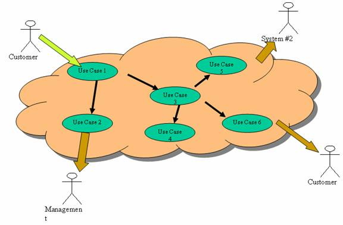
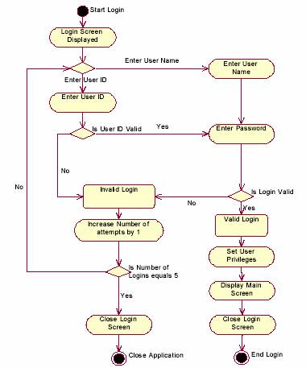

Module 6: Supporting Requirements – Topic 1: Creating Use Cases

Modeling with UML

https://www.linkedin.com/learning/software-design-modeling-with-uml/what-you-should-know?autoSkip=true&autoplay=true&resume=false&u=75841506

Project Management Foundations: Requirements create use cases:
https://www.linkedin.com/learning/project-management-foundations-requirements-2019/document-project-requirements?autoSkip=true&autoplay=true&resume=false&u=75841506

## Topic 1: Creating Use Cases 

A use case documents a function (component / sub-component) that the system performs. Each use case describes how the system reacts to an event that occurs from another component or from the environment. Think of a use case as a non-technical description of an interaction between the user and the system.

> *For example, in a library system, when someone borrows a book, it triggers the system to record the transaction. The use case would document and describe the transaction to sign out the book.*

**Steps to Creating Use Cases**

#### **1. Identify the use case**

The first step is to identify the number of use cases for the system, identifying basic information about each use case. The natural breakdown would have a use case for each function, however if you find that you have more than nine use cases for each system, then you need to consolidate some of them. Also, if you find that the use case has become too large and difficult to document, then split the use case into two or more so that the information can be clear.

The information documented about each case should have the following:

**Name**

Simply states the unique name for this use case

**Actors Involved**

This section contains a list of all of the actors interacting with the use case. These actors should already have been defined for the reader. The actors identified here will be initiators of actions on the system or be receiving events from the system as defined in the normal course or alternate course(s).

**Description**

This is a descriptive text of the use case that is used to give the reader some context and additional information while reading the use case.

**Pre-conditions**

This is a list of conditions that need to be in place before the normal course of the use case can be executed. Without these pre-conditions, the use case cannot be executed.

**Post-conditions**

This is a list of actions, events, statuses, or object changes which occur once the normal course has been completed in the use case. Each use case should have a specific goal or goals and these goals should be realized in the post-conditions.

If you are able to list the above information for each use case, you could create a high-level diagram indicating how the use cases interface with each other and the environment. For example:

In this example, we have identified six different components within the system and that the customer provides input into the system and receives output along with management and another system.

#### **2. Identify the major steps within each use case**

The next step is to go back through each of the use cases to fill in the major steps for the normal flow and the steps for any alternative flow.

The normal flow steps focus on what the business process or system does to complete the use case, usually listing then in the order in which they are performed. All normal flows should begin with one of the actors initiating an action or event and continue the flow through to the desired process providing details on the system responses to the different activities / tasks. The normal flow details the 'error-free' walkthrough of the use case, that is, it assumes all activities are executed without error.

Occasionally you will have flows where the steps are performed infrequently or an error sends the user back to a previous step. In these situations you can use the alternative flow section to indicate how the deviation from the normal flow is handled.

Identifying the steps within the use case is an iterative process in which you may change your mind about the scope of the use case / project. If this occurs, it is important to document the changes and ensure that you make the necessary changes to other use case documents.

#### **3. Identify elements within steps**

The third step requires you to return to each step and clearly document what occurs, identifying inputs, outputs, types of processing, business rules, storage & data needs. It is important to remember that you are capturing **what** the system needs to do, not **how** the system will work.

It is important at this stage to be specific when identifying the requirements. The following defines some of the information you could collect:

- Inputs - Identifying the actor / system / use case that initiates the input, what information is within the input and any verification that is required.
- Outputs -Identifying the actor / system / use case that will receive the output, the information contained within the input and the type of output (file, report, message, etc)
- Types of Processing - Identifying what processing occurs (calculating a value, changing the data, creating new data), what data is used and a description of the process so that it can be coded.
- Business Rules - Identifying the details of the business rule, when it occurs and the actions taken based on its outcome.
- Storage & Data Needs - Identifying what data is stored, how long it will be stored for and if it should be backed up or moved to a history file.
- Also remember to include any validations that may cause the normal flow to be diverted to an alternative flow. The alternative flow is also documented to the same level of detail. It is also a good idea to include assumptions that you make when documenting the information. This gives the reader more context and additional information when reading and analyzing the use case.

This section can capture non-functional requirements of the system, including information about performance, reliability, availability, and scalability of the system. If this information is not included in the use case, a separate document or section of the requirements specifications will need to be developed.

It is important to define the terminology used so that all users, analysts and developers will have the same understanding. For instance, if the requirement is for the system to be 'quick', 'quick' should be clearly defined with definitions for system performance:

Real - A real time/instantaneous response (0 - 1 second)

Quick - A fast response (1-5 seconds)

Med - A medium response (5 - 15 seconds)

Slow - A slow response (15 - 60 seconds)

#### **4. Confirm the use case**

The final step is to have the users confirm that the use case report is correct as written, which means reviewing the use case with the users to make sure each step and the respective requirements are correct.

The most powerful approach is to ask the user to role-play, or execute the use case using the written steps in the use case report. The analyst will hand the user pieces of paper labelled as the major inputs to the use case and have the user follow the written steps like a recipe to make sure that those steps and inputs really can produce the outputs defined for the use case.

The above steps indicate how use cases can be used to document a system, however we need to remember that we must work closely with the users to gather the information that will be documented. Also, using use cases does not automatically mean that you will get good requirements. Use cases are no more than a structured format for gathering and expressing requirements. A good format is helpful but not sufficient, we also rely on the knowledge of the users.

## Topic 2: Tips for Writing Use Cases 

**Tip 1: Develop Your Use Cases Iteratively**

Use cases evolve and vary in format and complexity as you move through your project. Don't get caught trying to define your use cases in great detail. Early in your project, use cases can be lightweight and informal, providing users with enough information to understand their overall scope, complexity, and priority. Later on, use cases can be filled in, reviewed and refined.

**Tip 2: Involve Users Directly**

User involvement (truly hearing the "voice of the user") is critical to successfully developing use cases. Your job is to describe what users really need and not the project team's interpretation of possible needs. Involving users can be difficult, but it is essential to plan for user participation as you enter each iteration of your project in which use cases are a key principle for the development work.

**Tip 3: Depict Your Use Cases Visually**

Consider supplementing text use case descriptions with diagrams. Here are some examples:

- A use case diagram 
- A process flow

Diagrams can help users see the larger context for a set of logically related use cases, keeping the big picture in mind.

**Tip 4: Allow Your Use Cases to Define Nonfunctional Requirements**

Along with defining use cases, a critical part of your job is to describe nonfunctional requirements, which can be difficult to define. However, they assist with the system's architecture and user satisfaction. The key to uncovering them is to ask good questions as you elicit your use cases. Asking questions such as response time, throughput and usability will start to define the user's view of nonfunctional requirements.

**Tip 5: Prioritize Your Use Cases and Use Case Scenarios**

After you and the users understand the purpose of the use cases in scope, ask key customers to prioritize them so that you can decide when to define and analyze them. For example, it might be wise to delay lower-priority use cases until future releases or put off working on those with less architectural significance until a later time. Of course, you must balance customer priorities with other factors, including system dependency (wherein one use case must be implemented before others) and risks that can arise from new or untried technology or business processes.

**Tip 6: Capturing the What, Not the How**

A common mistake is to focus on how something happens, rather than what happens. Remember, we need to capture what happens before we care about how it will happen. Users will often make this difficult because they already know how they want the solution to be, however we need to keep them focused on defining the what so that we can have all the issues / requirements defined before a solution (the how) is determined.

#### **Use Case Template & Example**

The following example illustrates the information that a use case can capture and a template for the information.

| Name                        | Log On                                                       |
| --------------------------- | ------------------------------------------------------------ |
| Actors Involved             | User - Log On                                                |
| Description                 | This use case is performed when a user needs to log onto the VACS application and be identified and authenticated by the system. Once successful, the user is given appropriate access to the application. |
| Pre-conditions              | The user existsThe user has been assigned appropriate credentials and authorizationsThe user should have the application installed in his / her system. |
| Post-conditions             | The application authenticates the user and accepts and/or rejects access depending upon the supplied credentials |
| Assumptions                 | Bio-metrics are not needed for user identification           |
| Non-functional Requirements | This use case needs to be accessible 7 x 24The response time of this use case needs to be 'Real' |
| Normal Course               | This Use Case starts when the user chooses to open the application.The system displays the Login ScreenThe user hits the Enter or Tab key.The system places the cursor at the Password fieldThe User enters the PasswordThe user hits the Enter or clicks the OK button.The system verifies the information.The system sets User Privileges.The system logs the user to the VACS application.The Use Case ends. |
| Alternate Course            | Cancel LoginIf the user chooses "Cancel", the system closes the Login ScreenInvalid User IDIf the user enters an invalid User ID, the system does not allow the user to navigate to the Password field.Invalid User NameIf the user enters an invalid User Name and / or Password, the system displays a message to the user that the login is incorrect. |
| Business Rules              | The username needs to be less than 10 characters and greater than 6 charactersThe password needs to be less than 10 characters and greater than 6 characters |

#### **ACTIVITY DIAGRAM**

## Summary

In this module, we explored how use cases can be used to create a non-technical description of how a user interacts with the system.

Reflect on the content of this module:

\1) Can you see the value of use cases?

\2) Can you explain the steps to prepare a use case?

\3) Can you see an advantage to using UML for some projects?