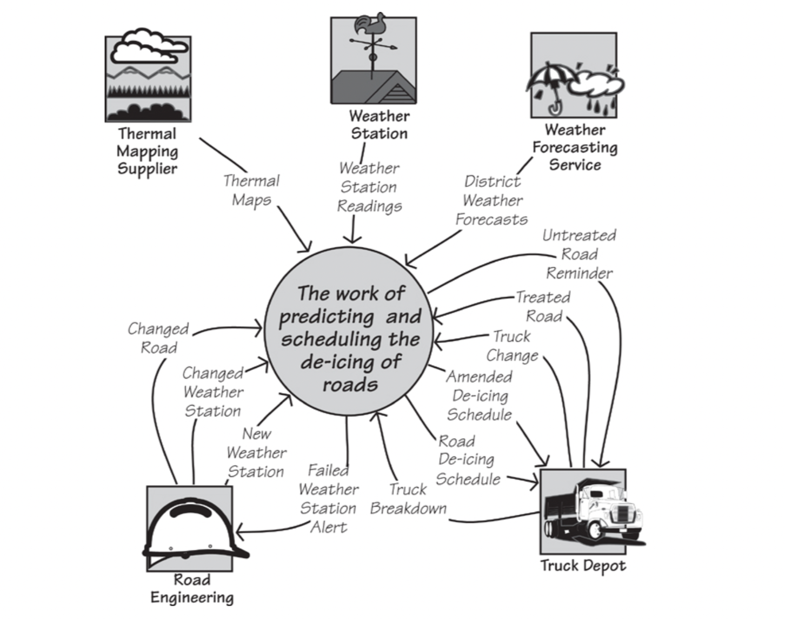

IceBreaker
IceBreaker is a case study we have put together to illustrate the requirements process. IceBreaker uses data from the environment to predict when ice will form on roads. It then schedules trucks to treat the roads with de-icing material (a salt compound) before the roads can become dangerous. The IceBreaker case study uses subject-matter knowledge from the many ice forecasting and road de-icing systems, and other products produced by Vaisala”“(U.K.) Limited and Vaisala Worldwide. We acknowledge Vaisala’s permission to use its material and the company’s kind cooperation. Figure 3.4 depicts a weather station used by IceBreaker.”“Imagine IceBreaker is your project. You work for Saltworks Systems, and you are responsible for producing the requirements specification. The first customer for the IceBreaker product is the Northumberland County Highways Department. Northumberland is a county in the northeast of England, tucked up under the border with Scotland, with serious snow and icy conditions in winter. The Highways Department is responsible for keeping the roads free of ice that is likely to cause accidents; it has agreed to provide expertise and information for you to build the optimally valuable product for the department.”

“A lot of activities are carried out as part of the process in which the IceBreaker work predicts whether there is a need to treat a road: A weather forecast is generated, the temperature at the surface of the road is taken, predictions about which roads will freeze are made, trucks are dispatched, and so on. To deliver optimal value, you must determine which of these activities should be studied because they have the possibility for improvement, and which can be safely excluded from the study.
To illustrate your decisions, collect all the activities to be studied and hide them (for the moment) in the central circle. Put the connected activities that are not part of your study outside the circle, and show the data that connects them. Using this approach, our first draft of the context diagram for the IceBreaker work is shown in Figure 3.5.”

“The context diagram shows the work to be studied, as well as those activities you decide not to study. The latter activities are called adjacent systems. The purpose of the context diagram is to show the processing responsibilities of the work and the responsibilities of the adjacent systems. But be aware that the responsibilities are in reality defined by the flows of data on the context diagram. As an example, the flow called Truck Change advises the work about changes to the de-icing trucks—for example, new trucks that have been added to the fleet, trucks that have been taken out of service, and modifications to trucks that would affect the way that they are scheduled. Why is this flow there? The work needs this information when it allocates a truck to each road that needs treatment as part of the production of the de-icing schedule. But what if you changed this responsibility? What if the depot became responsible for allocating trucks to the icy roads? In that “the depot became responsible for allocating trucks to the icy roads? In that scenario, the flow would be different. In fact, the Truck Change flow would not appear on the work context diagram at all, as the activities that are triggered by this data flow have become the responsibility of the adjacent system.

The work context shows where the responsibilities of the work and the responsibilities of the adjacent systems start and end.

This leads to us saying that the data flows around the boundary of the work are the clearest indication of its processing capabilities. By defining these flows, you define the precise point at which the processing of the work ends and that of the adjacent system starts, and vice versa.
One problem commonly arises in setting the context: Often we see product-centric contexts that contain only the intended software product. Remember that you are investigating some work, and the eventual product will become part of that work. To specify the most valuable product, you must understand the work into which that product is to be deployed. In most cases, projects”

“that restrict their study to only what they think the product will contain build less useful products; in fact, they often omit functionality that would have been valuable to the owner. As a rule of thumb for commercial projects, if you do not have any humans inside your work context, then chances are that your work context is too narrow.
Also consider the possibility that by enlarging the scope of the work, you find other potential areas for automation or other types of improvements that could be valuable. All too often, before we understand the work, we think of an automation boundary, and we never rethink it. Of course, then the “hard stuff”—the work that we did not intend to automate—is not considered. By casting your net wider, you usually find aspects of the work that would benefit from automation or some other improvement, and in the end turn out to be cheaper than first thought. The moral of the story: First understand the work, and then decide which product is most valuable to that work.”

